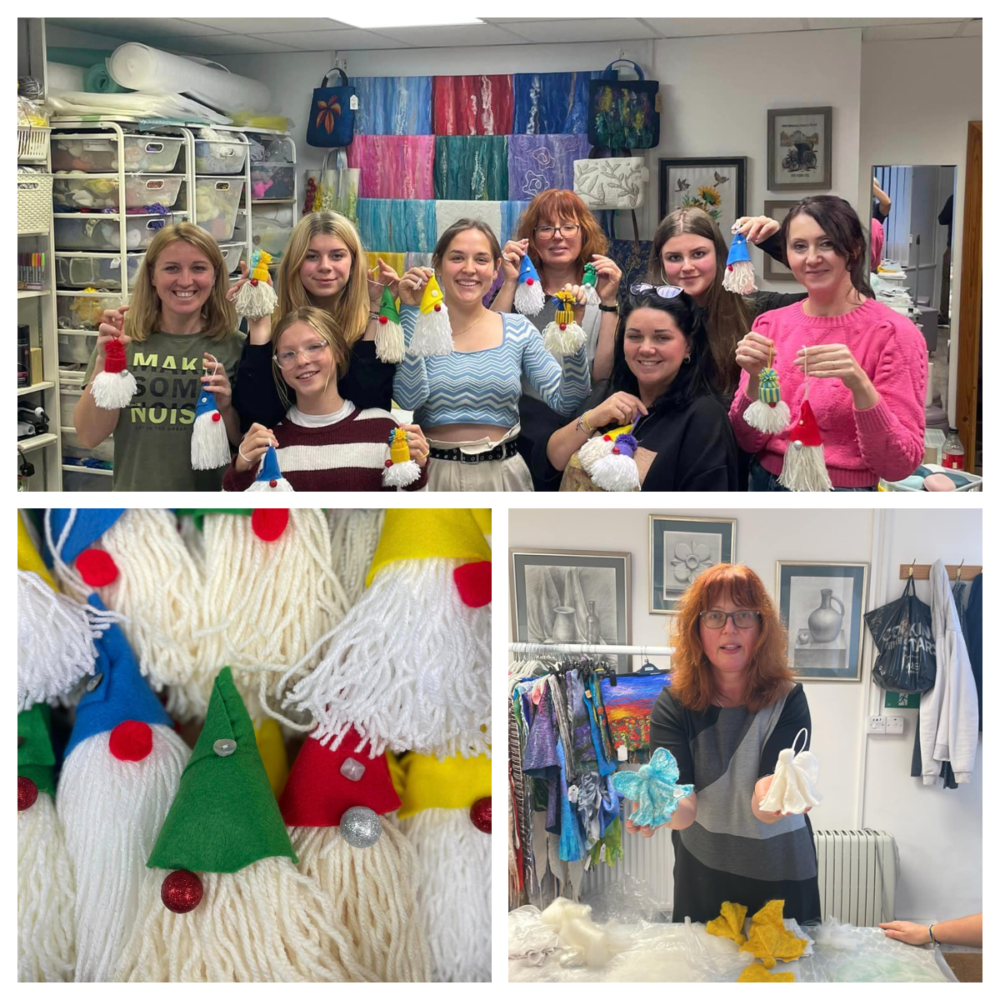
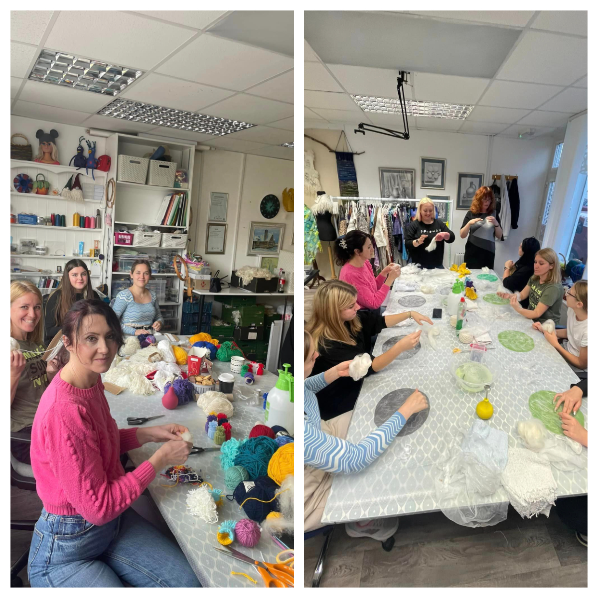
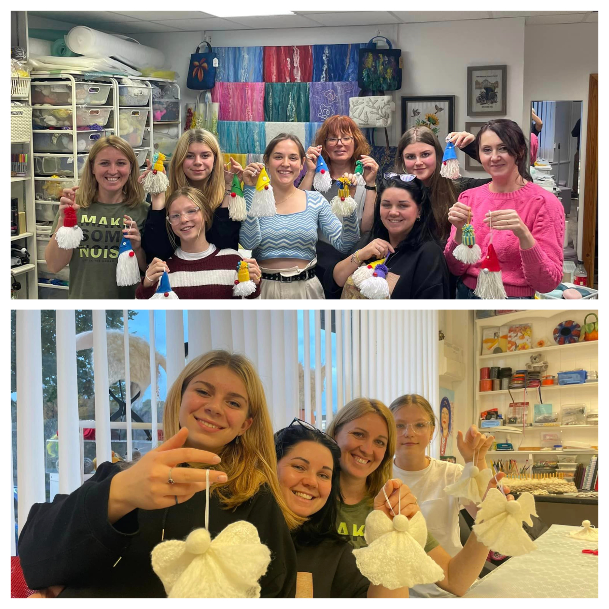
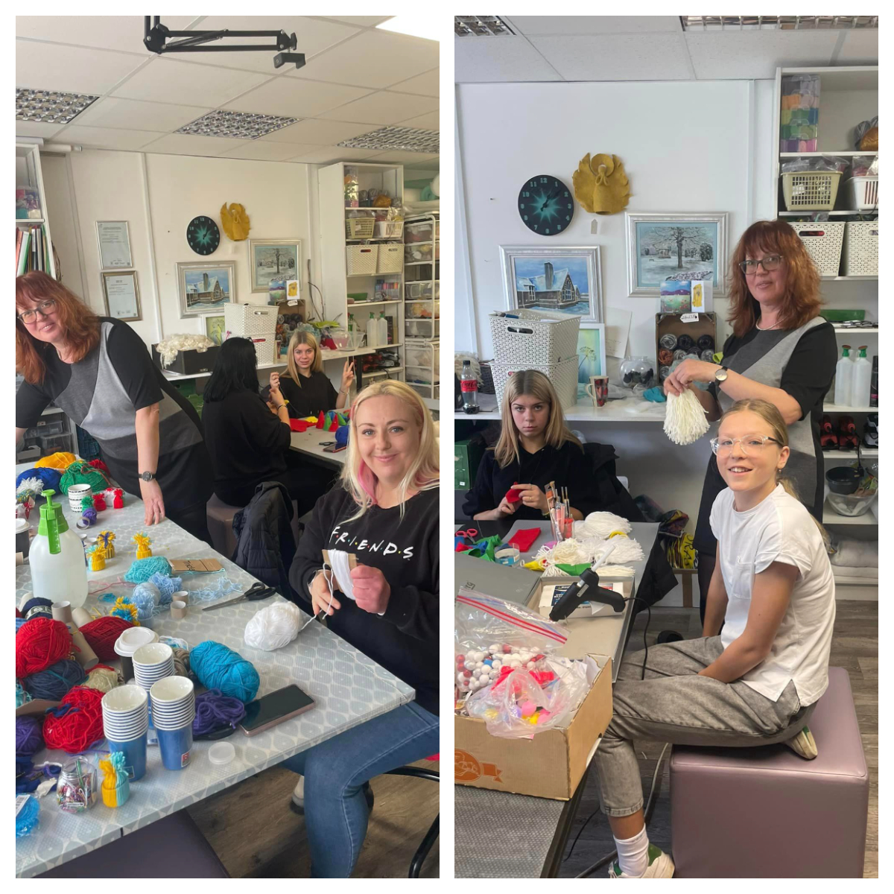

<a href="https://www.facebook.com/groups/601579067497655" target="_blank">Sunflowers Wales (Соняшники)</a> are preparing to take part in <a href="https://fos.wales/" target="_blank">Llandeilo Festival of Senses</a>.
So today we spent very busy day with <a href="https://www.facebook.com/svetlana.lilley" target="_blank">Svetlana Lilley</a> in <a href="https://www.woolsilk.co.uk/" target="_blank">Wool&Silk Art Studio</a>.

We made 63 gonks and 10 angels!!!

All of them we will be selling in Llandeilo and money raised as always will be used to buy medical aid, vitamins, warm clothing, baby formula etc and will be shipped to Ukraine.

Next Sunday we will do the same:)

Thank you, Svetlana, for you time, inspiration and pacience:)!

