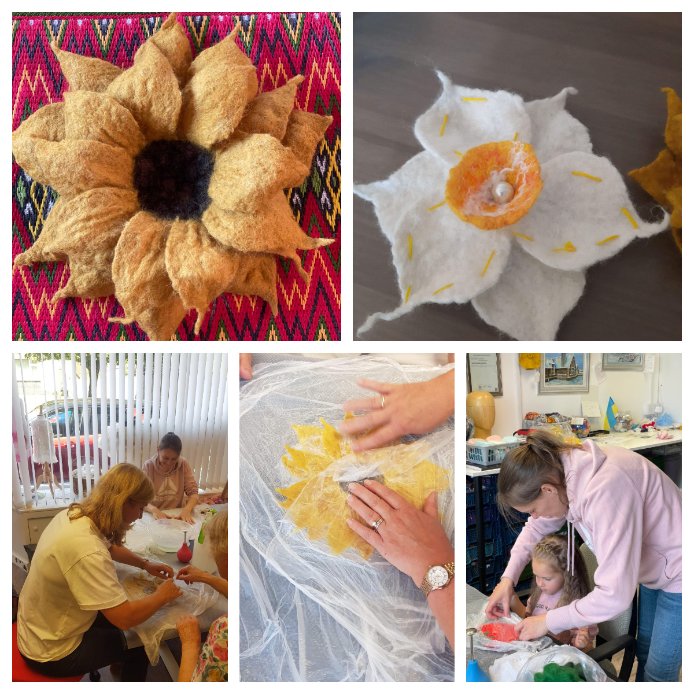
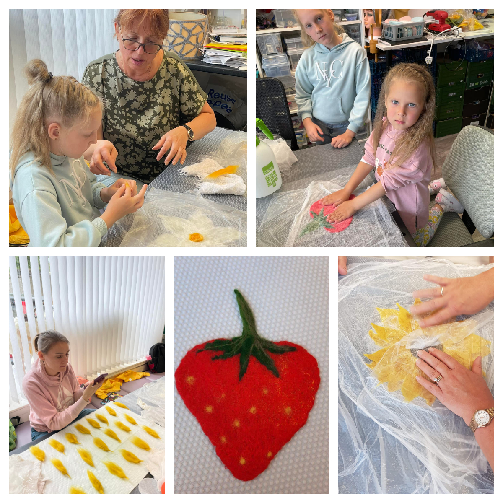

Members of <a href="https://www.facebook.com/groups/601579067497655" target="_blank">Sunflowers Wales (Соняшники)</a> Facebook group had a nice day in <a href="https://www.woolsilk.co.uk/" target="_blank">Wool and Silk Art Studio</a> with <a href="https://www.facebook.com/svetlana.lilley" target="_blank">Svetlana Lilley</a>. 

What we made? Sunflowers! :-) And Welsh daffodils of course :-) 
Thank you, Svetlana, for welcoming us!

