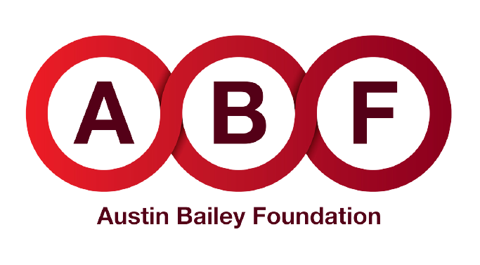
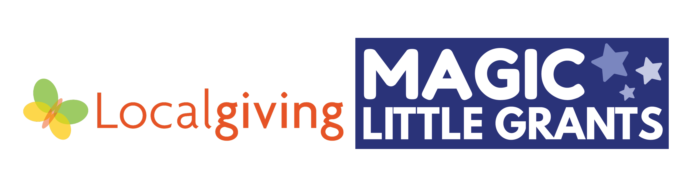
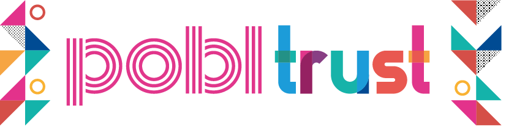
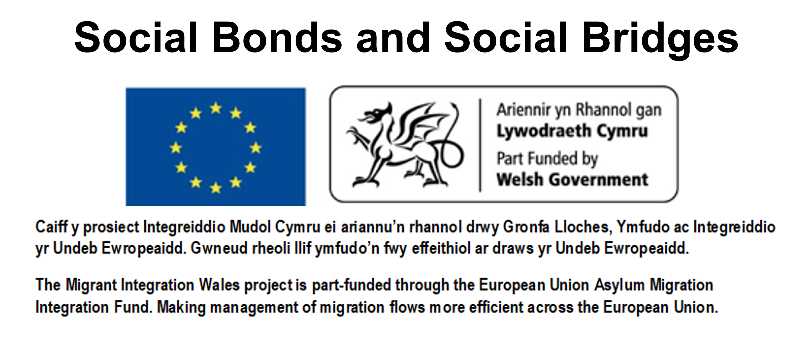
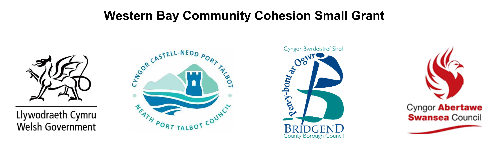
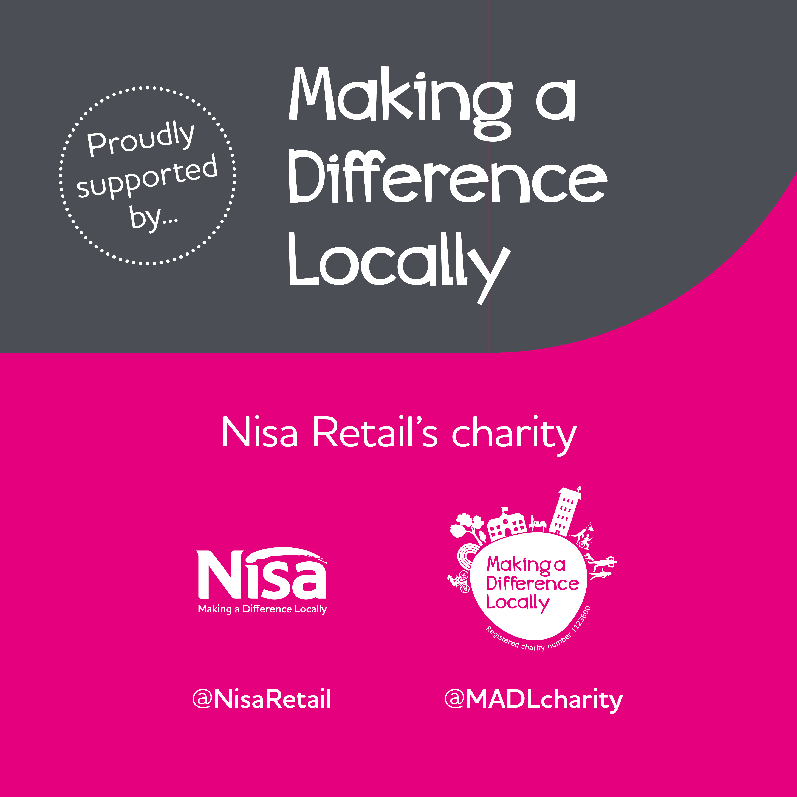

---
# An instance of the Contact widget.
# Documentation: https://wowchemy.com/docs/page-builder/
widget: blank

# This file represents a page section.
headless: true

# Order that this section appears on the page.
weight: 10

title: We were proudly supported by

design:
  columns: '1'
  background:
    color: 'var(--bg)'
---

 

 

<a href="https://www.austinbaileyfoundation.charity/" target="_blank">&nbsp;&nbsp;&nbsp;&nbsp;&nbsp;&nbsp;

 

<a href="https://www.gov.wales/" target="_blank">&nbsp;&nbsp;&nbsp;<a href="https://www.swansea.gov.uk/article/20077/Western-Bay-Community-Cohesion-small-grants-fund-2022--2023-terms-and-conditions" target="_blank">

 

&nbsp;&nbsp;&nbsp;

