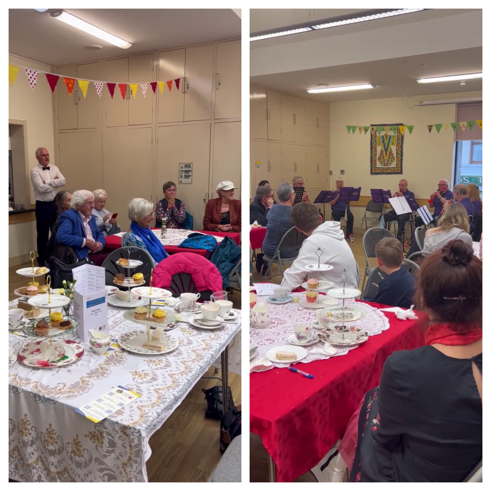
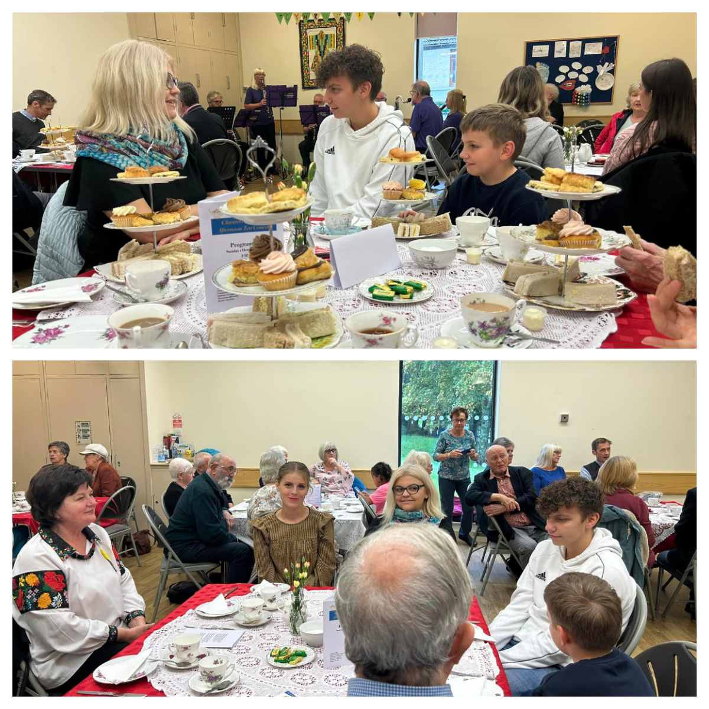
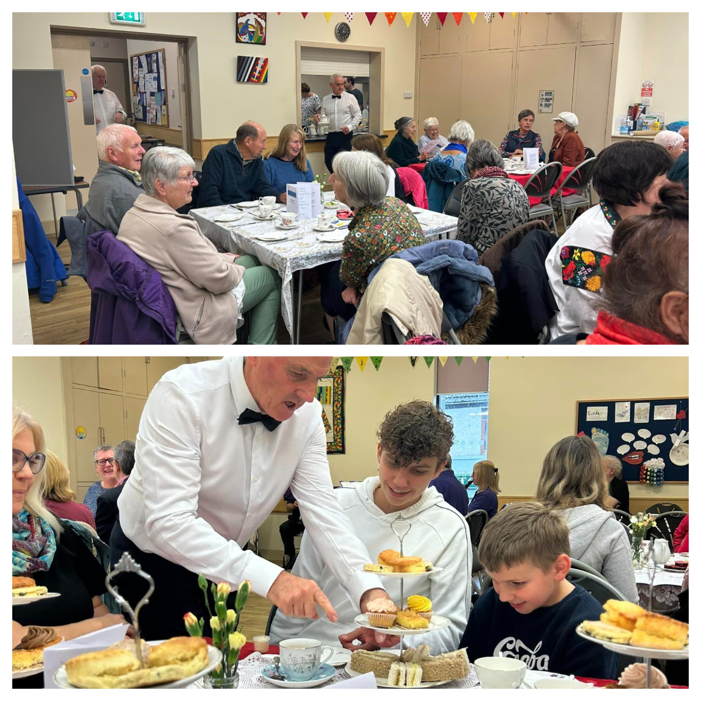
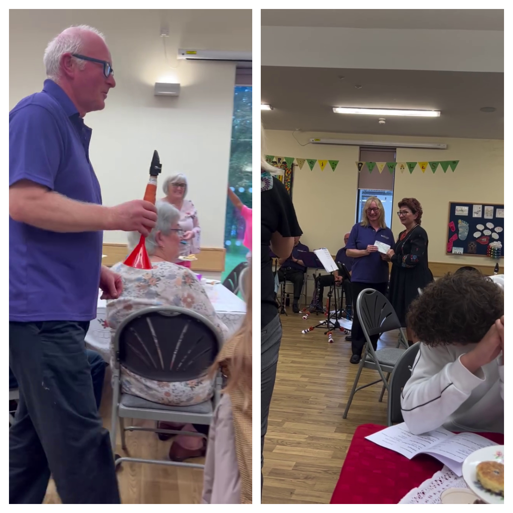

What a lovely afternoon we had today with Llanelli Community Wind Band! 

<!--more-->

Relaxing and informal atmosphere, beautiful music by the band and delicious afternoon tea provided by Phil Shingler and Beverley Shingler from <a href="https://www.facebook.com/groups/llanellicommunitywindband/" target="_blank"> Llanelli Community Wind Band</a>. 

We have been moved by the kindness and generosity of people from Llanelli! 

All the money raised (£660) by the band and people who attended has been kindly donated to Sunflowers Wales. 

We will use the money to purchase medical supplies and other very much needed items for people in Ukraine who are suffering from russian aggression. 

Big Thanks to Louise for organising this and everyone involved! 

The band finished their concert with music that they composed and played on clarots ( clarinet made from carrots! ). It was a lovely surprise and put a smile on everyone’s face.

