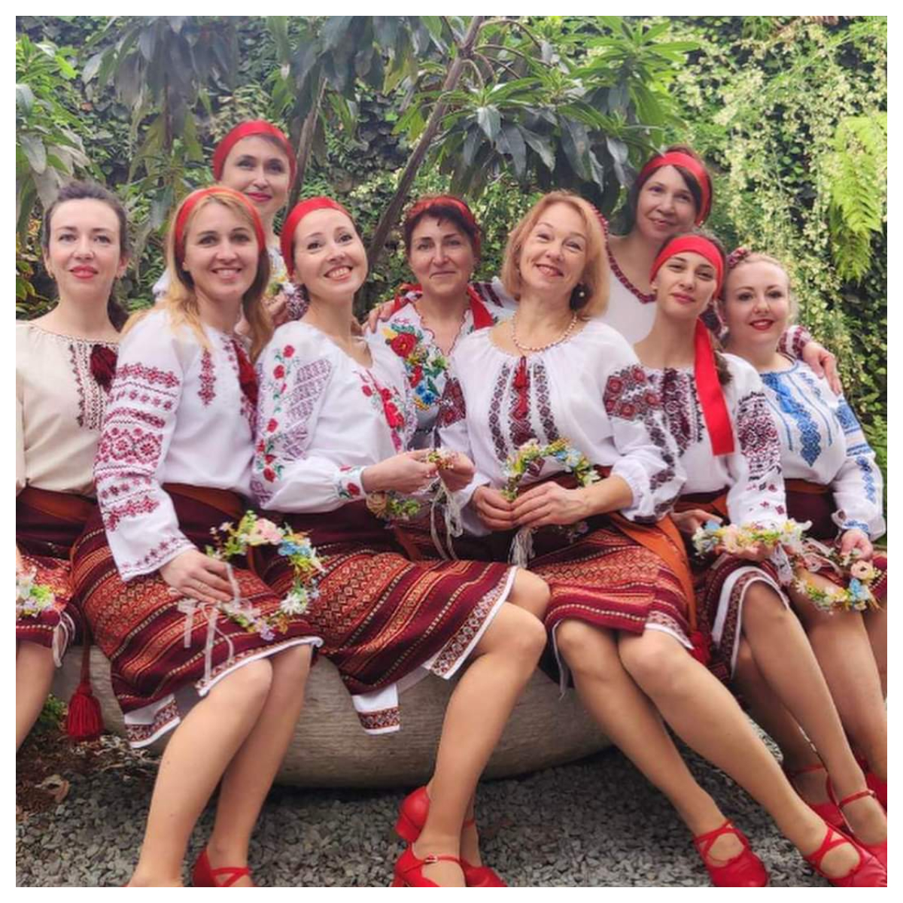
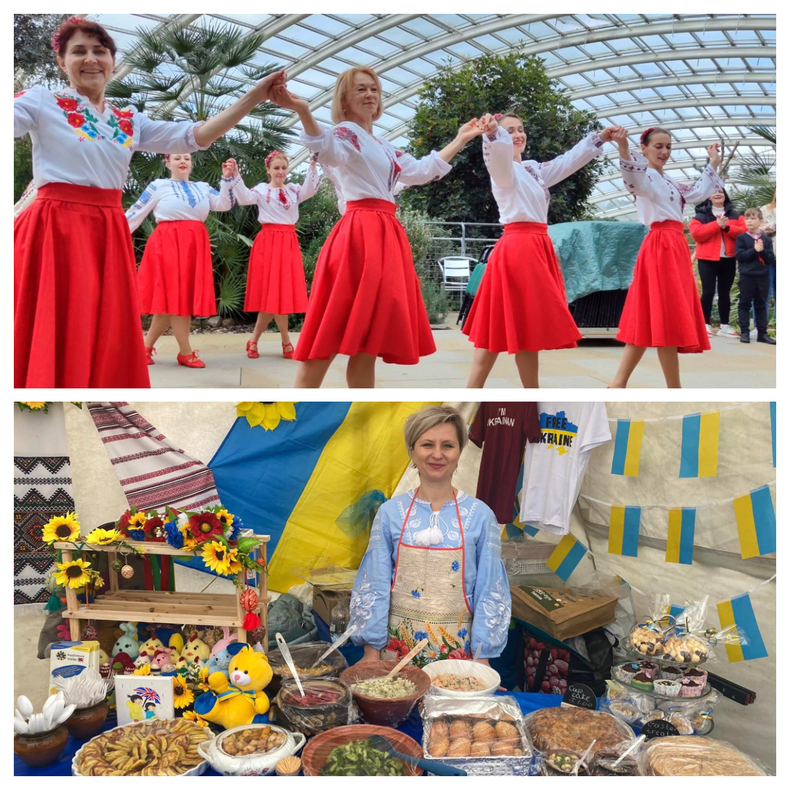
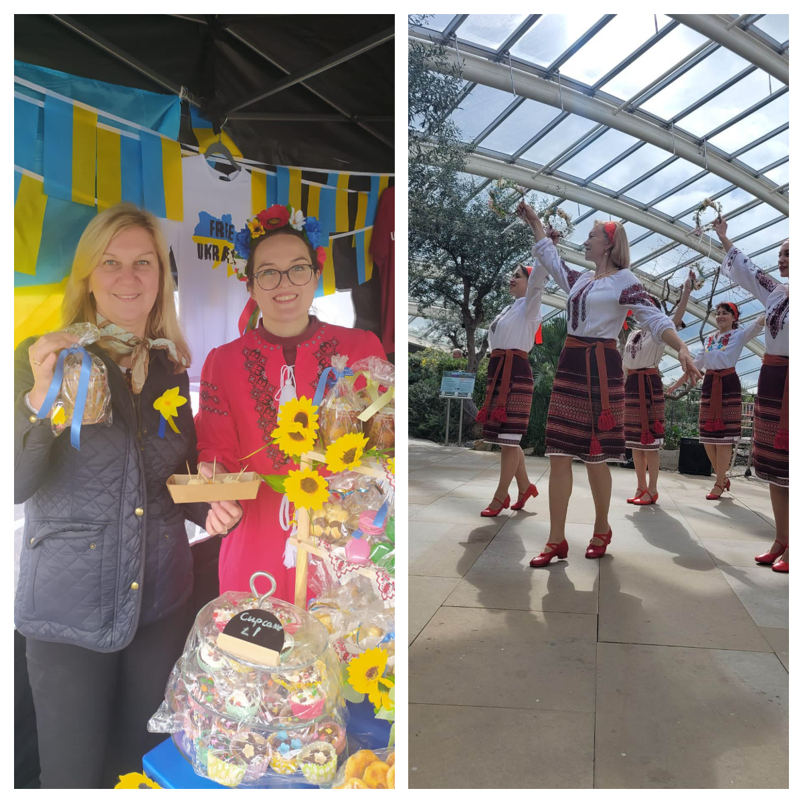
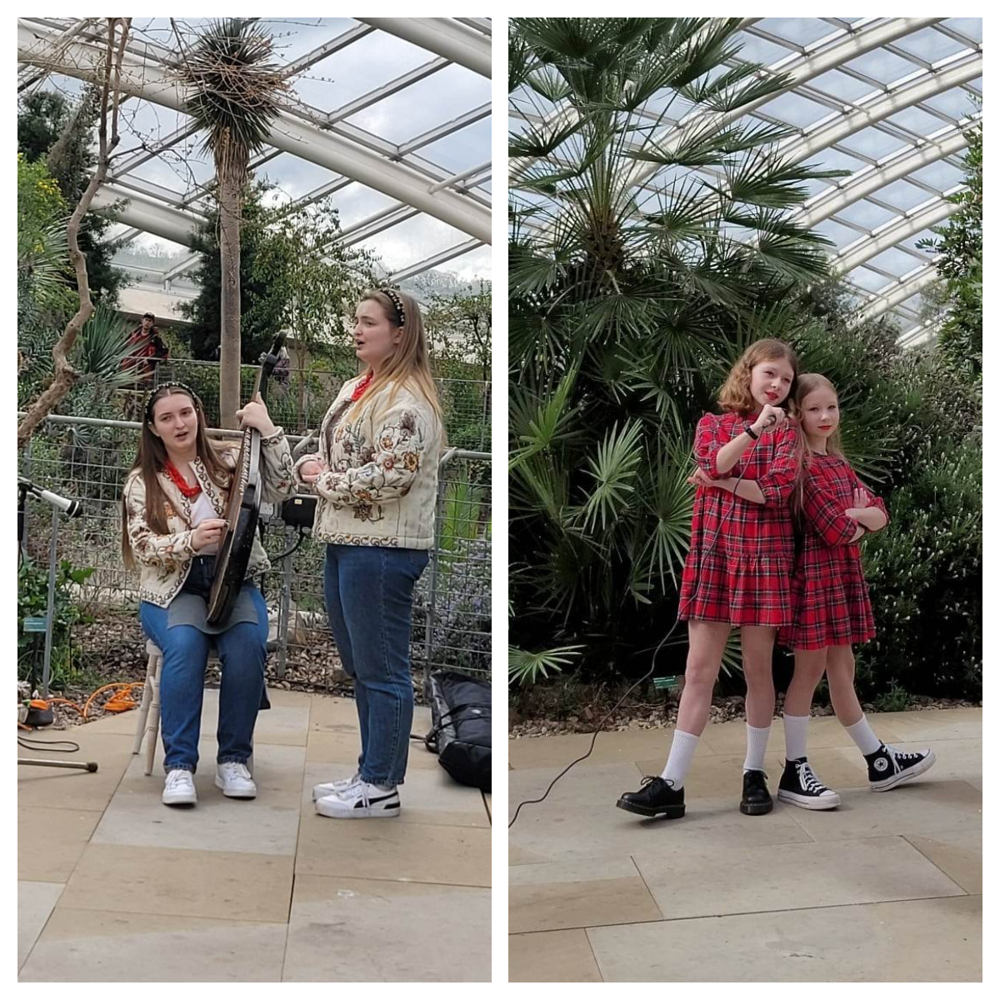
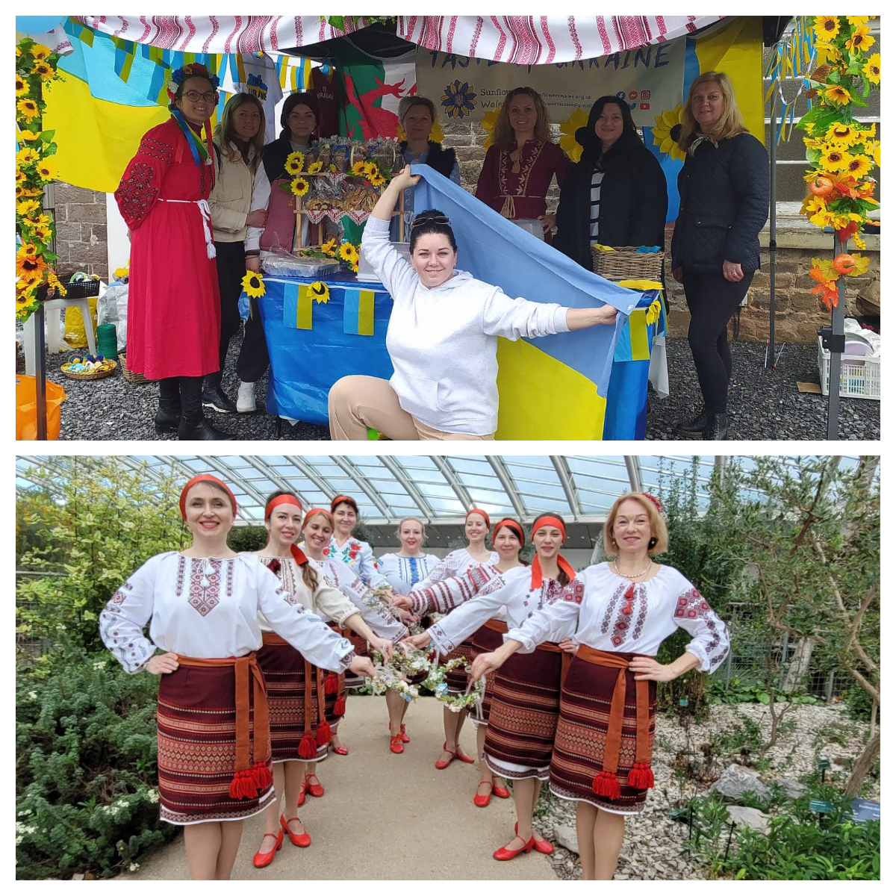
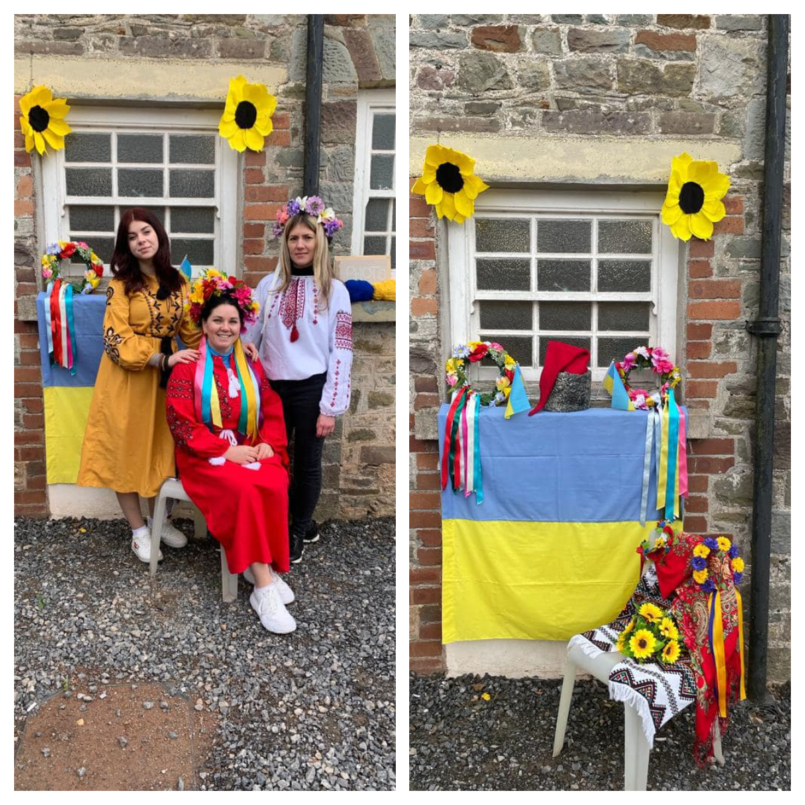
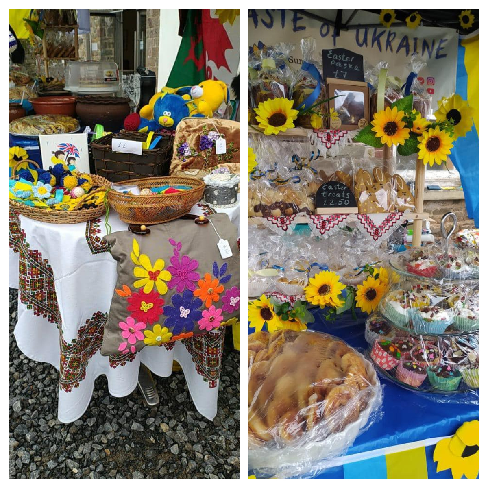

This weekend Sunflowers Wales took part at a Festival at the National Botanic Garden of Wales.

<!--more-->

<a href="https://www.facebook.com/events/599330982024397/" target="_blank">A Taste of West Wales Spring Festival</a> was organized on 1-2 April 2023 by <a href="https://www.facebook.com/ShowcasingWalesandtheBorders" target="_blank">Showcasing Wales and the Borders</a> at <a href="https://www.facebook.com/pages/National%20Botanic%20Garden%20of%20Wales/136641249690054/" target="_blank">the National Botanic Garden of Wales</a>

Our Taste of Ukraine stall with Ukrainian food and souvenirs was a highly popular place for the festival guests. 

We danced, we sang, we made and SOLD OUT of traditional Ukrainian food and raised £1583.25!

Our Sunflowers dancing group presented three authentic Ukrainian dances; it was also a great opportunity to enjoy the music and singing of Lisa and Kate Kaliianova and their unique Ukrainian instrument bandura; people were also astonished by the performance of Kateryna and Anne Andrushyna.

A huge thank you to all our beautiful Ukrainian ladies for making this possible!

Also a heartfelt thank you to the festival organizers for giving us the opportunity to present a snapshot of the Ukrainian culture! We hope we made the festival even more colourful! 

Diolch yn fawr! Дякуємо!

Thank you for promoting Ukraine!

Together we're strong!

