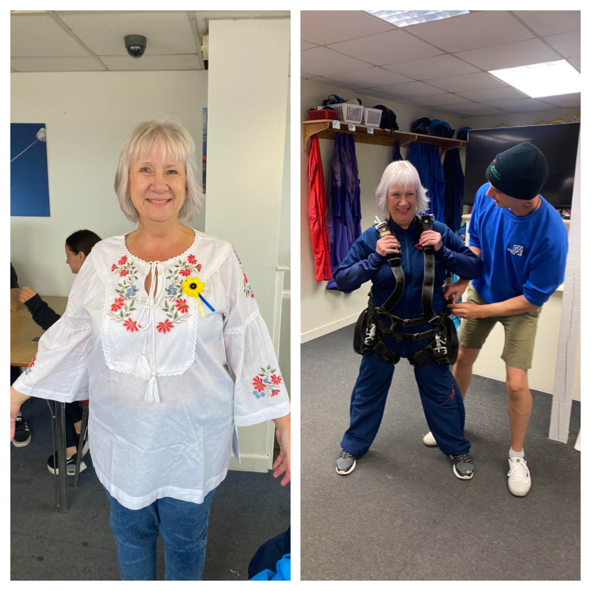
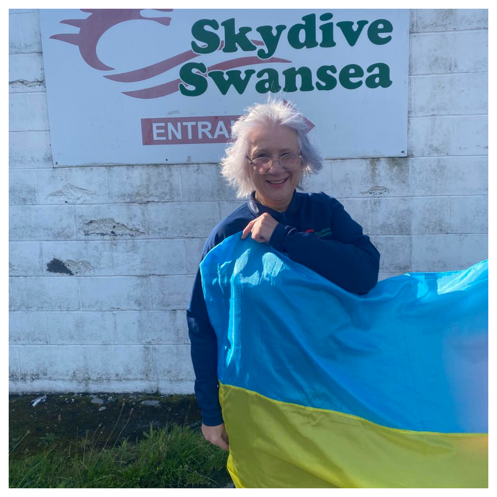

An incredible achievement and breathtaking action! 

<!--more-->

Today, <a href="https://www.facebook.com/groups/601579067497655/user/100000742517082" target="_blank">Sarah Wright</a> completed her skydive in support of Sunflowers Wales. She has raised an astounding sum over <b>£1400</b>.

The money will be used to buy tourniquets, haemostatic dressings, and other crucial life-saving medical supplies for Ukrainian paramedics.

A heartfelt thank you, <a href="https://www.facebook.com/groups/601579067497655/user/100000742517082" target="_blank">Sarah Wright</a>! Your bravery and dedication will save the lives of many Ukrainian guardians!

And, of course, a big thank you to everyone who generously contributed to Sarah's skydive!

Sunflowers Wales – Standing Strong Together!

<video width="240" height="320" controls="controls" >
      <source src="Skydive_264.mp4" type="video/mp4" />
</video>

