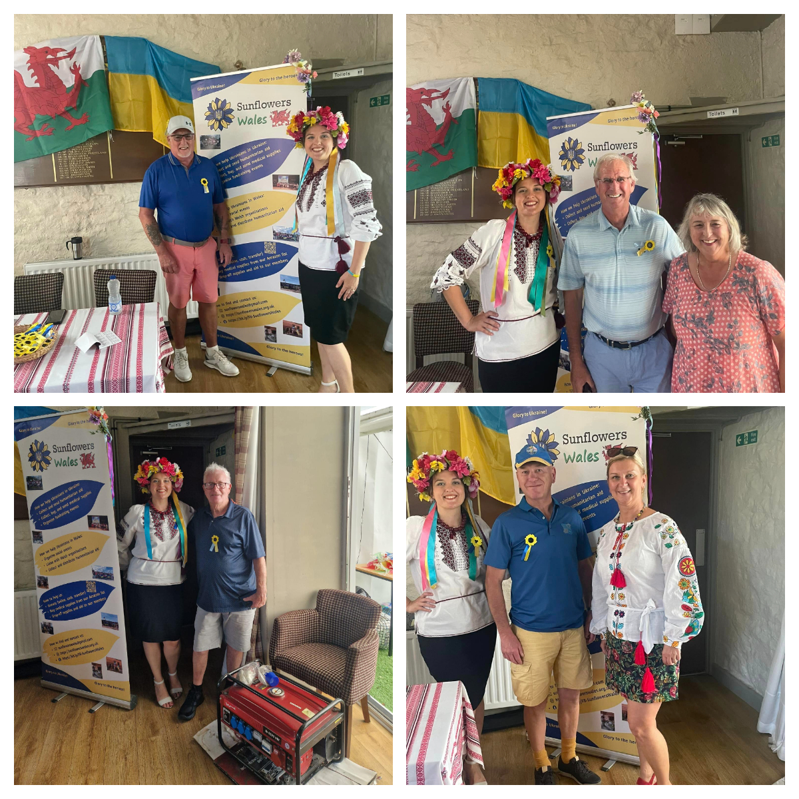
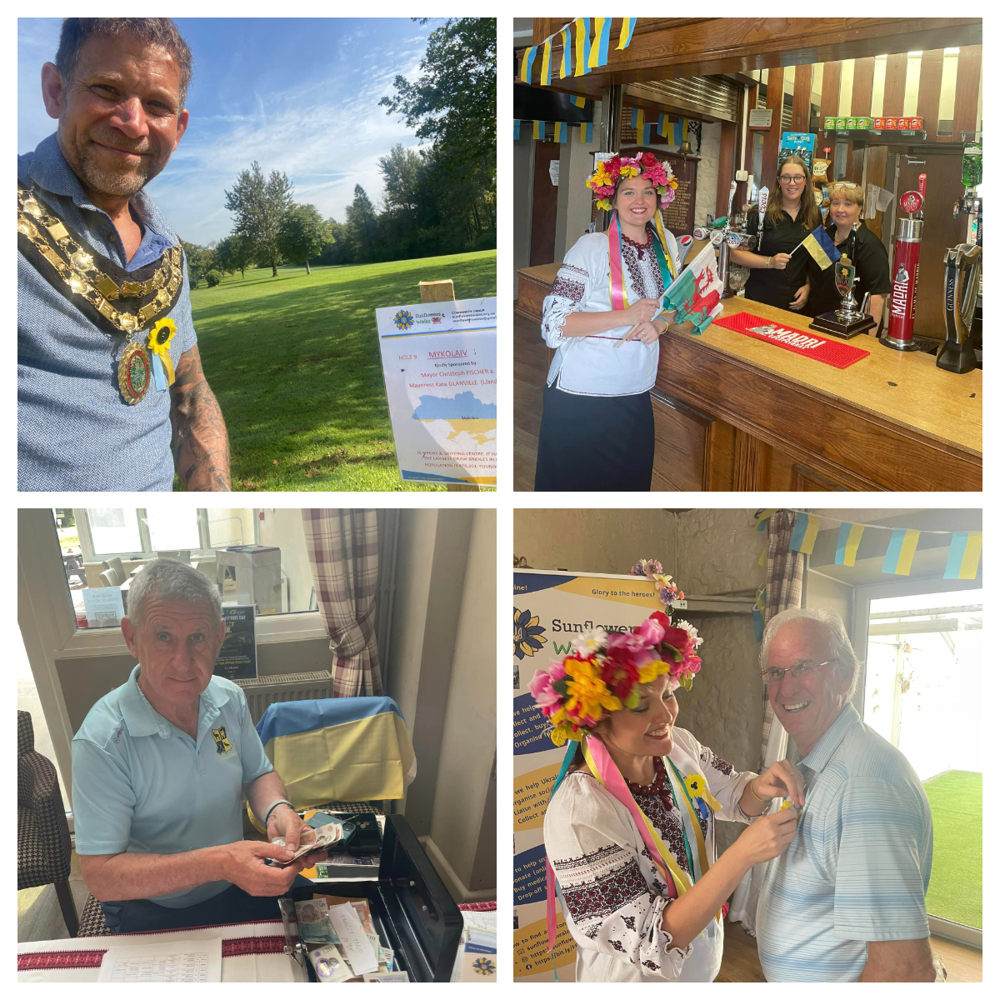
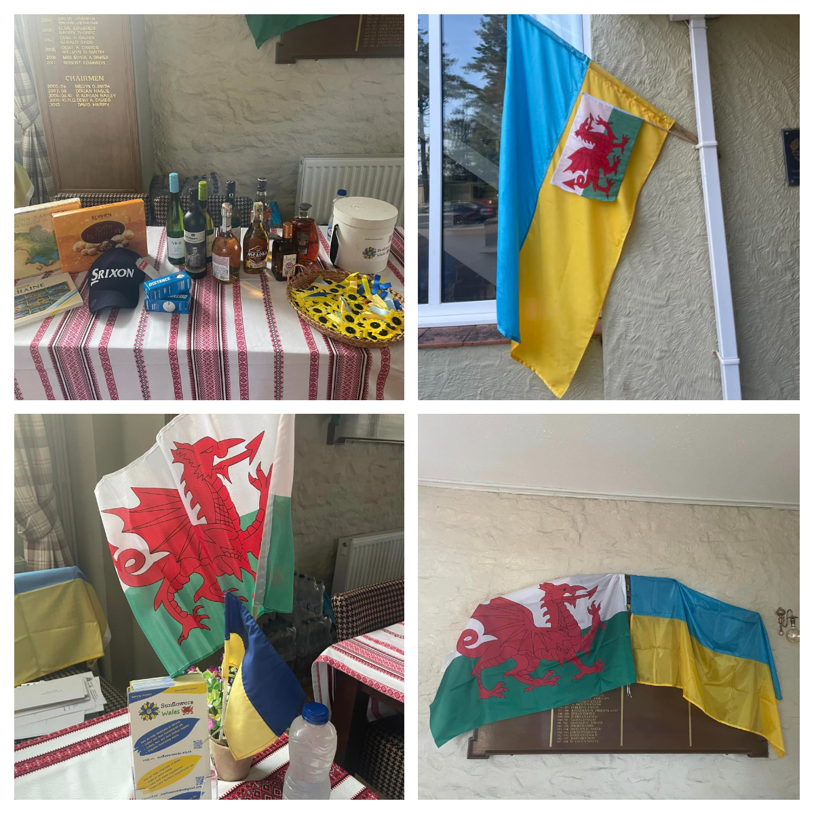

Today in <a href="https://www.glynhirgolfclub.co.uk/" target="_blank">Glynhir Golf Club</a>  was a great day – Ukrainian Charity Golf Day – all proceeds from which will go to Sunflowers Wales!!! 

<!--more-->

It’s second time that golfers and sponsors supported our cause and we raised an amazing 4.300 pounds!

And we received a generator as a gift from Graham Gunnell and his friend Jeff Jenions! Thank you!

Big thank you goes to Golf club management and members for support in organizing this event and for keeping grass nice and green!

Many thanks to local businesses: Diplomat Hotel Llanelli, CSA  recruitment, Dunbia Cross Hands, LBS builders merchants, Brecon Carreg, Llandeilo Dental Practice, Llwynhendy Health Center, as well as Mayor of Llandeilo Christoph Fischer and Mayoress Kate Glanville, MX-5 owners group, Glynhir Breakfast club, Glynhir Otters, Glynhir vets, Glynhir women’s section, family members of Tatyana Thomas, Gerard Murphy and Bohdana Bahlay.

Thank you to Olena Hainiieva for donating raffle presents straight from Ukraine!!!

To every and each player for taking part, having fun and buying raffle tickets;)))!

Special thank you goes to Bryan Francis❤️❤️❤️

Without your continuous support we would not be able to help our people and bring our Victory day over terroruZZia closer!

Thank you from the bottoms of our hearts!

Diolch o’r galon!

Дякуємо від щирого серця!

 

