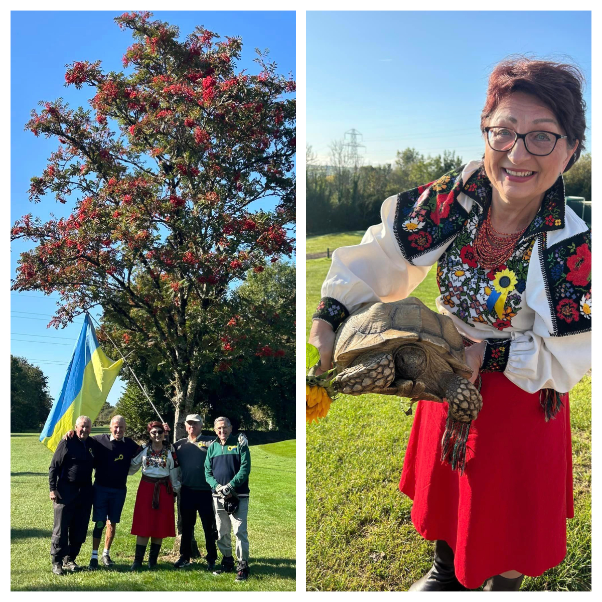

The golf fundraiser for Ukraine, held at <a href="https://www.facebook.com/bridgendgolfing" target="_blank">Coed-Y-Mwstwr Golf Club Bridgend</a> fundraised £1775!!!

<!--more-->

It was a resounding success, bringing together golf enthusiasts and supporters for a meaningful cause.

Sunflowers Wales would like to say a Big thanks to <a href="https://www.facebook.com/mike.paddick" target="_blank">Mike</a> and <a href="https://www.facebook.com/mich.paddick" target="_blank">Michelle Paddick</a> for their hard work organising the event and also to the club manager Gareth Summerton for his help and support!

Special taste of Ukrainian cuisine was offered on the day by amazing club’s chef Carla who made delicious borscht and stuffed peppers followed by shot of Ukrainian vodka. We would also like to mention the bar staff of the club who were very nice and helpful.

And the Star of the day was Frank — a giant tortoise. Everyone wanted to have a photo with him.

The event was organised to raise funds for humanitarian aid and relief efforts in Ukraine, saw an impressive turnout with participants from across the community.

Players enjoyed a day of friendly competition on the course, with prizes awarded for various categories. In addition to the golf tournament, a raffle was held, featuring a range of donated items that helped increase the fundraising total to the incredible £1775!

Thanks to the generosity of participants, sponsors, and donors to support vital services for those affected by the war in Ukraine. The funds will be directed to providing medical supplies and other very much needed items for families and individuals suffering from the devastating war.

Overall it was an amazing day of camaraderie, fun and support. Thank you to everyone who organised, participated and contributed to the event.

Слава Україні!

