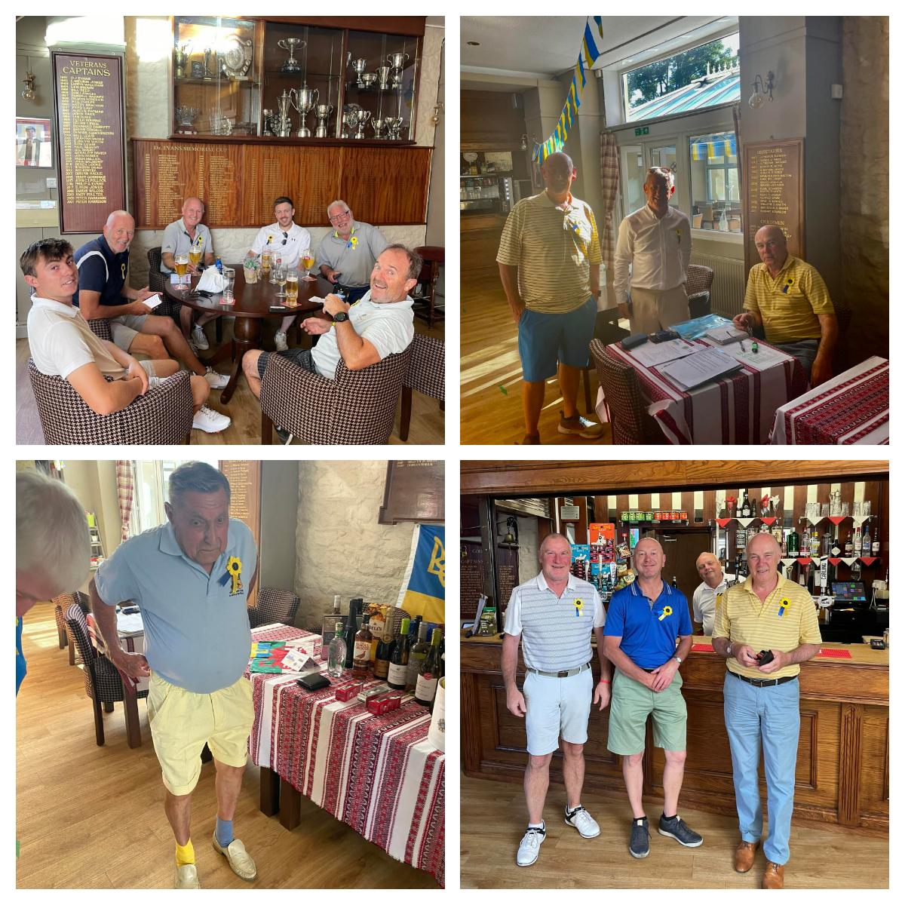
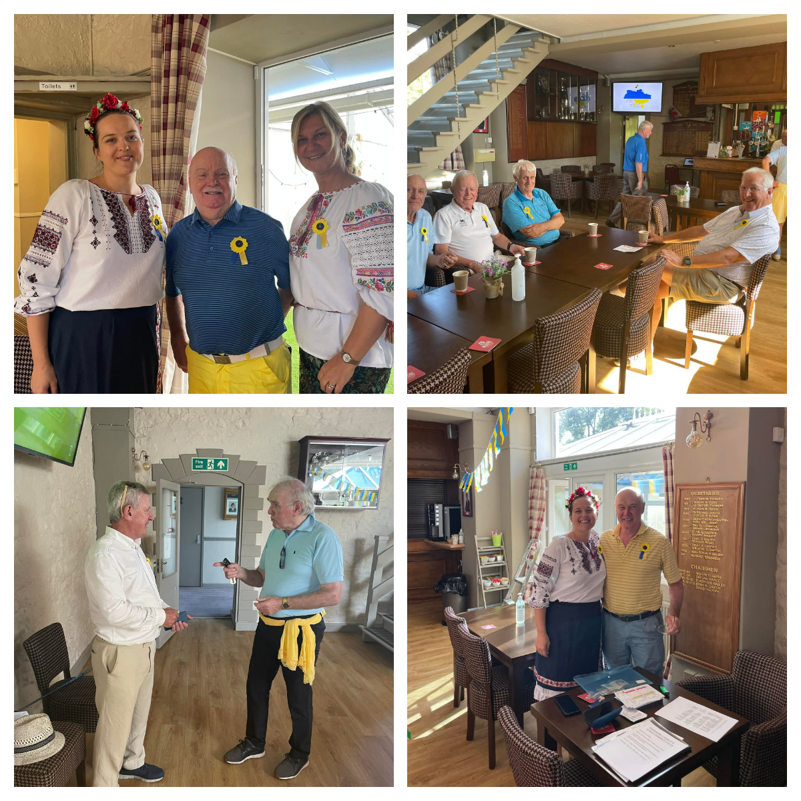
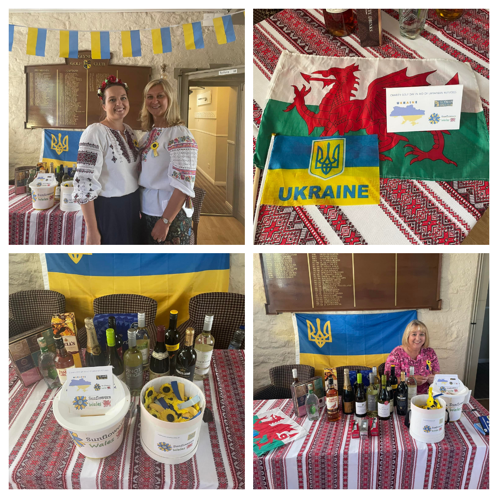
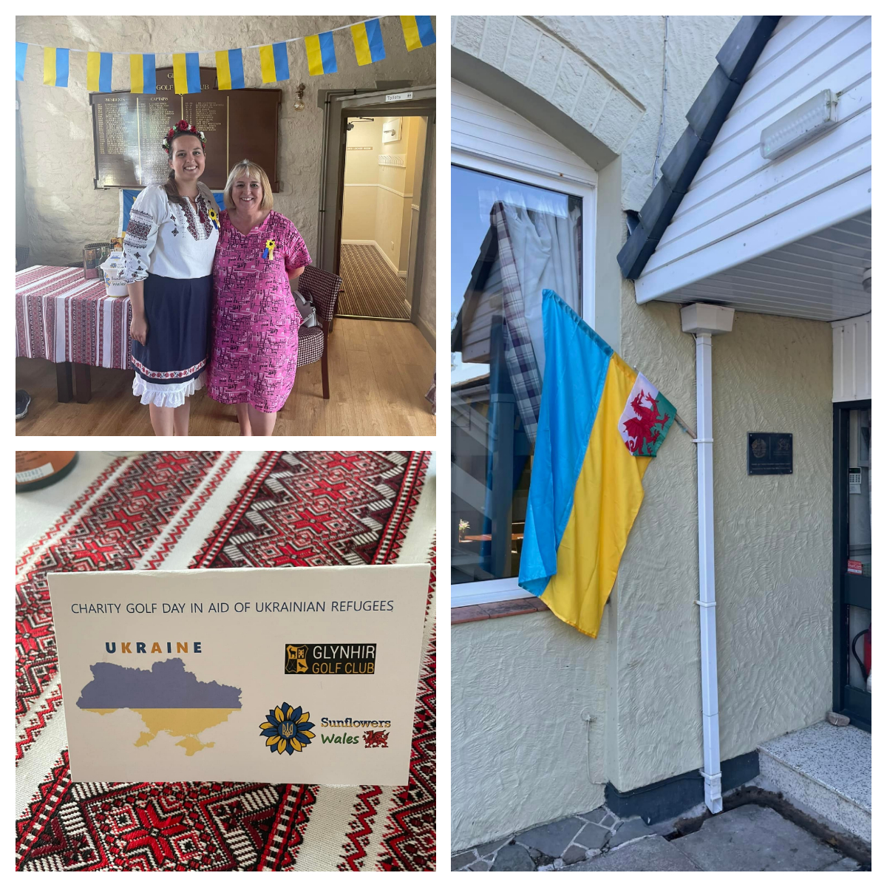

<a href="https://www.glynhirgolfclub.co.uk/" target="_blank">Glynhir Golf Club Ammanford</a> was dressed in  Ukrainian blue and yellow colours!!! 

<!--more-->

Club have organised charity golf day for Ukraine and raised over 5000 pounds! What a fantastic achievement!

All proceeds will be donated to our community group.
We would like to say big Thank you! and Diolch yn fawr! to sponsors of all 18 tees (businesses and individuals). 

Our Thank you goes to every and each player for their generous donations, for their support and kind words. 
And for their amazing effort to dress in Ukrainian colours! :-)

Another Thank you goes to greens staff for their hard work in keeping  golf course in immaculate condition  and  preparing it for the day, especially during this hot weather!

And Special Thank  you goes to the organisers, who made this day happen: Tom Askew, Andy Lewis, Mark Williams and Gerard Murphy.

Very kind touch was added to the day: every tee was named after Ukrainian city and presentation was displayed  all day on TV screen.
All raised money will be used to help Ukrainians who suffered from ruSSian invasion. We will keep you all updated and report as always.
Thank you very much again, <a href="https://www.glynhirgolfclub.co.uk/" target="_blank">Glynhir Golf Club</a>, for standing with Ukraine!

Together we stronger!
 

