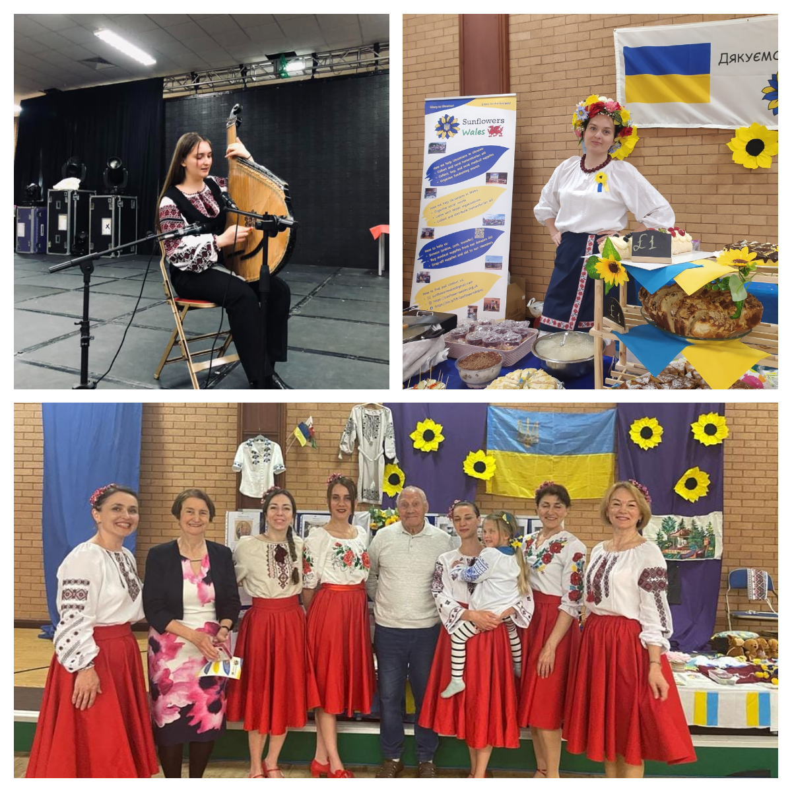
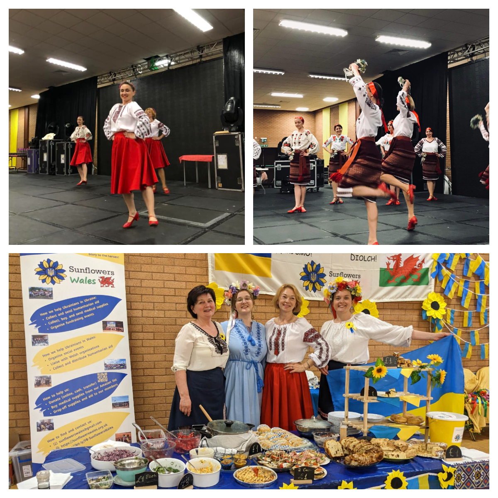
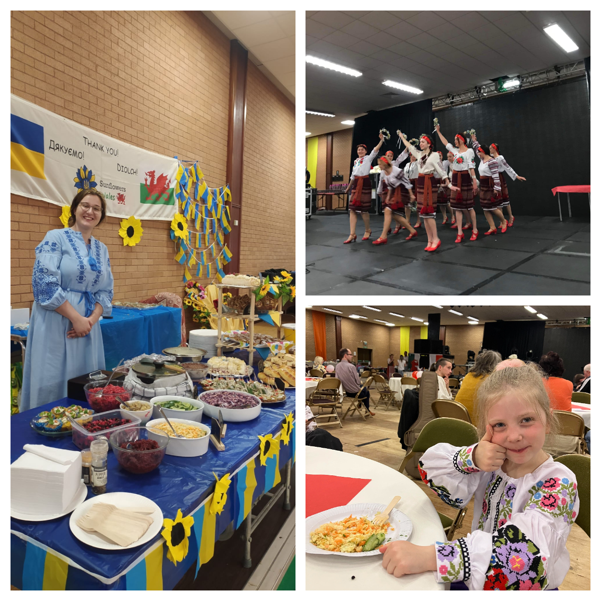
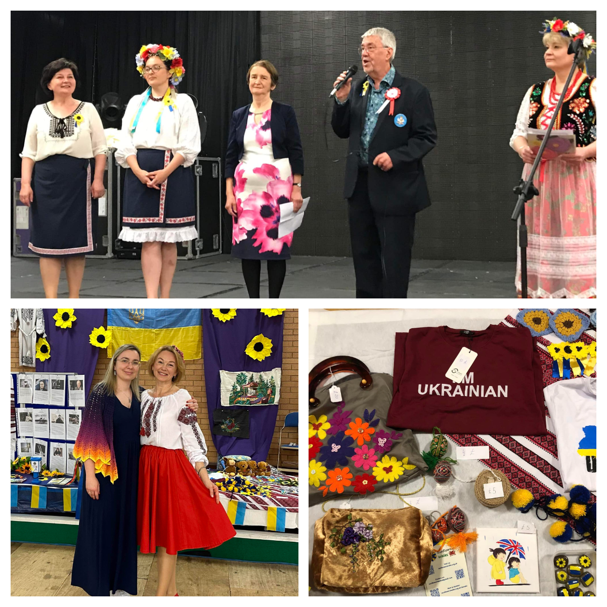

Sunflowers Wales proudly participated in the Polish-Ukrainian Day Llanelli.

<!--more-->

Polish-Ukrainian Day Llanelli was organized on 13 May 2023 by <a href="https://www.facebook.com/profile.php?id=100075695632917" target="_blank">Llanelli Multicultural Network - LMCN</a> with the support by a few Polish charities at <a href="https://www.facebook.com/pages/Selwyn%20Samuel%20Centre%20&%20Lliedi%20Suite/762089767226743" target="_blank">the Selwyn Samuel Centre</a> in Llanelli.

Our Taste of Ukraine stall with Ukrainian food and souvenirs was a highly popular place for the event guests.
Our Sunflowers dancing group presented three authentic Ukrainian dances; it was also a great opportunity to enjoy the music and singing of Lisa and Kate Kaliianova and their unique Ukrainian instrument bandura. 

A huge thank you to all our beautiful Ukrainian ladies for making this possible! See below a Youtube video-report about the event.

A heartfelt thank you to the organizers for giving us the opportunity to present a snapshot of the Ukrainian culture! Thank you, <a href="https://www.facebook.com/joanna.drozdek.58" target="_blank">Joanna Drozdek</a>, <a href="https://www.facebook.com/paolo.piana.923" target="_blank">Paolo Piana</a>, <a href="https://www.facebook.com/ann.evans.77920" target="_blank">Ann Evans</a>, <a href="https://www.facebook.com/profile.php?id=100005157739273" target="_blank">Llanelli CommunityPartnership</a>, and <a href="https://www.facebook.com/profile.php?id=100075695632917" target="_blank">Llanelli Multicultural Network - LMCN</a>! 
We hope we made the festival even more colourful! 

We raised over £430!

Dziękujemy! Diolch! Thank you!

Sunflowers Wales - Standing Strong Together!


