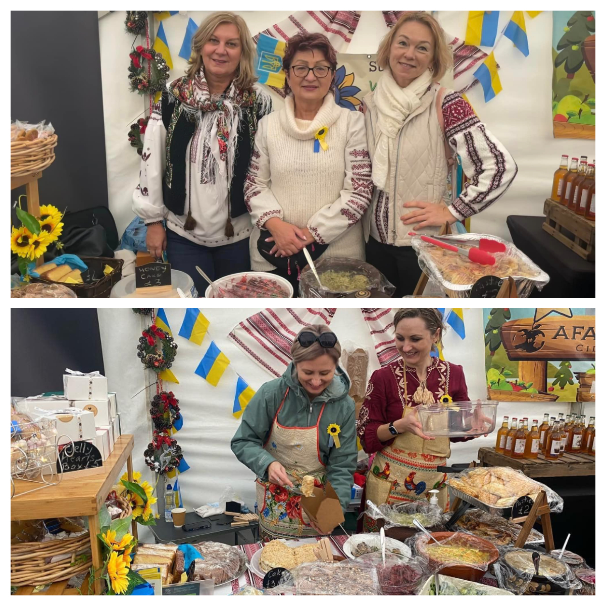
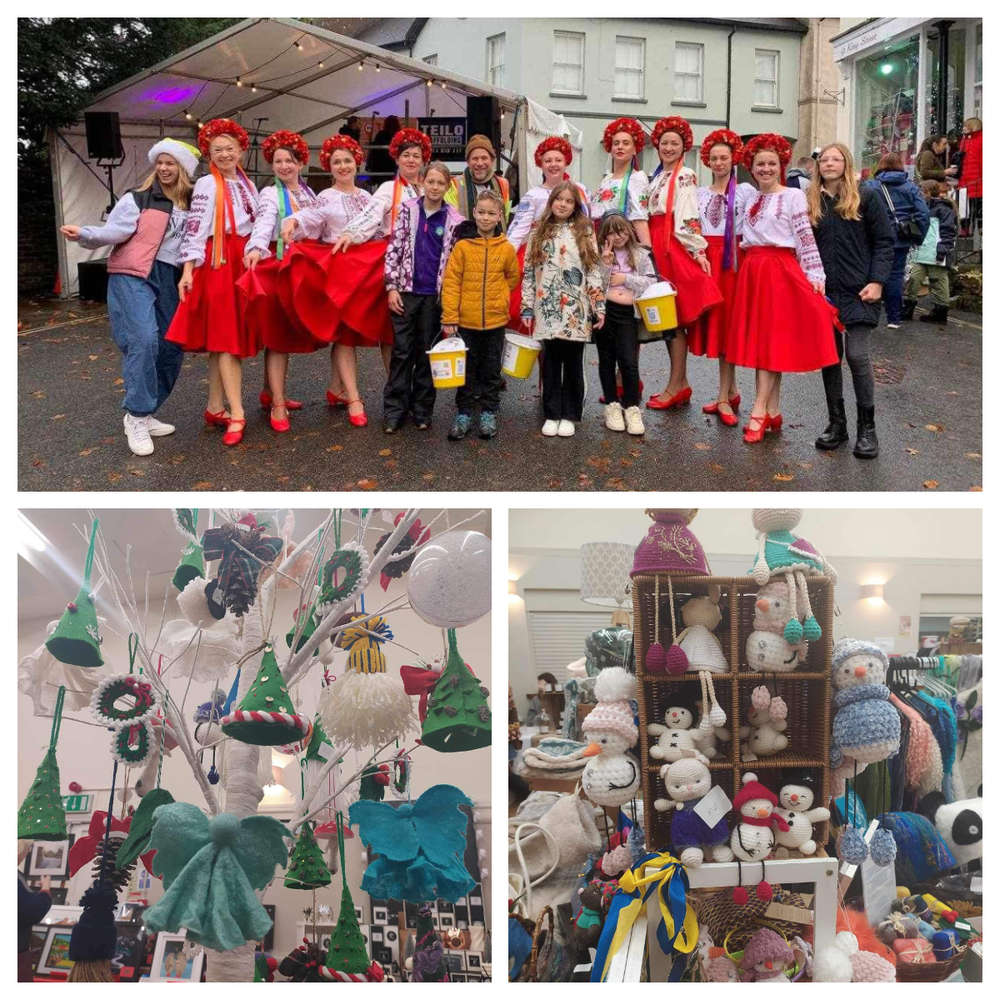
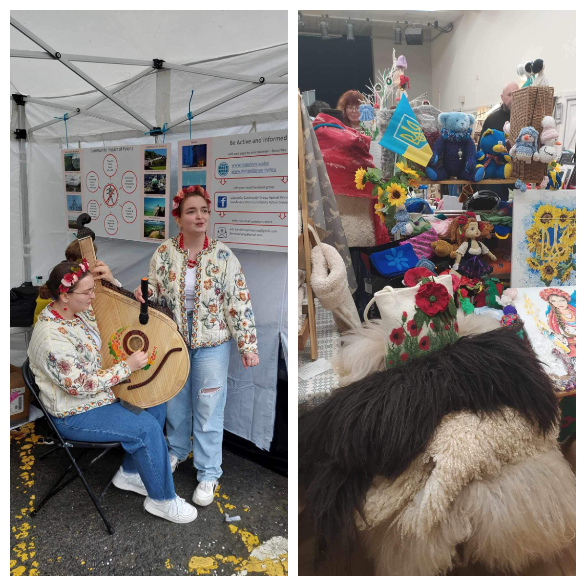
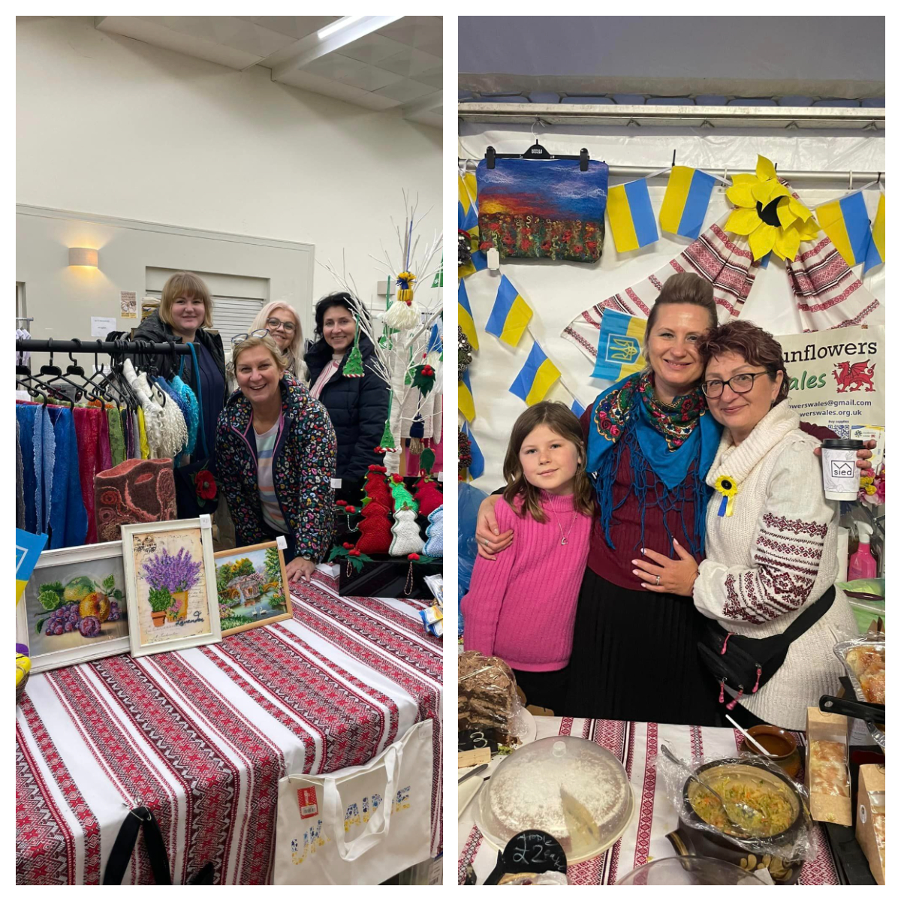
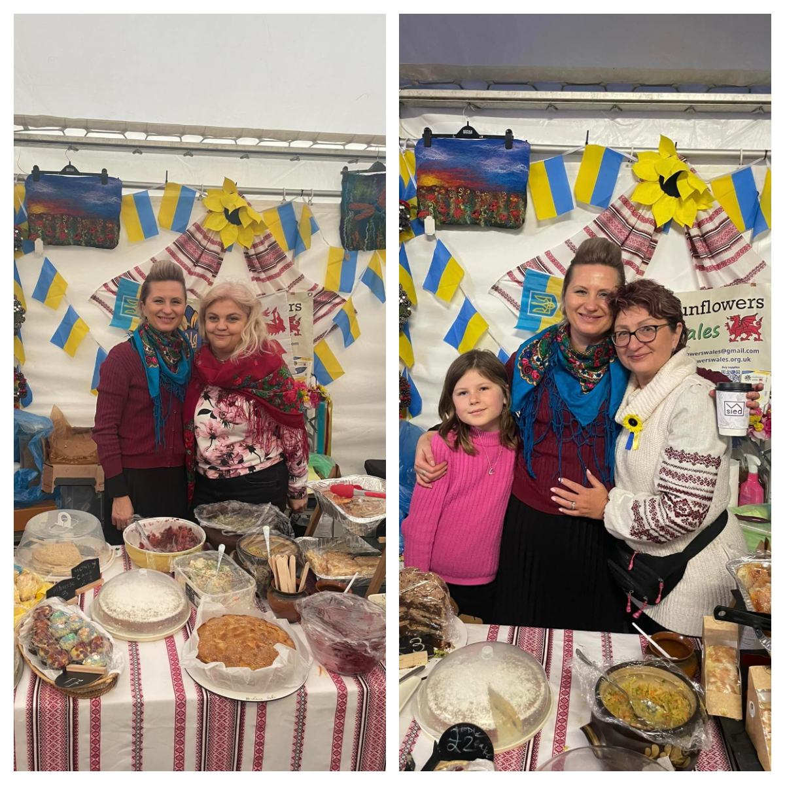
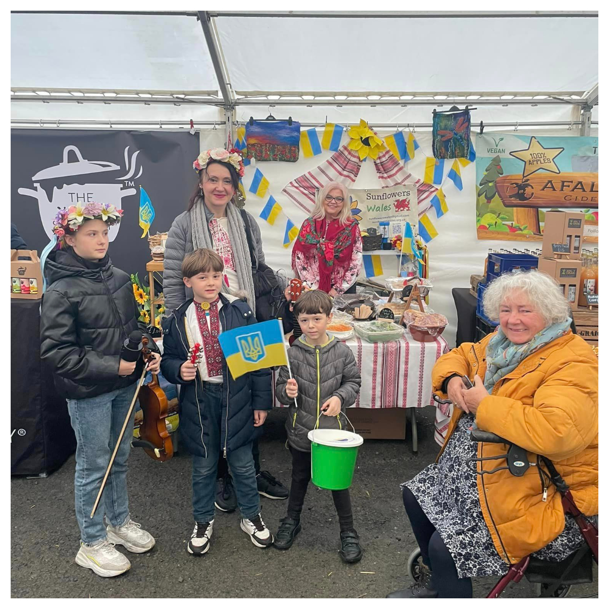
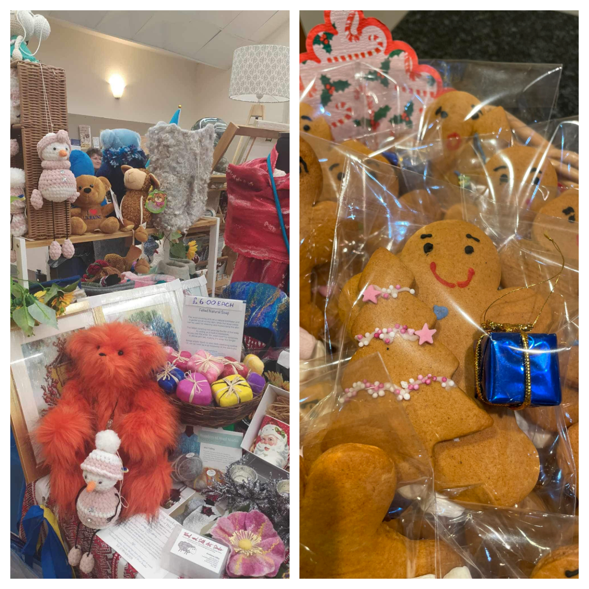

It was a very rainy good weekend in Llandeilo! 😊

<!--more-->

We would like to thank again for this opportunity to <a href="https://www.facebook.com/christophffischer" target="_blank" rel="noopener noreferrer">Christoph Fischer</a>, <a href="https://llandeilo.gov.uk/" target="_blank" rel="noopener noreferrer">Cyngor Tref Llandeilo Fawr Town Council</a> and <a href="https://fos.wales/" target="_blank" rel="noopener noreferrer">Llandeilo Festival of Senses</a>!

We presented Taste of Ukraine: Ukrainian traditional Xmas salads, pies and cakes. And of course Carol singing.

We have raised whopping £1570!!

As always money will be used to buy so much needed  medical aid for hospitals on front line (Kherson, Zaporizhzhia, Donetsk region)
Thank you to all kind Welsh people who keep helping and supporting us!

Special thank you to <a href="https://www.calon.church/" target="_blank" rel="noopener noreferrer">Calon Church in Ammanford</a> (Roxane) for very generous donation of £100!!

Thank you to all Ukrainian ladies who cooked, baked, hand made Christmas gifts for craft sale, sang, dance, drove around, gave  their time and hearts to raise money for our country. 

Every one of them is bringing Victory day closer!

Together we strong!

Diolch!

Thank you!

Дякуємо!

❤️🌟🏴󠁧󠁢󠁷󠁬󠁳󠁿🇺🇦🎄

