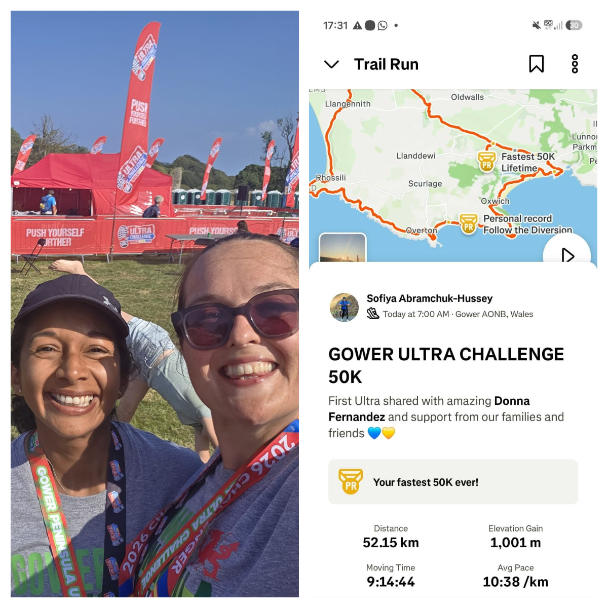

Today, in this summer heat — so very un-Welsh! — <a href="https://www.facebook.com/sofiya.abramchukhussey/" target="_blank">Sofiya Abramchuk-Hussey</a> conquered the <a href="https://www.ultrachallenge.com/gower-peninsula-challenge/" target="_blank">Ultra Challenge</a>: a 50 km marathon!

<!--more-->

The Gower Peninsula...

Steep, rugged trails, treeless hills and a scorching sun...

She ran it. She conquered it!!!

With faith in our shared Victory! 🇺🇦

Thank you to everyone who supported her, and to everyone helping our Ukraine as it fights a bloody war against the Moscow occupier! We are sincerely grateful for your help and support! 💪

And once again we have proved:

Together, we are strong! 💙💛

We have already raised **£1000**!
 

