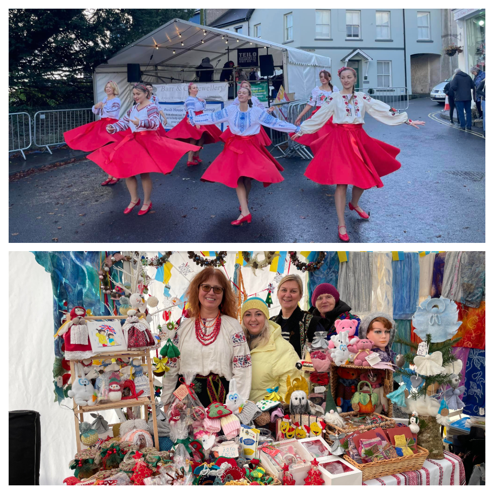
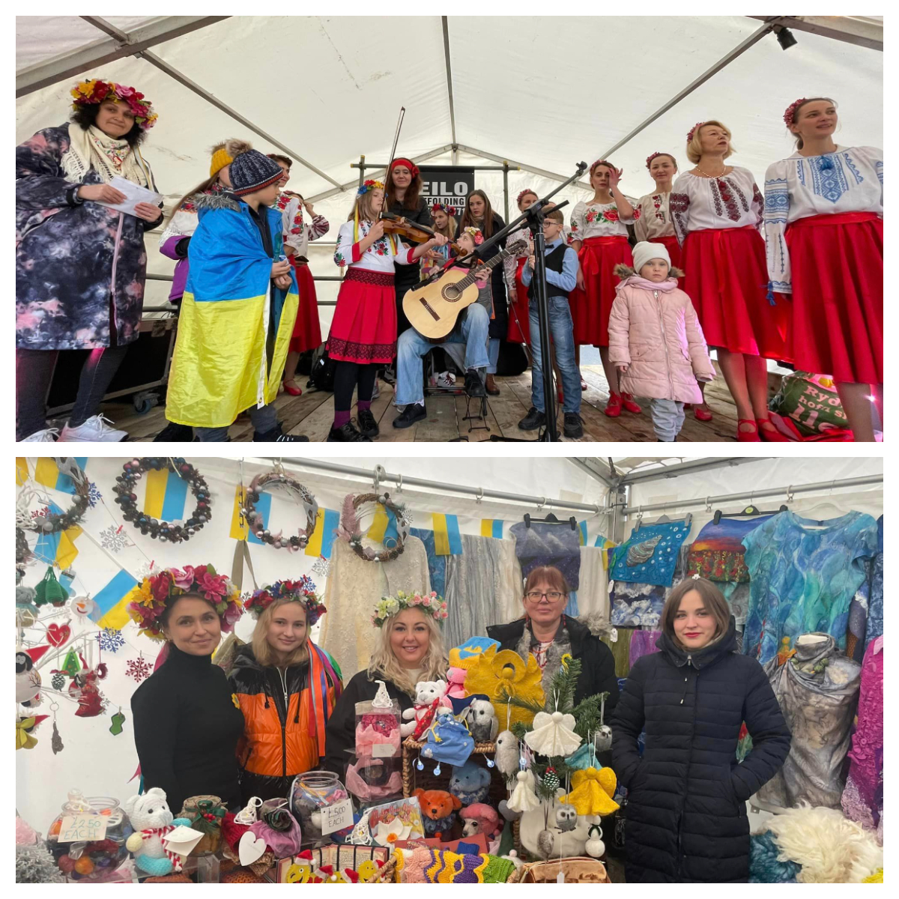
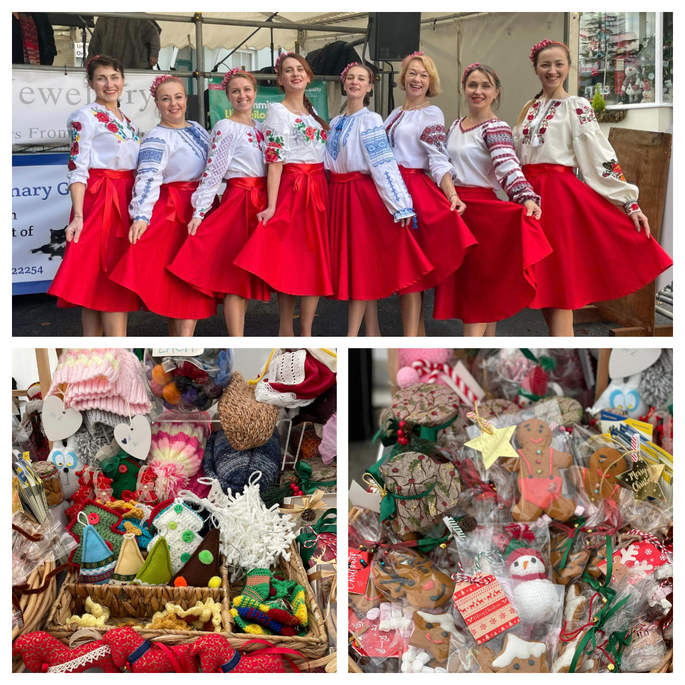
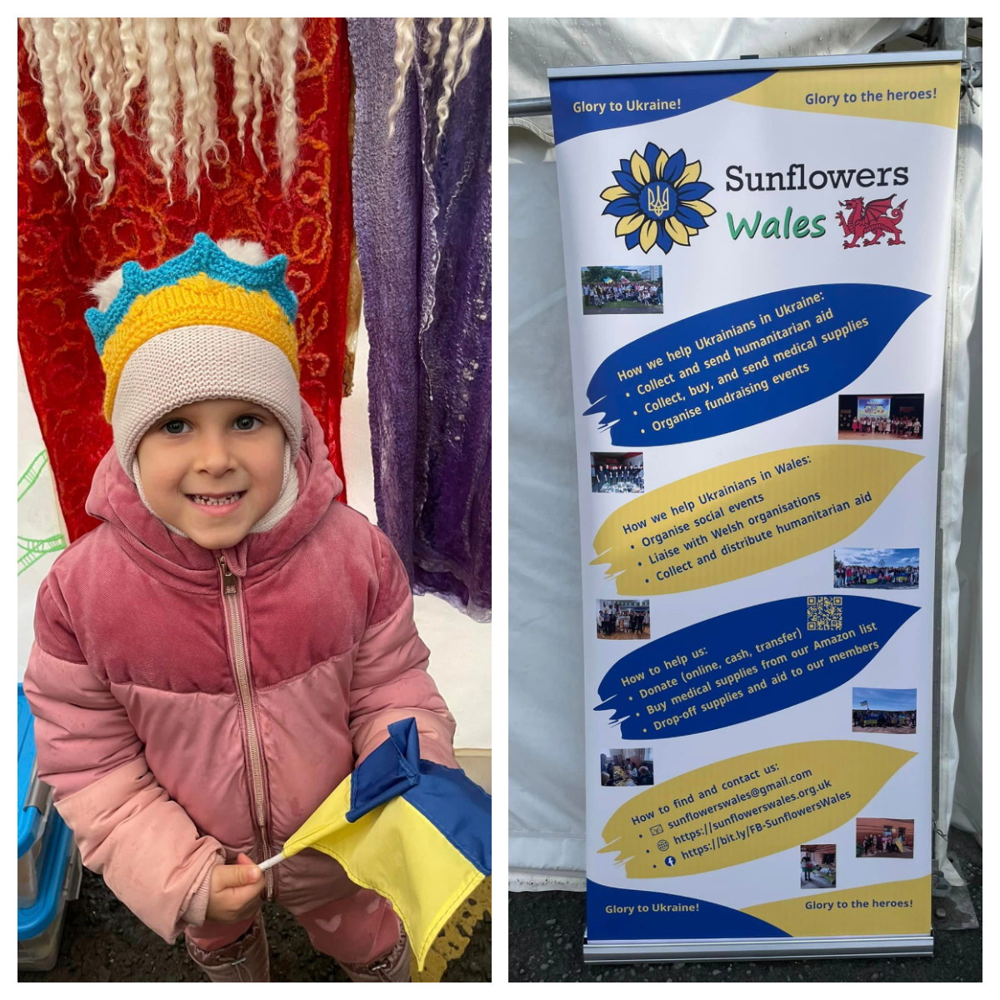

This year Llandeilo <a href="https://fos.wales/" target="_blank">Festival of Senses</a> was even more colourful --- Ukrainians came into town! 😃 

<!--more-->

Our members during three days were introducing guests of festival to Ukrainian culture!

We’ve raised more then £1500 and had a great time!

Thank you to everybody who was knitting, crocheting, baking, drawing, making toys, selling, dancing, singing carols!!!! 🙏

Thank you to Welsh people for great support, kindness and help.

Special Thank you from all of us as a group to <a href="https://www.facebook.com/christophffischer" target="_blank">Christoph Fischer</a>!!! 
He is our truly great friend! ❤️

Diolch yn fawr!

Nadolig Llawen!

 

