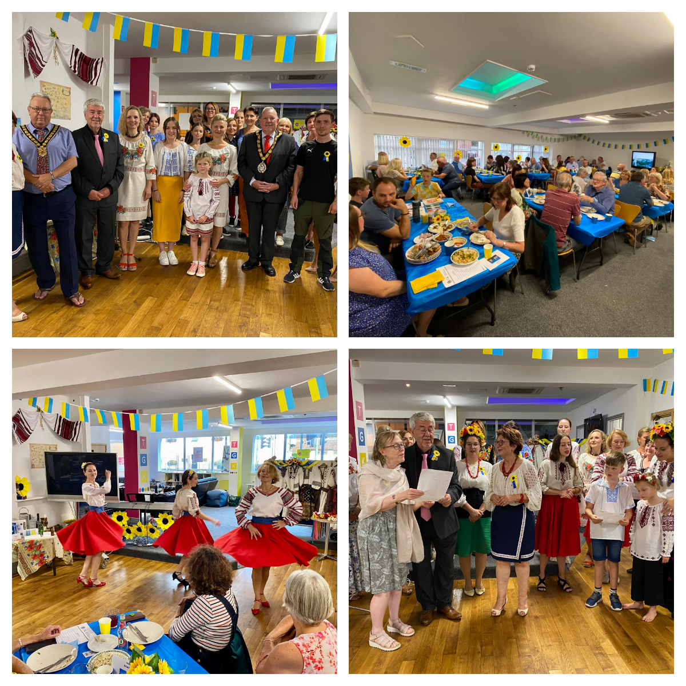
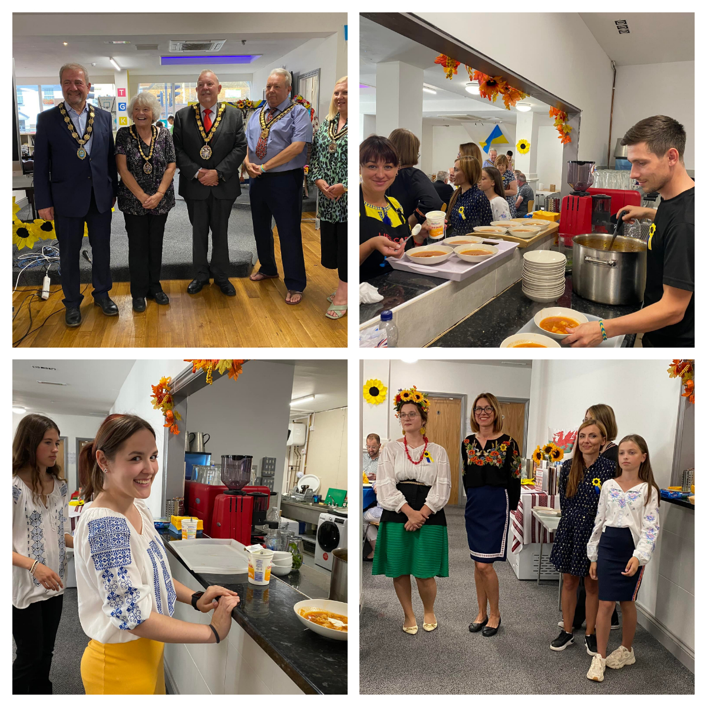
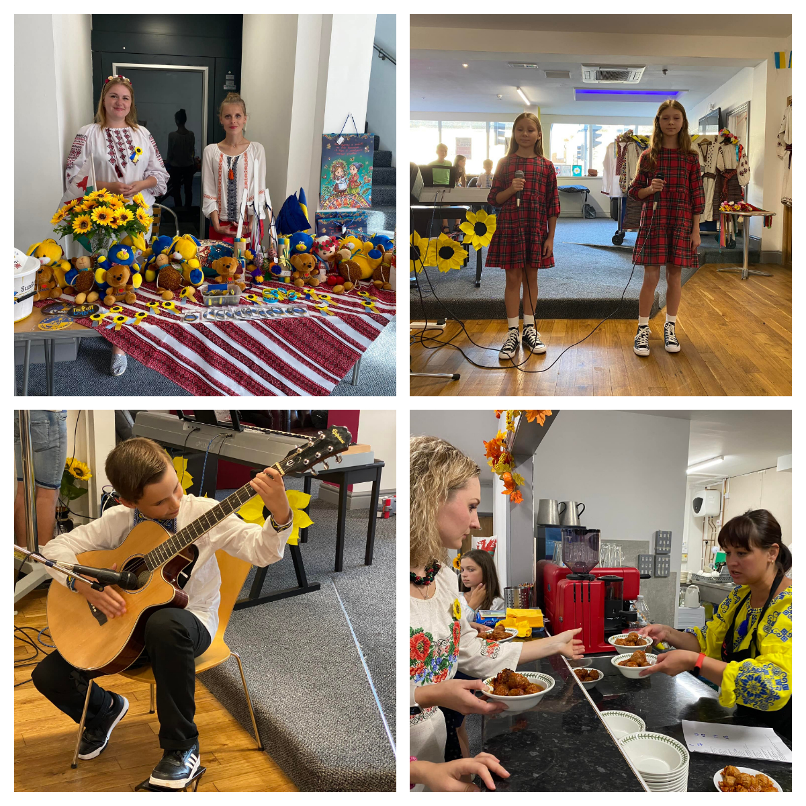
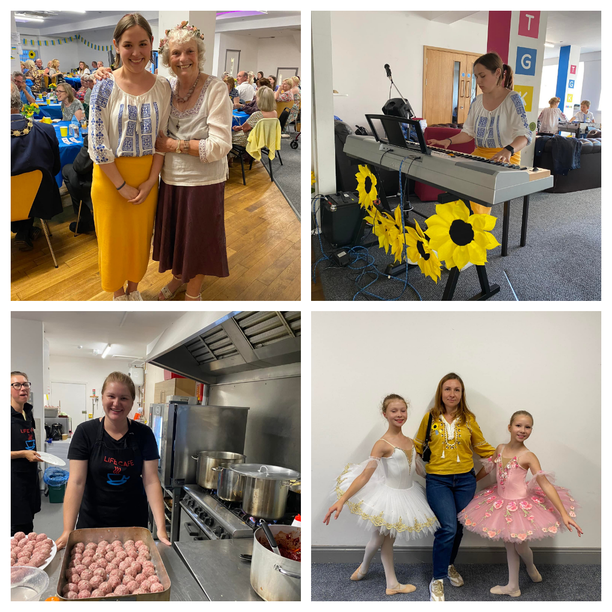

Sunflowers Wales hosted a sold-out Taste of Ukraine evening at Ty Gwyn Community Church. 

<!--more-->

We raised £3076.96, which will be used to buy medical supplies and to send humanitarian aid to Ukraine. 
It was so special to welcome 120 guests and give them a snapshot of Ukrainian cuisine and culture. 

Of course, none of this would be possible without the fantastic help and support we had!

Thank you to Pastor Ben, <a href="https://www.facebook.com/groups/601579067497655/user/517633431/" target="_blank" rel="noopener noreferrer">Sam Hodgetts</a> and <a href="https://www.facebook.com/TyGwynChurch/" target="_blank" rel="noopener noreferrer">Tŷ Gwyn Community Church</a> community for allowing us to use their premises and equipment and being helpful and supportive. 

Thank you to Dashti Rashid <a href="https://www.facebook.com/groups/601579067497655/user/100058909853000/" target="_blank" rel="noopener noreferrer">Zabka mini supermarket</a> in Llanelli, for supplying delicious cold cuts of meat, ham and sausages! 

Thank you to our kind raffle prize donors:
<a href="https://www.facebook.com/parcyscarlets/" target="_blank" rel="noopener noreferrer">Parc y Scarlets</a>, <a href="https://www.facebook.com/diplomathotelwales/" target="_blank" rel="noopener noreferrer">The Diplomat Hotel, Restaurant & Spa, Llanelli</a>, <a href="https://www.facebook.com/groups/601579067497655/user/100060692783920/" target="_blank" rel="noopener noreferrer">Claire's Flowers 4 All Occasions</a>, <a href="https://www.facebook.com/ffoslasracecourse/" target="_blank" rel="noopener noreferrer">Ffos Las Racecourse</a>, <a href="https://www.facebook.com/marzanos/" target="_blank" rel="noopener noreferrer">Marzano's Caffe Bar</a>, <a href="https://www.facebook.com/groups/601579067497655/user/100063705573697/" target="_blank" rel="noopener noreferrer">AVO CAFE</a>, John Fronde (<a href="https://www.facebook.com/groups/601579067497655/user/100000727482581/" target="_blank" rel="noopener noreferrer">Zina Minimurzina</a>),Jane Griffiths 

Also, thank you for the support from <a href="https://www.facebook.com/groups/601579067497655/user/100005157739273/" target="_blank" rel="noopener noreferrer">Llanelli CommunityPartnership</a>, <a href="https://www.facebook.com/groups/601579067497655/user/640042670/" target="_blank" rel="noopener noreferrer">Paolo Piana</a>, <a href="https://www.facebook.com/groups/601579067497655/user/100064946041490/" target="_blank" rel="noopener noreferrer">Cyngor Sir Gâr - Carmarthenshire County Council</a>, Llanelli Town Council, <a href="https://www.facebook.com/groups/601579067497655/user/100067062548972/" target="_blank" rel="noopener noreferrer">Pembrey Burry Port Town Council</a>. 

Our heartfelt thank you goes to our new Ukrainian families! Everyone worked so hard and gave their all! From cooking to serving to decorating, to cleaning and of course singing, dancing and playing musical instruments! Absolutely bursting with pride and admiration for everyone one of them!

<a href="https://www.facebook.com/groups/601579067497655/user/100005563908626/" target="_blank" rel="noopener noreferrer">Igor Khomov</a>, <a href="https://www.facebook.com/groups/601579067497655/user/100010140852854/" target="_blank" rel="noopener noreferrer">Боднарчук Ірина</a>, <a href="https://www.facebook.com/groups/601579067497655/user/100022883122623/" target="_blank" rel="noopener noreferrer">Таня Карнаух</a> and daughter Nika, <a href="https://www.facebook.com/groups/601579067497655/user/100000435325989/" target="_blank" rel="noopener noreferrer">Kateryna Nerush-Laktyonova</a> and son Ilya, <a href="https://www.facebook.com/groups/601579067497655/user/100009919216659/" target="_blank" rel="noopener noreferrer">Полина Трифонова</a>, <a href="https://www.facebook.com/groups/601579067497655/user/100012841634455/" target="_blank" rel="noopener noreferrer">Alena Bykovchenko</a>, <a href="https://www.facebook.com/groups/601579067497655/user/100002425518234/" target="_blank" rel="noopener noreferrer">Галина Чухно</a> and mother Lena, <a href="https://www.facebook.com/groups/601579067497655/user/100009204770664/" target="_blank" rel="noopener noreferrer">Tetiana Mydza-Obukhovska</a> and sons Danik and Arsen, <a href="https://www.facebook.com/groups/601579067497655/user/100000872378105/" target="_blank" rel="noopener noreferrer">Ann Kotovets</a> and daughter Anastasia, <a href="https://www.facebook.com/groups/601579067497655/user/100014563804797/" target="_blank" rel="noopener noreferrer">Аня Литвиненко</a> and daughter Valeria, Halyna Hrabovska, <a href="https://www.facebook.com/groups/601579067497655/user/1833868299/" target="_blank" rel="noopener noreferrer">Marina Avdzhy</a>, <a href="https://www.facebook.com/groups/601579067497655/user/100013523310564/" target="_blank" rel="noopener noreferrer">Mariia Zalutska</a> and daughter Vitalina, <a href="https://www.facebook.com/groups/601579067497655/user/100007102721701/" target="_blank" rel="noopener noreferrer">Залуцька Христина</a>, <a href="https://www.facebook.com/groups/601579067497655/user/100006338559946/" target="_blank" rel="noopener noreferrer">Tatyana Marshtupa</a>, <a href="https://www.facebook.com/groups/601579067497655/user/100002198745639/" target="_blank" rel="noopener noreferrer">Галина Андрушина</a> and daughters Anya and Katya, <a href="https://www.facebook.com/groups/601579067497655/user/100035244510941/" target="_blank" rel="noopener noreferrer">Елена Пролина</a>, Olya, Yulia and Ania.

And also our local sunflowers: <a href="https://www.facebook.com/groups/601579067497655/user/1488936646/" target="_blank" rel="noopener noreferrer">Bohdana Bahlay</a>, <a href="https://www.facebook.com/groups/601579067497655/user/539659438/" target="_blank" rel="noopener noreferrer">Marianna Horokhivska-John</a>, <a href="https://www.facebook.com/groups/601579067497655/user/100002570886095/" target="_blank" rel="noopener noreferrer">Sofiya Abramchuk-Hussey</a>, <a href="https://www.facebook.com/groups/601579067497655/user/100001342691071/" target="_blank" rel="noopener noreferrer">Oksana Harries</a>, <a href="https://www.facebook.com/groups/601579067497655/user/100004189091446/" target="_blank" rel="noopener noreferrer">Ulyana Abramchuk</a>, <a href="https://www.facebook.com/groups/601579067497655/user/100009219208454/" target="_blank" rel="noopener noreferrer">Ana Abramchuk</a>, <a href="https://www.facebook.com/groups/601579067497655/user/100005384823760/" target="_blank" rel="noopener noreferrer">Oksana Shapovalova</a> and children Amelia, Max, Avalyn, Lydia, Vlad.

Together we are strong! We won't be defeated! 

Thank you to everyone who attended, your support is so important to us.

We are already thinking to do another Taste of Ukraine evening and hoping you will be able to join us again soon!

Thank you!

Diolch yn fawr!

Дякую!
    

 

