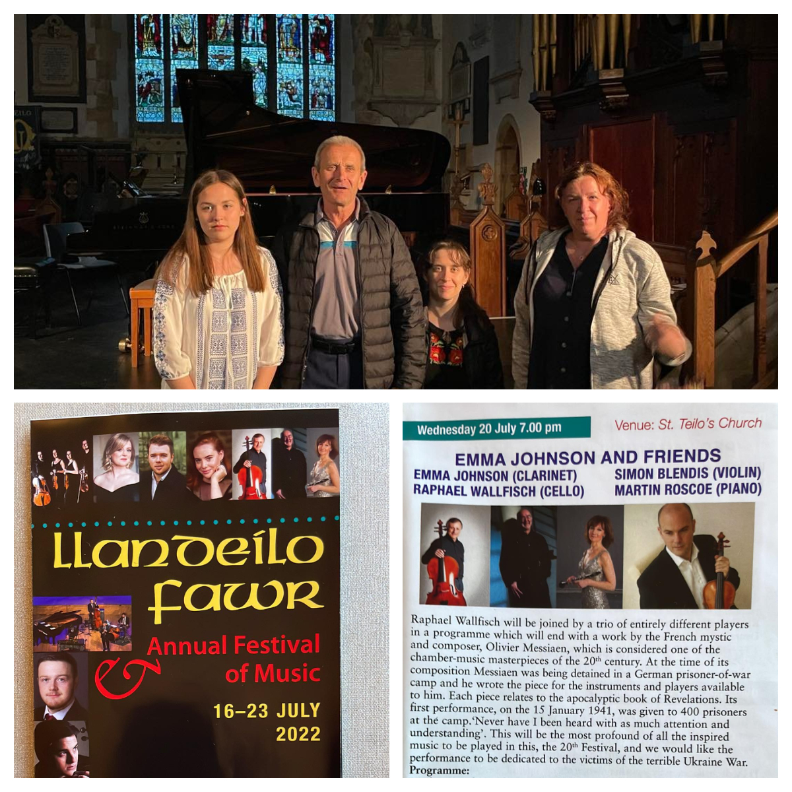

Wednesday <a href="http://www.llandeilomusicfestival.org.uk/programme/programme/wednesday20.html" target="_blank">Evening Concert</a> of the Llandeilo Music Festival 2022 was dedicated to the victims of the terrible Ukraine War. 

<!--more-->

From the concert webpage:

“Raphael Wallfisch will be joined by a trio of entirely different players in a programme which will end with a work by the French mystic and composer, Olivier Messiaen, which is considered one of the chamber-music masterpieces of the 20th century. At the time of its composition Messiaen was being detained in a German prisoner-of-war camp and he wrote the piece for the instruments and players available to him. Each piece relates to the apocalyptic book of Revelations. Its first performance, on the 15 January 1941, was given to 400 prisoners at the camp.‘Never have I been heard with as much attention and understanding’.”

