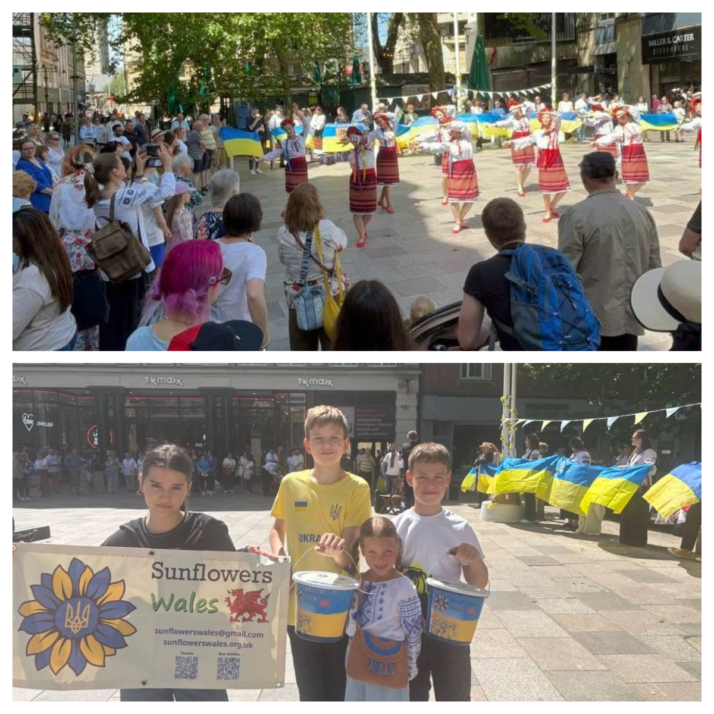

Today we celebrated Vyshyvanka Day in the centre of Cardiff.

<!--more-->

To be frank, this time we were a little nervous. Somewhere deep inside, there was a question: how would people respond to us? Would this event matter to them?

And once again, we were reminded that gatherings like this really do matter. They matter enormously.

Above all, it was an opportunity to say a sincere and heartfelt thank you to the people of Wales who opened their hearts to Ukrainians during the darkest of times. Thank you for supporting those who fled the war in 2022. Thank you for giving them safety, for your humanity, and for giving thousands of Ukrainian children the chance to live without the constant sound of air-raid sirens, explosions and fear.

It was also a wonderful example of cultural diplomacy. During the concert, people stopped, smiled, came over to talk, asked about the performances — and, most importantly, about Ukraine.

Our incredible young gymnasts and their performance featuring the map of Ukraine truly touched the hearts of passers-by. 

<a href="https://www.facebook.com/profile.php?id=61591909480036" target="_blank">Strings of Heart</a> — your medley made us want to sing, smile and simply enjoy being alive.

The Soloveyky Choir, <a href="https://www.facebook.com/nichola.bojczuk" target="_blank">Nichola Bojczuk</a>, <a href="https://www.facebook.com/profile.php?id=100009576666509" target="_blank">Ангелина Фе</a>, <a href="https://www.facebook.com/profile.php?id=100015631320433" target="_blank">Olena Kalianova</a>, <a href="https://www.facebook.com/profile.php?id=100021879950219" target="_blank">Людмила Павловская</a> — your singing gave us goosebumps. It moved people and brought us together.

<a href="https://www.facebook.com/profile.php?id=100088240741211" target="_blank">Clarke Alonzi</a> — a special and heartfelt thank you for your constant support, openness and wonderful performance.

And, of course, what would a Ukrainian celebration be without Ukrainian dance? Our Sunflowers can both touch your heart with the gentle Kalyna and bring so much energy with Palala that it is impossible to stay in your seat!

<a href="https://www.facebook.com/mick.antoniw" target="_blank">Mick Antoniw</a>, <a href="https://www.facebook.com/nick.wysoczanskyj" target="_blank">Nick Wysoczanskyj</a> — thank you for everything you do for Ukraine. Your presence, support and commitment mean a great deal to us.

And a very special thank you to every Ukrainian who put on their finest vyshyvanka, came along, brought friends, stood in the sunshine holding a Ukrainian flag — and helped create this day together with us.

We all know that for our soldiers on the frontline, life is incomparably harder. That is why supporting military medics remains one of our priorities.

The money raised by Sunflowers Wales during our Vyshyvanka Day celebration (**£315**) has already been transferred to volunteers in Ukraine. Those funds have already been used to provide essential medical supplies for the military.

Because for us, Vyshyvanka Day is not only about tradition or beautiful clothing. It is about memory, gratitude, unity and support. It is about the Ukraine we carry in our hearts — wherever we may be.

Thank you to everyone who was with us.



