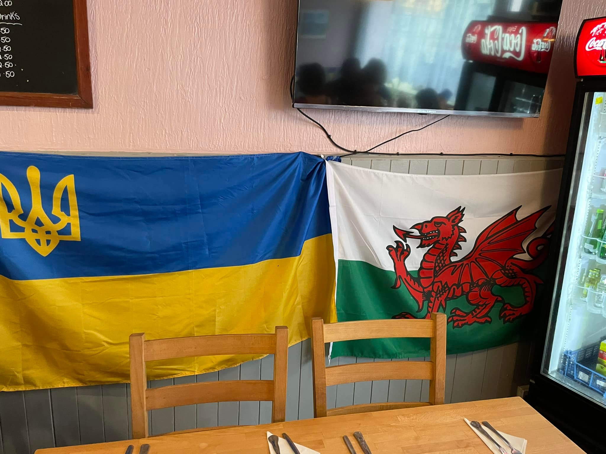

A great Ukrainian fundraising evening, organised by deputy mayor <a href="https://www.facebook.com/christophffischer" target="_blank">Christoph Fischer</a>. 

<!--more-->

There was raised £685, which were donated to **Sunflowers Wales**. 
Borshch and meet balls were cooked and cakes were baked  by our Ukrainian refugees, for whom Wales  became a safe haven  from war.

By such an acts of support we can carry on helping Ukrainians. War is still raging in my country. Help still needed: from money, kindly donated by Welsh communities, - to anti rocket launches sent to Ukraine by British government!

Hope, we will do it again!

Diolch yn fawr!

