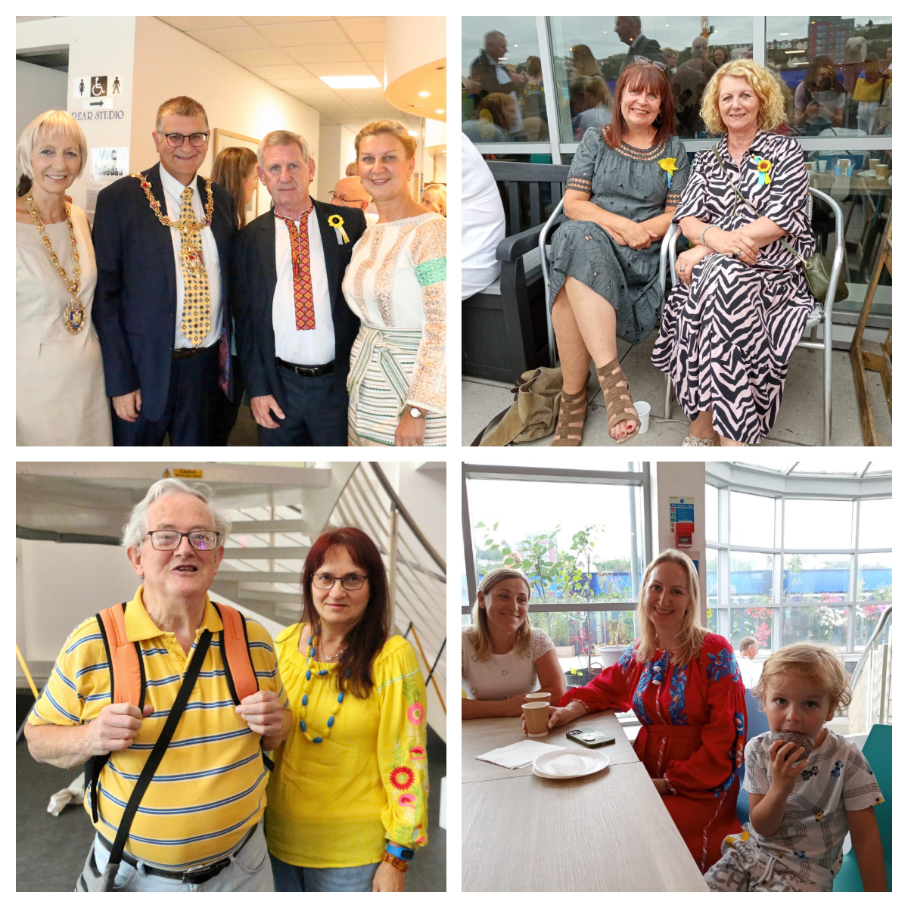
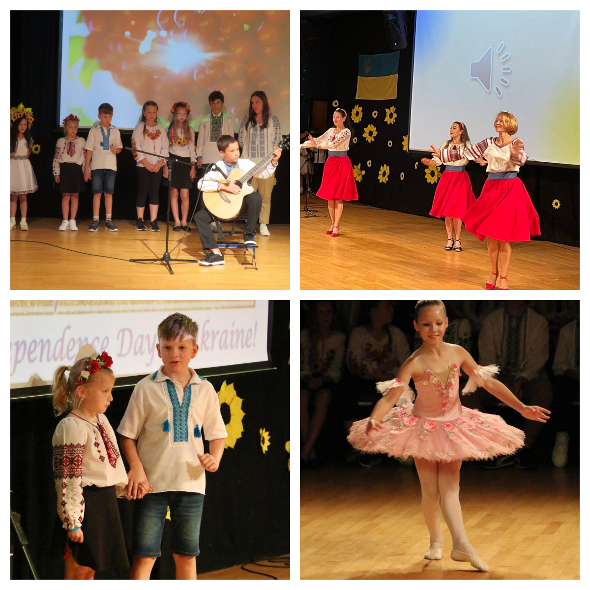
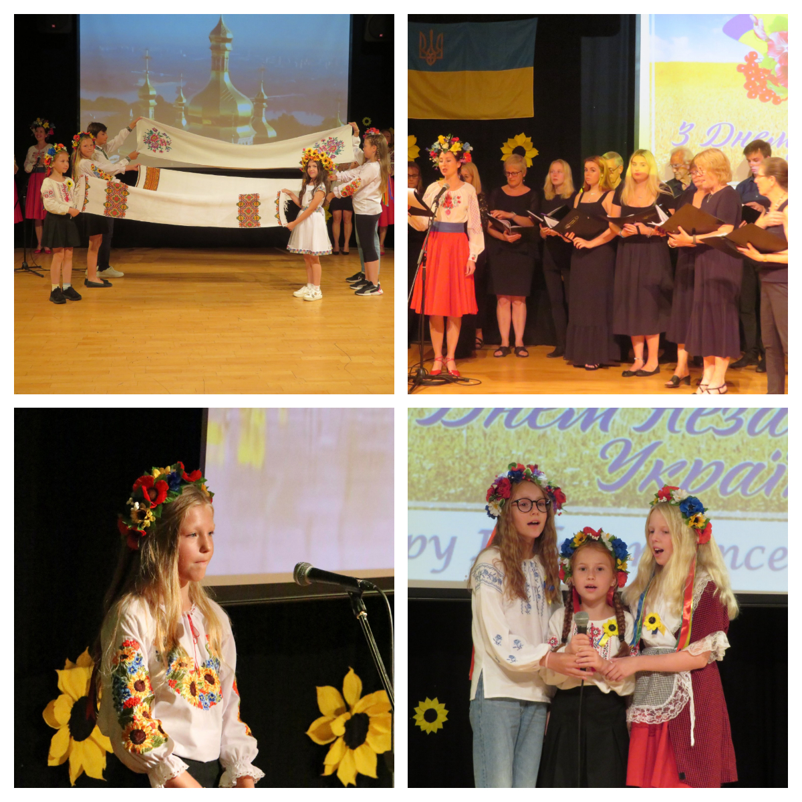

An incredible celebration of the Independence Day of Ukraine was on Wednesday, 24 August, at the Arts Wing of the Swansea Grand Theatre!

<!--more-->

Sunflowers Wales invited friends, and the friends came!

We are happy that our guests enjoyed conversations, photo sessions, delicious Ukrainian cakes, fascinating Ukrainian souvenirs and authentic clothes, live grand piano and violin music, craft activities and, of course, the Concert!

We were delighted to welcome <a href="https://www.facebook.com/groups/601579067497655/user/602618033/" target="_blank">Mike Day</a> and Chris Day, <a href="https://www.facebook.com/groups/601579067497655/user/523168694/" target="_blank">Nia Griffith</a>, <a href="https://www.facebook.com/groups/601579067497655/user/679067131/" target="_blank">Christoph Fischer</a>, Helen Clancy, Nicola Furlo, <a href="https://www.facebook.com/groups/601579067497655/user/100000423078676/" target="_blank">David Rees</a>, Stephanie Grimshaw, Susanne Renkes, Issa Farfour, Julia Jones, <a href="https://www.facebook.com/groups/601579067497655/user/1125671480/" target="_blank">Rachel Morris</a>, <a href="https://www.facebook.com/groups/601579067497655/user/710684362/" target="_blank">Chris Perry</a>, <a href="https://www.facebook.com/groups/601579067497655/user/100003343497933/" target="_blank">John Mansfield</a>, Marian Sturrock, <a href="https://www.facebook.com/groups/601579067497655/user/640042670/" target="_blank">Paolo Piana</a>, <a href="https://www.facebook.com/groups/601579067497655/user/100003498257397/" target="_blank">Andrew Bruce</a>, Tracy Jones, Andrew and Sarah Vye, <a href="https://www.facebook.com/groups/601579067497655/user/100001219661180/" target="_blank">Aneta Malachowska</a> and Daniel Stefanowicz, <a href="https://www.facebook.com/groups/601579067497655/user/100001931433543/" target="_blank">Nicky Dutton</a>, Sally Hallett, <a href="https://www.facebook.com/groups/601579067497655/user/1258741749/" target="_blank">Beverley Carver</a>, Catherine Mary Whittaker, Kay Denver, <a href="https://www.facebook.com/groups/601579067497655/user/1236805362/" target="_blank">Uzo Iwobi</a>.

We are very thankful to Phil Orrin and Mumbles A Cappella for amazing songs and the huge support you provided, and for helping our Ukrainian choir to sound really Welsh with the Sospan Fach! Many thanks to Irfon Higgins for the exquisite saxophone solos!

Many thanks to <a href="https://www.facebook.com/groups/601579067497655/user/100006338559946/" target="_blank">Tatyana Marshtupa</a>, our creative director, who also acted as a perfect compere together with <a href="https://www.facebook.com/groups/601579067497655/user/1488936646/" target="_blank">Bohdana Bahlay</a>, and as a beautiful dancer together with <a href="https://www.facebook.com/groups/601579067497655/user/100005384823760/" target="_blank">Oksana Shapovalova</a> and <a href="https://www.facebook.com/groups/601579067497655/user/100002059226749/" target="_blank">Ольга Юрьевна</a>!

Our amazing kids, Alisa and Ruslan, Anna and Kateryna, Illya and Solomiya, Vlada and Zlata and Helisent, Lidia and Vlad — you all were incredible!

<a href="https://www.facebook.com/groups/601579067497655/user/100012841634455/" target="_blank">Alena Bykovchenko</a> created a great musical atmosphere for all during the first part of the event, and she amazed us with a touching piano performance at the concert. Irina Bradley presented us with a memorable and professional dance.

The members of our community group, <a href="https://sunflowerswales.org.uk/" target="_blank">Sunflowers Wales</a>, did extraordinary work! Many thanks to <a href="https://www.facebook.com/groups/601579067497655/user/1488936646/" target="_blank">Bohdana Bahlay</a>, <a href="https://www.facebook.com/groups/601579067497655/user/100001342691071/" target="_blank">Oksana Harries</a>, <a href="https://www.facebook.com/groups/601579067497655/user/100005384823760/" target="_blank">Oksana Shapovalova</a>, <a href="https://www.facebook.com/groups/601579067497655/user/542897591/" target="_blank">Christina Evans</a>, <a href="https://www.facebook.com/groups/601579067497655/user/100008110478133/" target="_blank">Vladimir Pavliichuk</a> and <a href="https://www.facebook.com/groups/601579067497655/user/100003694771659/" target="_blank">Victoria Pavliychuk</a>, <a href="https://www.facebook.com/groups/601579067497655/user/100002570886095/" target="_blank">Sofiya Abramchuk-Hussey</a>, <a href="https://www.facebook.com/groups/601579067497655/user/100004189091446/" target="_blank">Ulyana Abramchuk</a>, <a href="https://www.facebook.com/groups/601579067497655/user/100009219208454/" target="_blank">Ana Abramchuk</a>, <a href="https://www.facebook.com/groups/601579067497655/user/100001687011241/" target="_blank">Svetlana Lilley</a>, <a href="https://www.facebook.com/groups/601579067497655/user/539659438/" target="_blank">Marianna Horokhivska-John</a>, <a href="https://www.facebook.com/groups/601579067497655/user/1014742862/" target="_blank">Ania Owen</a>, <a href="https://www.facebook.com/groups/601579067497655/user/1075586456/" target="_blank">Olena Samsonenko</a>, <a href="https://www.facebook.com/groups/601579067497655/user/100003706749621/" target="_blank">Nataliya McDyer</a>, and of course, Maxim and Amelia! We did it, people!

Many thanks to the Ukrainians we met this year, and who became our good friends! Your work with baking, decoration, kitchen, stalls, and stage was perfect! Thank you <a href="https://www.facebook.com/groups/601579067497655/user/100012841634455/" target="_blank">Alena Bykovchenko</a>, <a href="https://www.facebook.com/groups/601579067497655/user/1833868299/" target="_blank">Marina Avdzhy</a>, <a href="https://www.facebook.com/groups/601579067497655/user/1233606156/" target="_blank">Olga Nagornaya</a>, <a href="https://www.facebook.com/groups/601579067497655/user/100051810405490/" target="_blank">Анна Бывальцева</a>, Виктория Зотова, <a href="https://www.facebook.com/groups/601579067497655/user/100002198745639/" target="_blank">Галина Андрушина</a>, <a href="https://www.facebook.com/groups/601579067497655/user/100002425518234/" target="_blank">Галина Чухно</a>, <a href="https://www.facebook.com/groups/601579067497655/user/100022883122623/" target="_blank">Таня Карнаух</a>, <a href="https://www.facebook.com/groups/601579067497655/user/100029269173459/" target="_blank">Татьяна Быковченко</a>, <a href="https://www.facebook.com/groups/601579067497655/user/100000435325989/" target="_blank">Kateryna Nerush-Laktyonova</a>, Pochasova Alena, <a href="https://www.facebook.com/groups/601579067497655/user/100010140852854/" target="_blank">Боднарчук Ірина</a>, <a href="https://www.facebook.com/groups/601579067497655/user/100002563734278/" target="_blank">Irina Bliznova</a>, and we we have not mentioned all yet.

We are grateful to the Grand Multicultural HUB for hosting and supporting: Guy Keown, Kay Denyer, and <a href="https://www.facebook.com/groups/601579067497655/user/1236805362/" target="_blank">Uzo Iwobi</a> — you rock!

Last but not least, many thanks to all guests! We were all together on this great day! We will be proud to welcome you all in the future!

Stand with Ukraine!

Glory to Ukraine!

Glory to the heroes!

P.S. Despite it was not the main aim of the event, we were happy to fundraise £1010 that will be spent for nice activities (tba) for the members of <a href="https://www.facebook.com/groups/601579067497655" target="_blank">Sunflowers Wales (Соняшники)</a> who worked tirelessly making this event happen!

