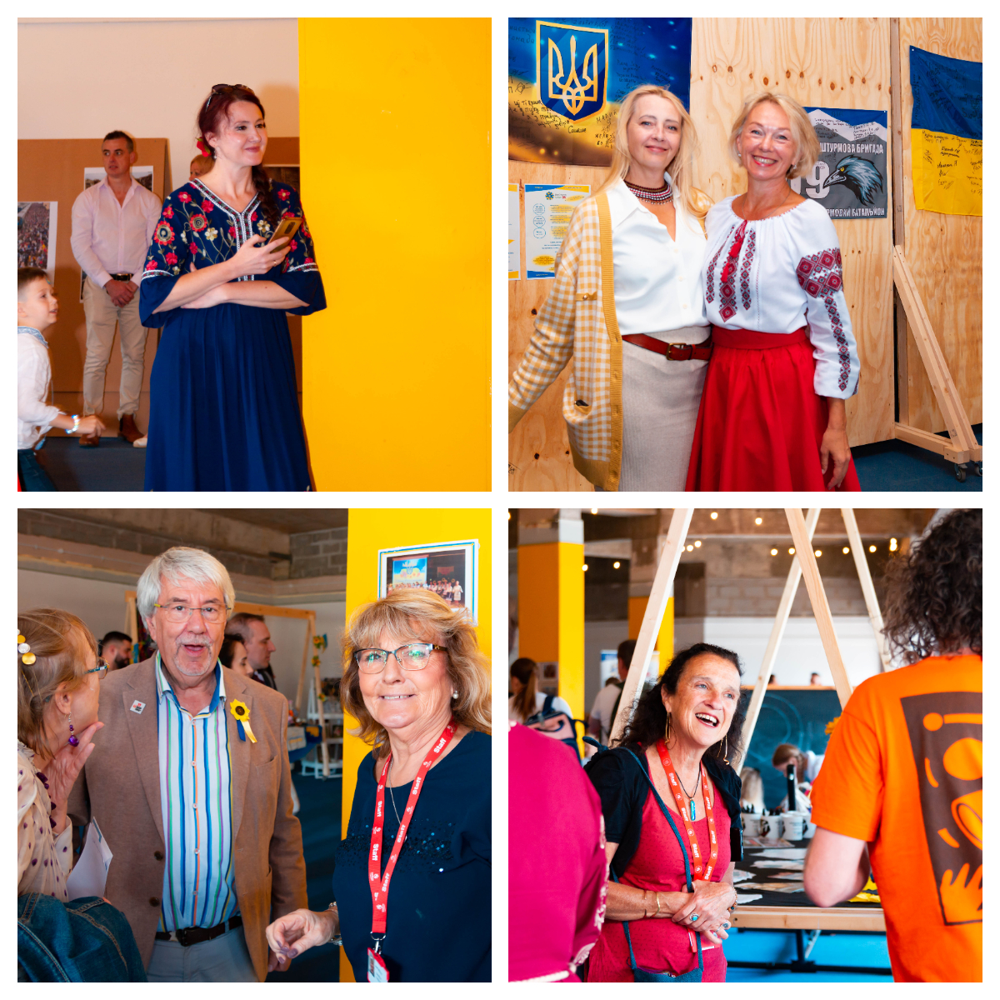

A great day at St David's Pl in Swansea City Centre!

<!--more-->

We are incredibly grateful to everyone who joined our celebration of the Independence Day of Ukraine! It was amazing to meet so many old and new friends there! 

We believe everyone could entertain themselves: music, songs, dances, Ukrainian food and souvenirs, exhibitions, information stalls, art class, craft, joggling, face painting, and playground. Our amazing children also played music, sang, danced, and read verses. 

Our Welsh friends gifted us with their professional performances, and we were proud to thank them with Yma o Hyd song!

It was a great event created by the efforts of the Sunflowers Wales team together with dozens of our Ukrainian and Welsh friends!

Thank you <a href="https://www.swansea.gov.uk/" target="_blank">Swansea Council</a> and <a href="https://wrc.wales/" target="_blank">Welsh Refugee Council</a> for the provided funding! And thank you <a href="https://www.urbanfoundry.co.uk/" target="_blank">Urban Foundry</a> for the kind hospitality!

Thank you all!

**We've raised over £1400!!!**

Glory to Ukraine!

Glory to the heroes!

    

        <iframe src="https://youtube.com/embed/0ozlLNJugLI?si=CNqrXJq6Ddv5xFdA" style="position: absolute; top: 0; left: 0; width: 100%; height: 100%;" frameborder="0" allow="accelerometer; autoplay; clipboard-write; encrypted-media; gyroscope; picture-in-picture" allowfullscreen></iframe>
    

