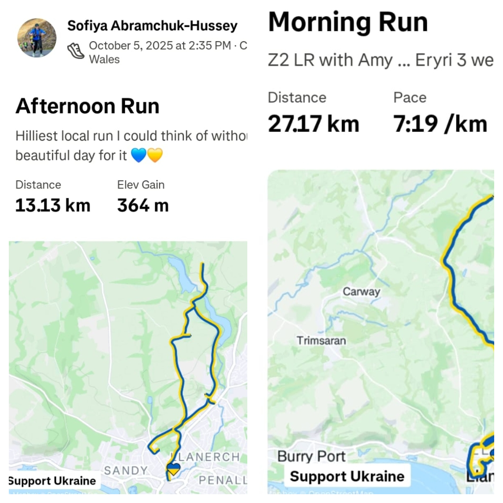
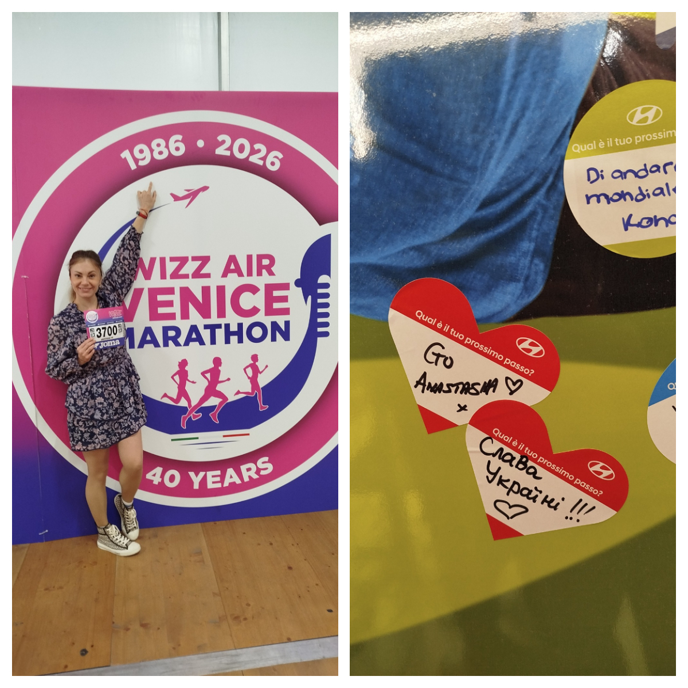
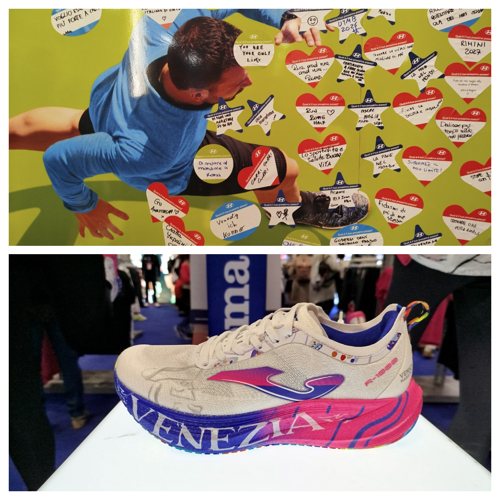
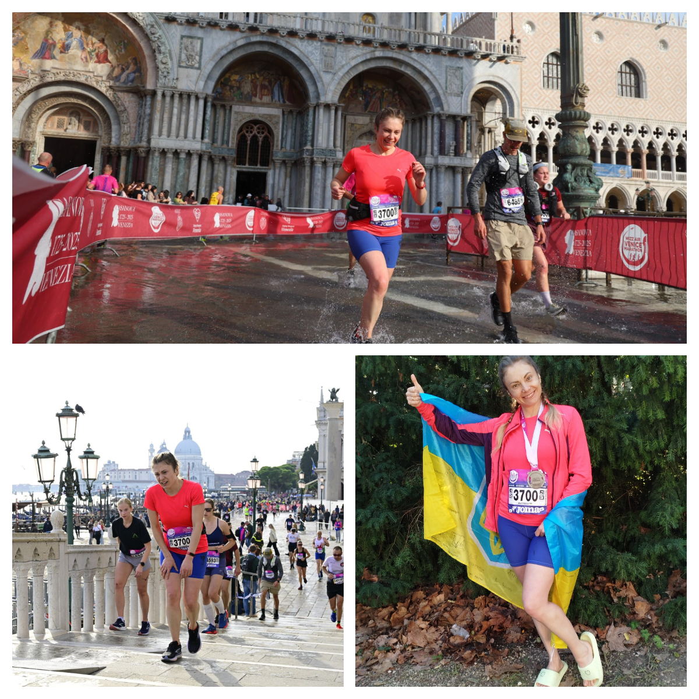

At the end of October, two amazing Ukrainian women ran marathons in different parts of Europe.

<!--more-->

They both were united by one goal: to raise funds for vital medical aid for Ukraine.

On 25 October, our incredible <a href="https://www.facebook.com/sofiya.abramchukhussey" target="_blank">Sofiya Abramchuk-Hussey</a> took on the Snowdon Eryri Marathon in North Wales — for the second year in a row. Despite harsh weather conditions — rain, hail, and cold winds — Sofiya kept going through the mountains of Snowdonia when many others had to stop. She finished the race soaked, frozen, but smiling. Her determination and strength became a powerful reminder that Ukrainians cannot be broken.

The very next day, 26 October, our wonderful young runner <a href="https://www.facebook.com/anastasia.opalatenko" target="_blank">Anastasiia Opalatenko</a> represented our community in the Wizz Air Venice Marathon in Italy. Running through the beautiful streets and bridges of Venice, she carried the same purpose in her heart — to help those in need back home. After finishing, Anastasiia shared her joy and gratitude: “It was not easy, but I knew why I was doing it. This motivation gave me strength and energy during the race. Together we are bringing this victory closer.”

We are immensely proud of both Sofiya and Anastasiia for their courage, endurance, and devotion. Their marathons were not just races — they were symbols of hope, resilience, and unity. Together, we have already fundraised over **£1500**!

Thank you to everyone who supported them and donated to help Ukraine. Together — we are strong! 💪💙💛

