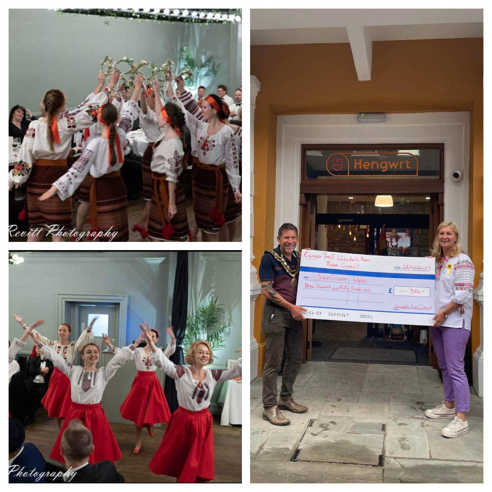
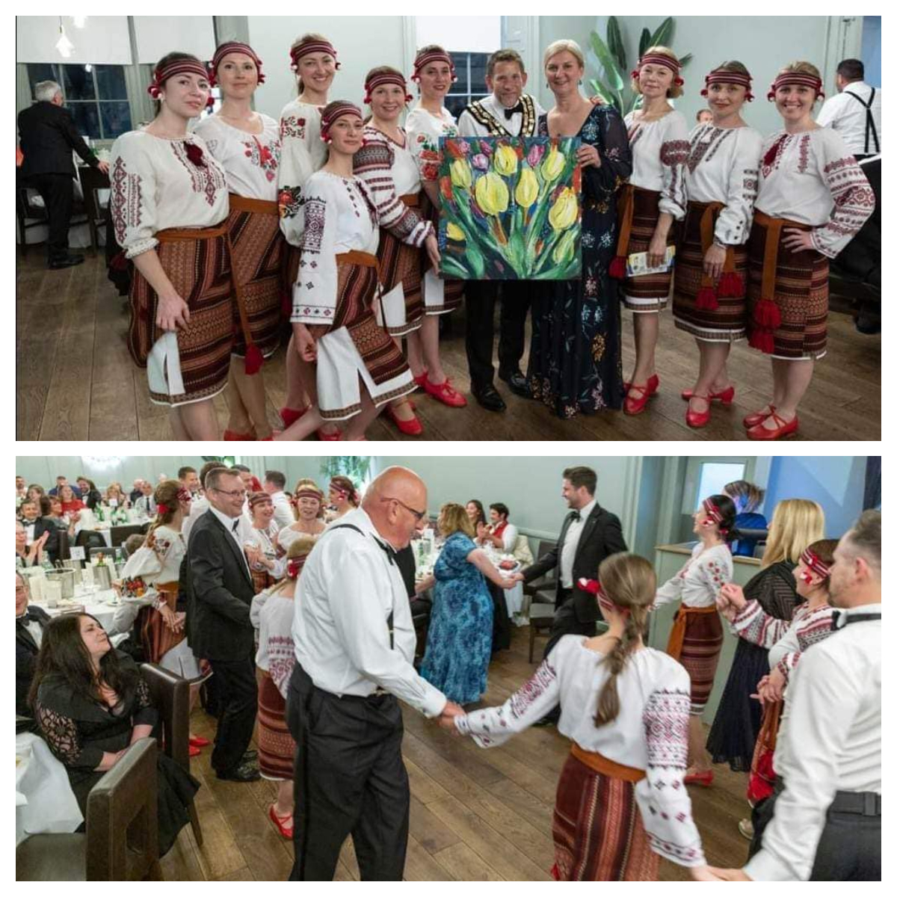
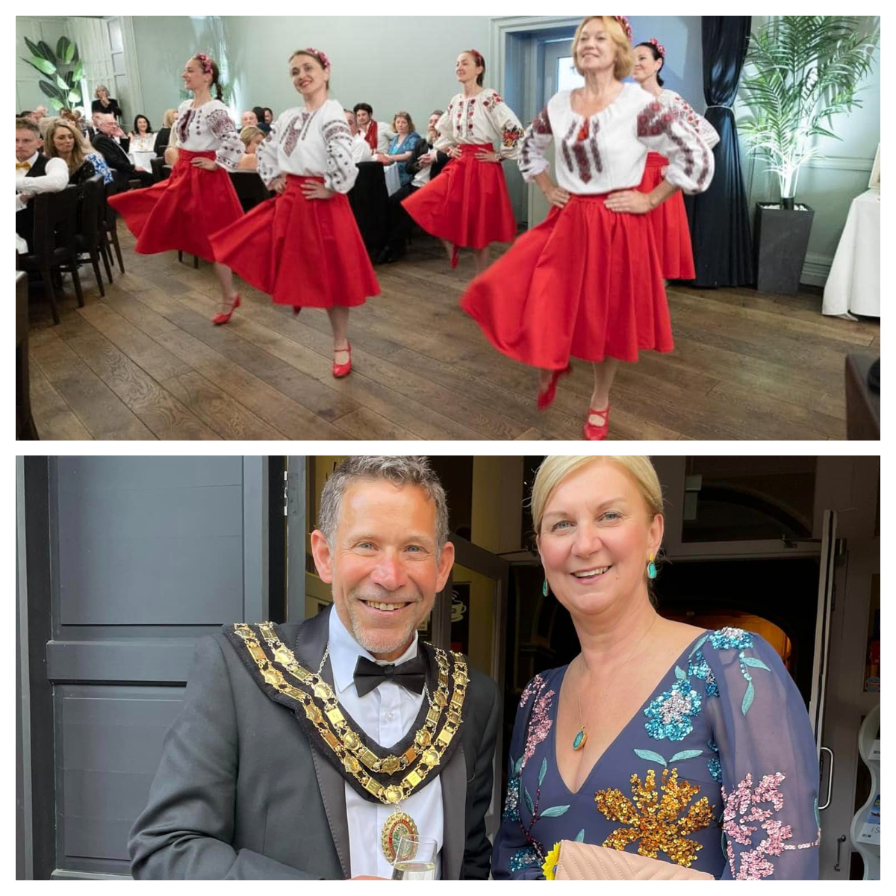

On the 26th of May, <a href="https://www.facebook.com/groups/601579067497655" target="_blank">Sunflowers Wales (Соняшники)</a> were honoured to take a part in Mayor making ceremony.

<!--more-->

<a href="https://www.facebook.com/christophffischer" target="_blank">Christoph Fischer</a>, our good friend with whose help we have raised almost £6000, became a Mayor of Llandeilo and he’s chosen us to be a Mayor’s charity!!!

It was a great night!

We felt privileged to be a part of such a celebration!!

And we hope with a help of newly elected Mayor and Llandeilo community we will raise more money to buy so much needed medical aid to our people in Ukraine!

Congratulations again and thank you very much, Christoph!

Later, we have received an impressive cheque for £950 from the hands of Mayor Christoph Fischer!
Along with money our dancers have collected we received in total of <b>£1218</b>!
Incredible!

As usual, the funds were used to purchase medical supplies for hospitals and paramedics on the frontline in Ukraine.

Together we strong!

Diolch o’r galon!

PS Thank you <a href="https://www.facebook.com/groups/601579067497655/user/100001259015536" target="_blank">Mark Revitt</a> for beautiful pictures.

And thank you to Ukrainian artist <a href="https://www.facebook.com/groups/601579067497655/user/100006019834030" target="_blank">Mila Kuzmenko</a> for a beautiful painting we’ve presented to Christoph

