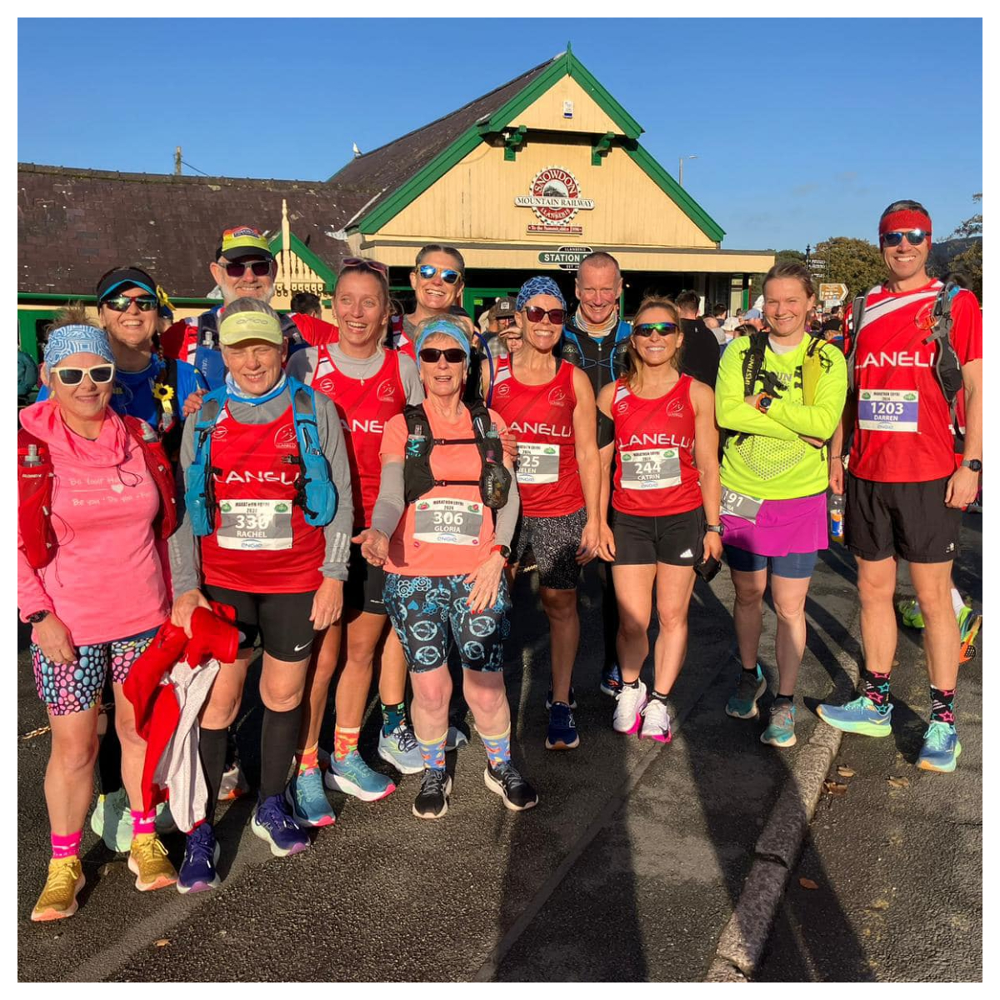
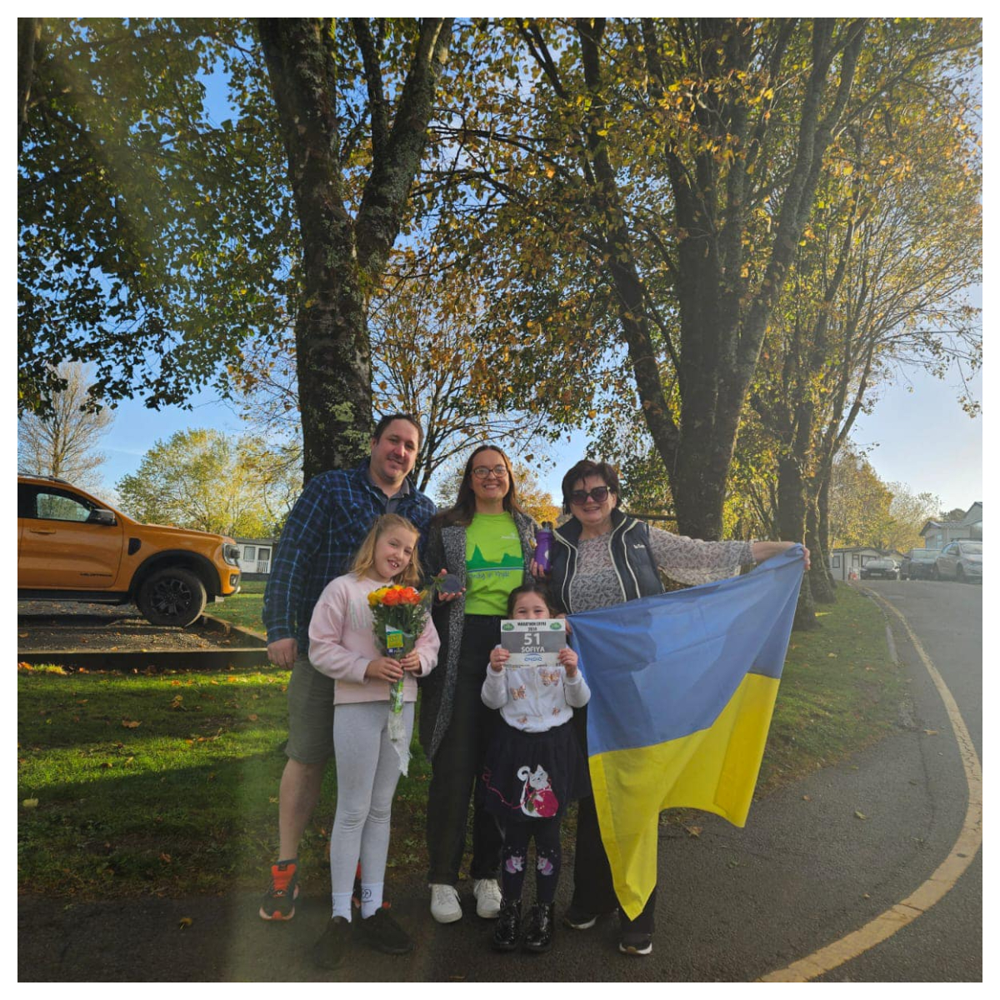
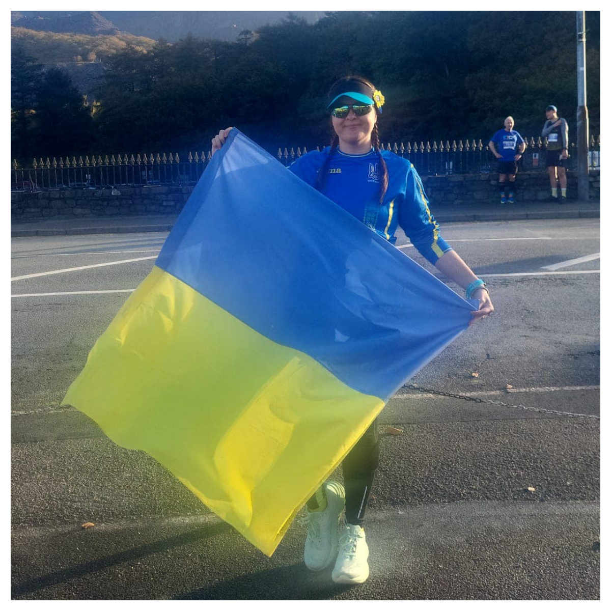

We are so proud of our amazing member Sofiya Abramchuk-Hussey for completing the Snowdon Marathon in an incredible 5 hours and 10 minutes! 🎉

<!--more-->

Not only did she conquer the marathon, but she also raised over £1000 for Sunflowers Wales supporting the Ukrainian people! 🇺🇦🌻

There’s still time to show your support and help make a difference—every donation counts! Let’s keep the momentum going! 💪 <a href="https://www.gofundme.com/f/first-marathon-to-support-ukraine-via-sunflowers-walesth" target="_blank">Fundraising link</a>

Sunflowers Wales – Standing Strong Together!

