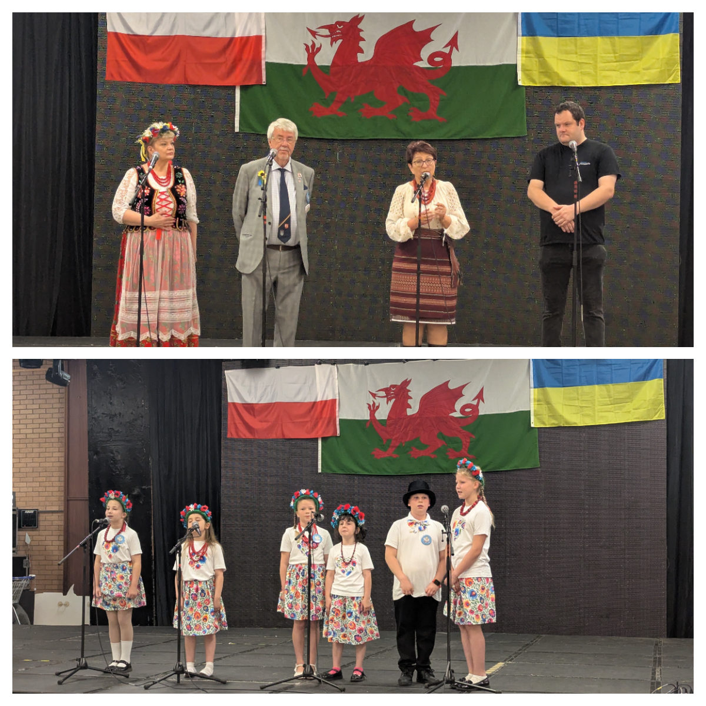
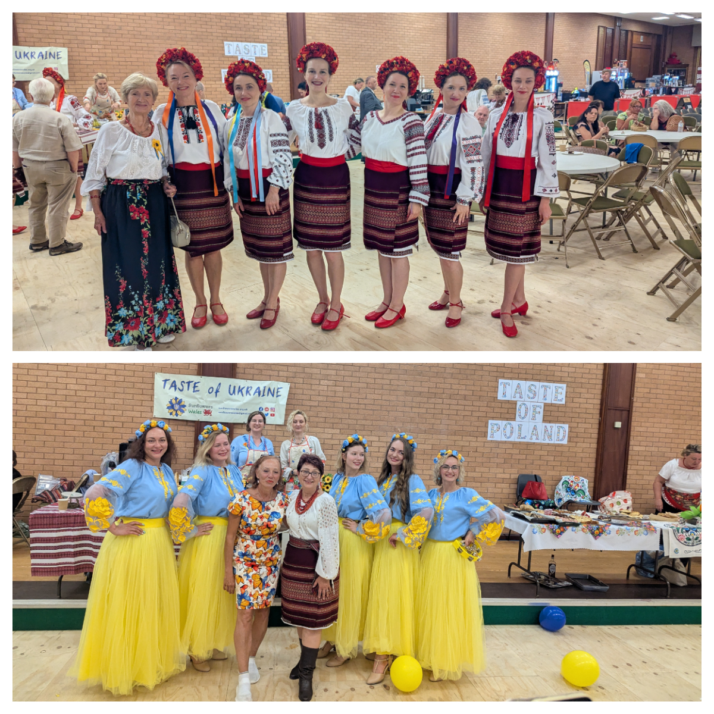
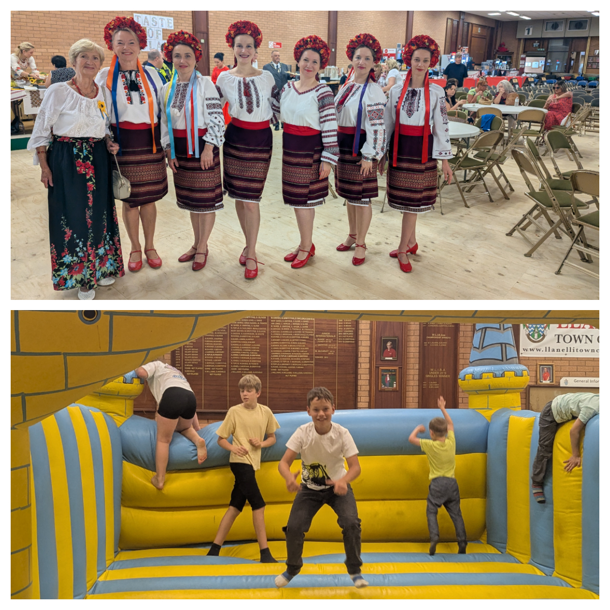
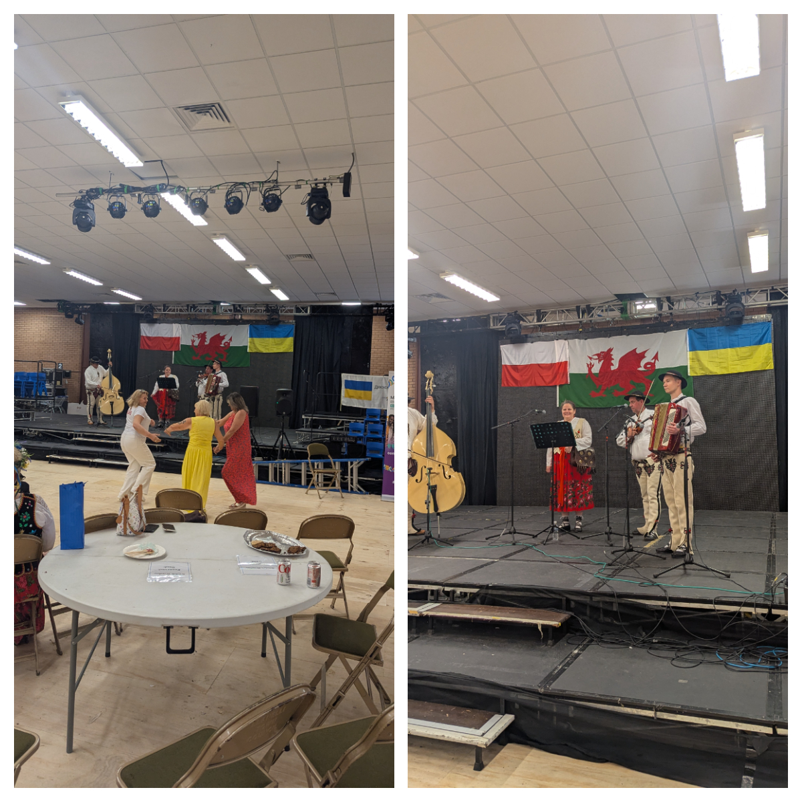
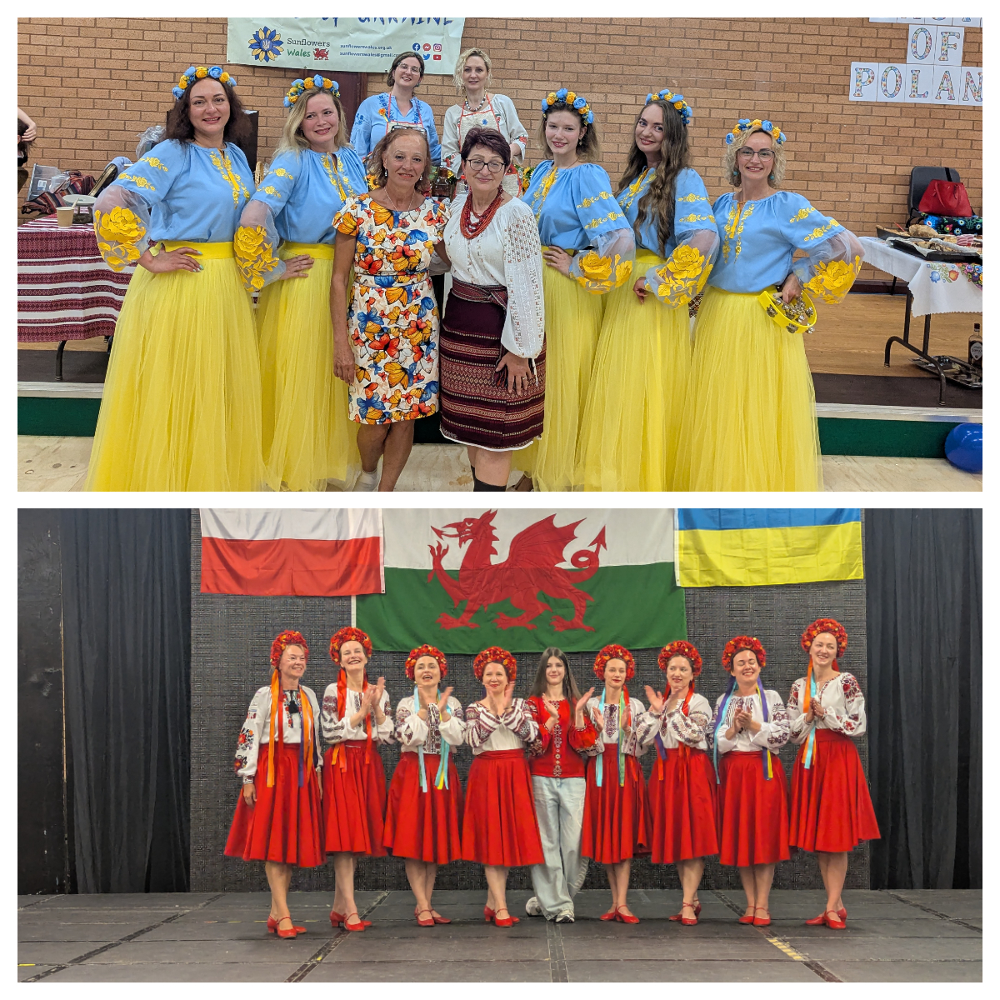
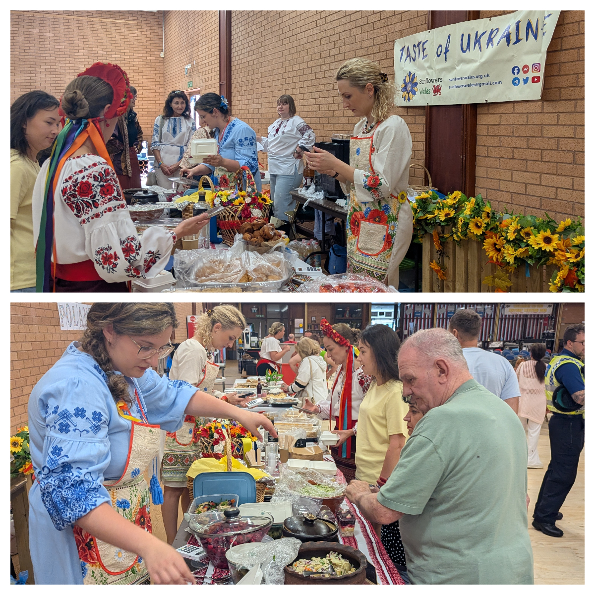

Today our hearts are so full. 💛💙 🤍❤️

<!--more-->

We spent this beautiful day at the Selwyn Samuel Centre in Llanelli, at a wonderful Welsh-Polish-Ukrainian community event — and what a day it was.

The Centre was alive in the best possible way. Children cheered with joy on the bouncy castle, little hands were busy colouring and crafting, and the air was filled with the most incredible smells from the Ukrainian and Polish food stalls. People kept coming back for more — and honestly, who could blame them? 😉

Around the room, information boards and national decorations from both communities reminded us of how rich and beautiful our traditions are.

And the stage! Spacious, with sound that was set up just perfectly. Performances flowed one after another — dances, songs, instruments, children and adults, all pouring their hearts out.

Our Ukrainian dancers from Sunflowers Wales were breathtaking as always. The audience was simply amazed.  And our rising star, young Eva — she sang with such confidence and such flowing emotion that the whole room felt it. We are so proud of her.

The Polish performances were so joyful and infectious — the community joined in, dancing and singing together. That moment said everything.

Our dear friends from Cardiff, the incredible Ukrainian band <a href="https://www.facebook.com/profile.php?id=61591909480036" target="_blank">Strings of Heart</a>, sang as beautifully and powerfully as ever. Their acapella sent shivers down our spines, and before long so many of us were on our feet, joining hands and dancing. There is nothing quite like music that does that to you. 🎶

And then — the Welsh school band closed the evening and absolutely stole everyone's hearts. So impressive, so mature, and yet so full of youthful energy. A proper finale. 🏴󠁧󠁢󠁷󠁬󠁳󠁿

Sunflowers Wales raised almost **£800** today! We still can't quite believe it. Every single penny will go towards buying medical supplies for Ukrainian military paramedics and hospitals. Thank you from the bottom of our hearts to everyone who gave so generously. 💛💙

We are deeply grateful to <a href="https://www.facebook.com/paolo.piana.923" target="_blank">Paolo Piana</a>, <a href="https://www.facebook.com/joanna.drozdek.58" target="_blank">Joanna Drozdek</a>, <a href="https://www.facebook.com/oksana.chrinowsky" target="_blank">Oksana Harries</a>, <a href="https://www.facebook.com/profile.php?id=100004139050453" target="_blank">Llion Thomas</a> for organising this event, and <a href="https://www.facebook.com/profile.php?id=100005157739273" target="_blank">Llanelli CommunityPartnership</a> for constant support!

<a href="https://www.facebook.com/SelwynSamuelCentre" target="_blank">Selwyn Samuel Centre</a> for hospitality!

Thank you very much to everyone who helped to prepare the venue and made the treats!

<a href="https://www.facebook.com/galina.cuhno" target="_blank">Halyna Chukhno</a>, <a href="https://www.facebook.com/profile.php?id=100014563804797" target="_blank">Anya Lytvynenko</a>, <a href="https://www.facebook.com/ulyana.abramchuk" target="_blank">Ulyana Abramchuk</a>, <a href="https://www.facebook.com/christina.evans.752" target="_blank">Christina Evans</a>, <a href="https://www.facebook.com/ana.abramchuk" target="_blank">Ana Abramchuk</a>, <a href="https://www.facebook.com/profile.php?id=100009919216659" target="_blank">Polina Tryfonova</a>, <a href="https://www.facebook.com/profile.php?id=61557339797792" target="_blank">Nadia Furgalo</a>, <a href="https://www.facebook.com/solomiya.tykha" target="_blank">Solomiya Tykha</a> 

Days like today remind us why community matters so much. Different languages, different traditions — one big, warm, open heart. 🌻🌸🏴󠁧󠁢󠁷󠁬󠁳󠁿

