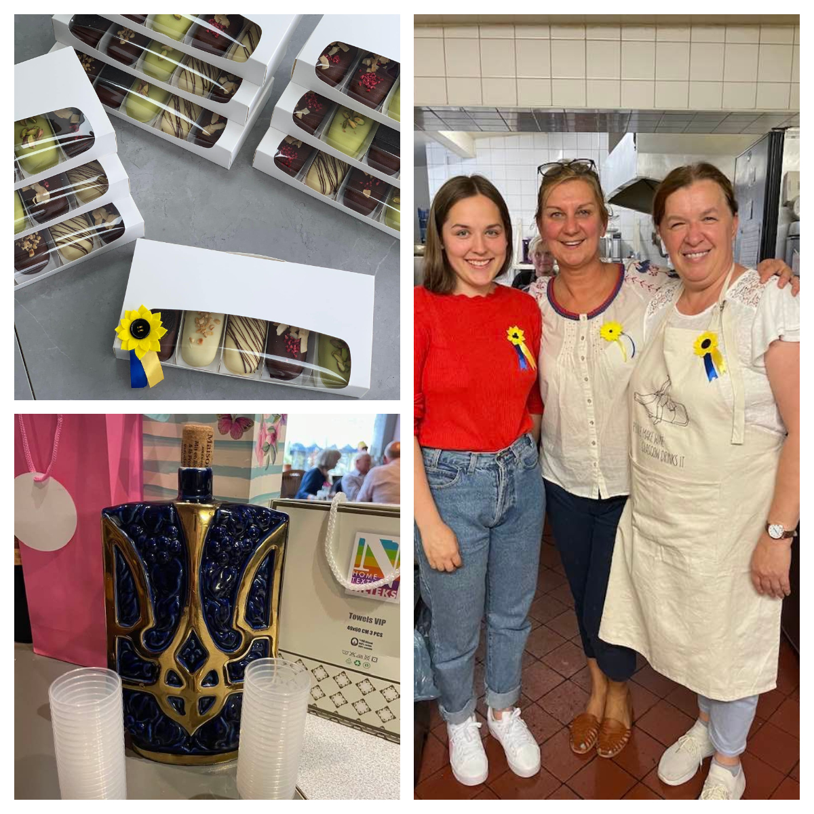
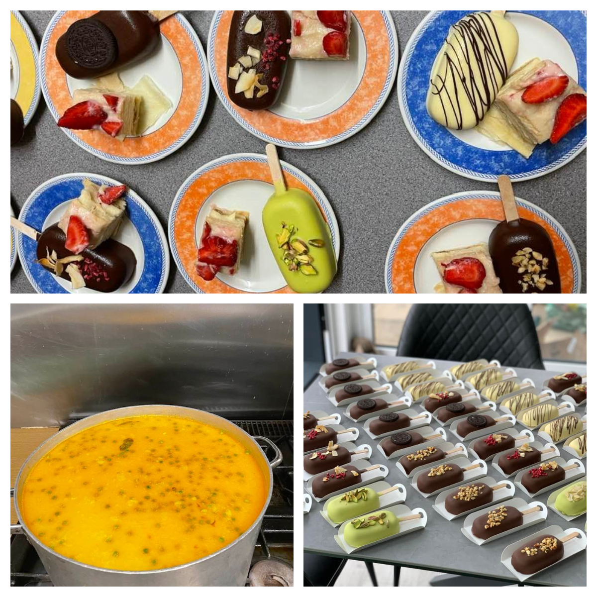
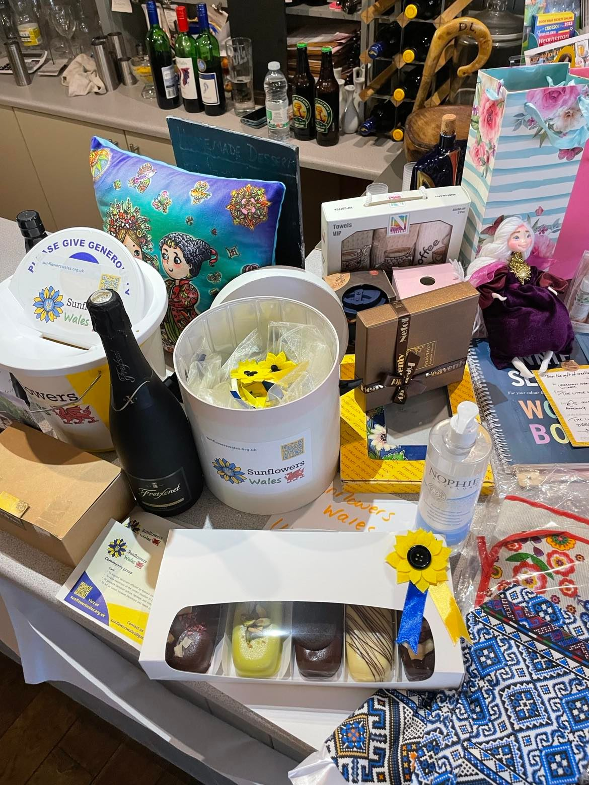

Another great evening in Gwilli Kitchen Cafe in Llandeilo. 

<!--more-->

We have raised £1000! We are so grateful for amazing support and generosity from people and businesses of Llandeilo! Special Thank you to <a href="https://www.facebook.com/christophffischer" target="_blank">Christoph Fischer</a> and <a href="https://www.facebook.com/williambryan.jones.3" target="_blank">Bryan Jones</a>.
Without them we wold not be able to raise money to help torn by war Ukraine 

And many thanks to members of <a href="https://www.facebook.com/groups/601579067497655" target="_blank">Sunflowers Wales (Соняшники)</a> for hard work in preparing authentic Ukrainian dishes (Tatiana and Alena Bykovchenko, Anna Melnyk, Irina Chaus Bake, Natalia Lehus)

We were told we can do it again! :-)

Thank you, Llandeilo!

Diolch yn fawr !

