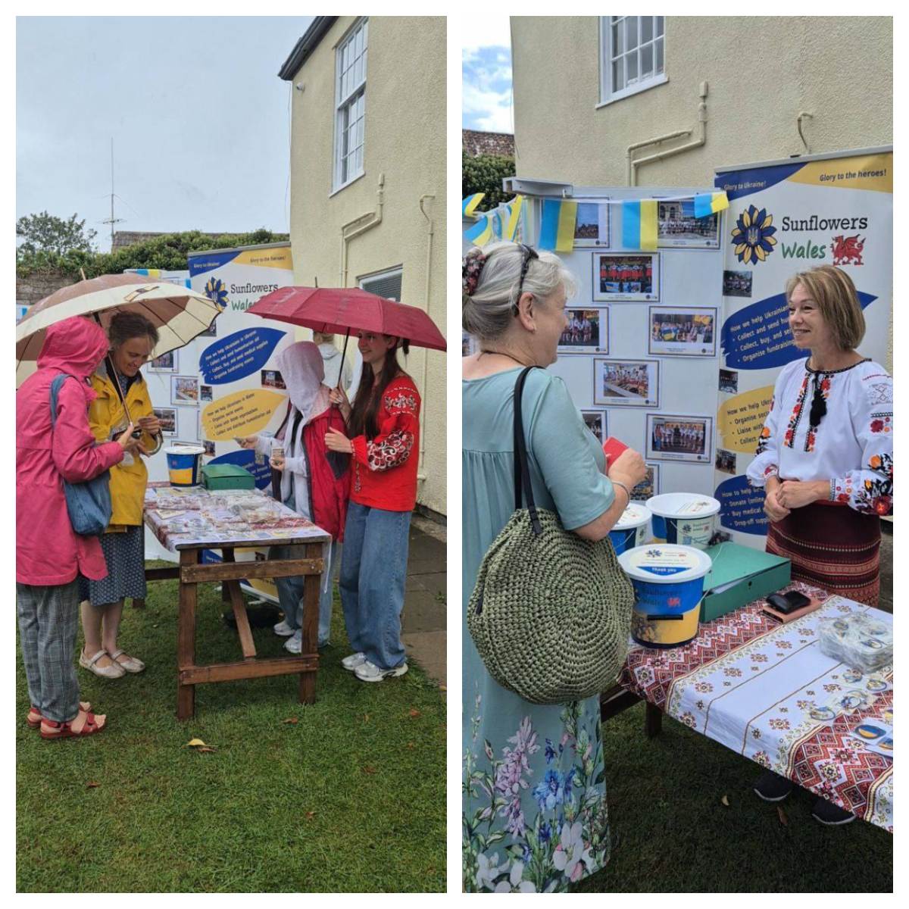

What happens if you combine beauty, talent, and a big heart?

<!--more-->

Not sure? Well, the guests at today’s celebration of Ukraine’s Independence Day in Thornbury near Bristol saw it with their own eyes!

The Sunflowers Wales <a href="../../dancing" target="_blank">dance group</a> once again visited our friends at <a href="https://www.facebook.com/sgloscouncil" target="_blank">South Gloucestershire Council</a> to help create a festive atmosphere and gift British guests and friends unforgettable emotions. Delicious treats, Ukrainian music, singing – everything blended together in harmony! Only the weather didn’t want to cooperate – it was raining and showed no intention of stopping.

And so, in the rain, our girls began their graceful dance performance “Kalyna.” Step by step, turn by turn, gentle movements of the arms – and the rain began to ease. They formed a line, spread out again – and the rain stopped. At the final chords, their hands rose to the sky – and the sun came out and stayed shining until the very end of the celebration!

Magic, nothing less!

So now, the girls are known not only for their beauty and talent, but also for their magical power to chase away clouds and stop the rain!

We are deeply grateful to the Council for the financial support and to all the visitors for their generous donations – this day raised **£955**.

<iframe width="560" height="315" src="https://www.youtube.com/embed/DT0kOdlKX9Q?si=Ps0LLXuACWt_zWd0" title="YouTube video player" frameborder="0" allow="accelerometer; autoplay; clipboard-write; encrypted-media; gyroscope; picture-in-picture; web-share" referrerpolicy="strict-origin-when-cross-origin" allowfullscreen></iframe>

