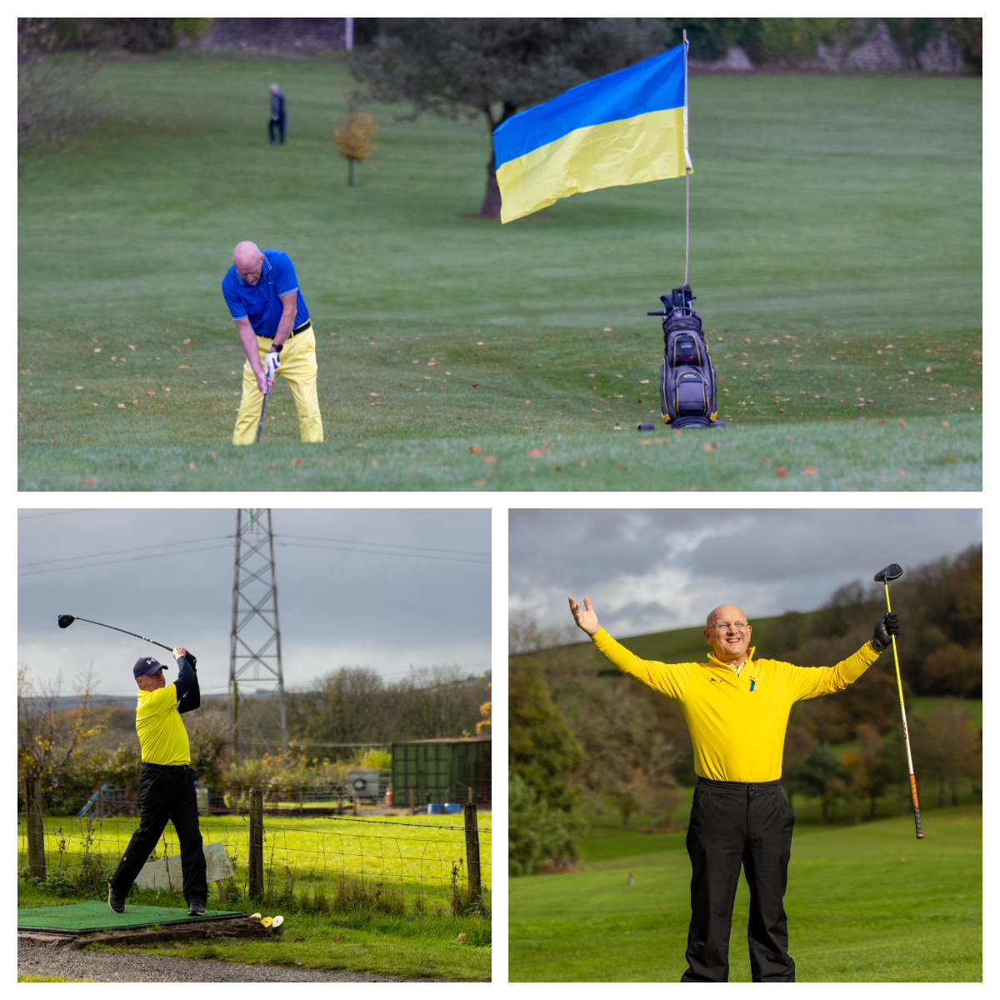
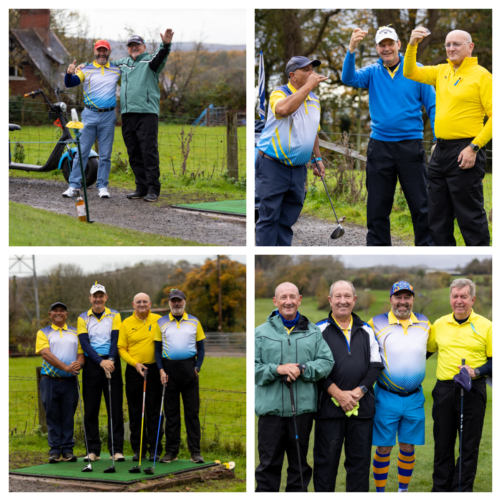
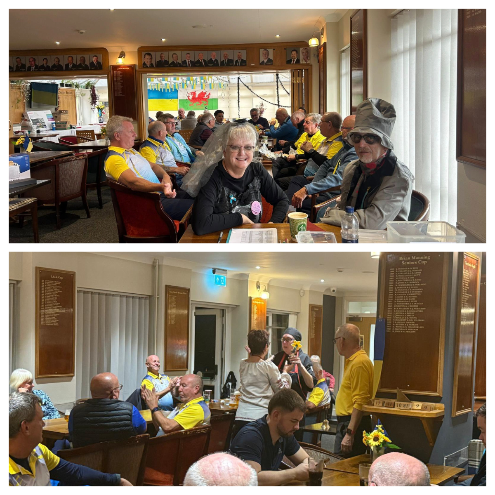
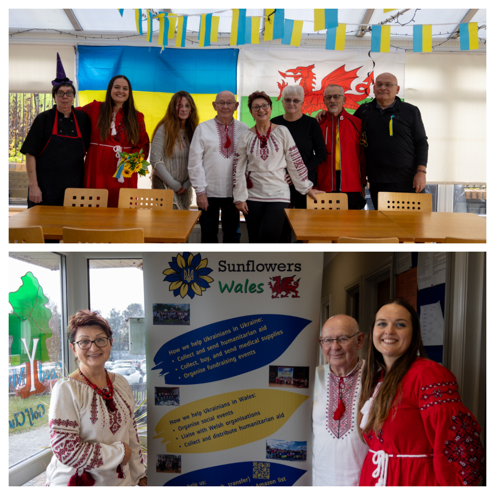
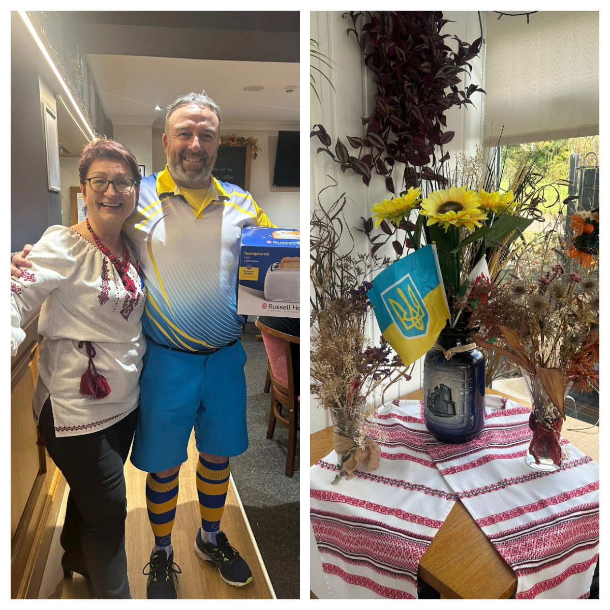
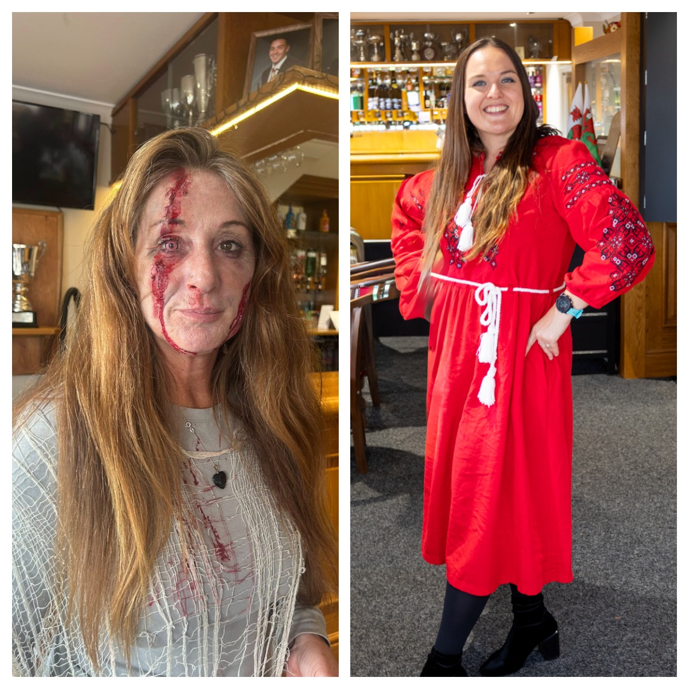
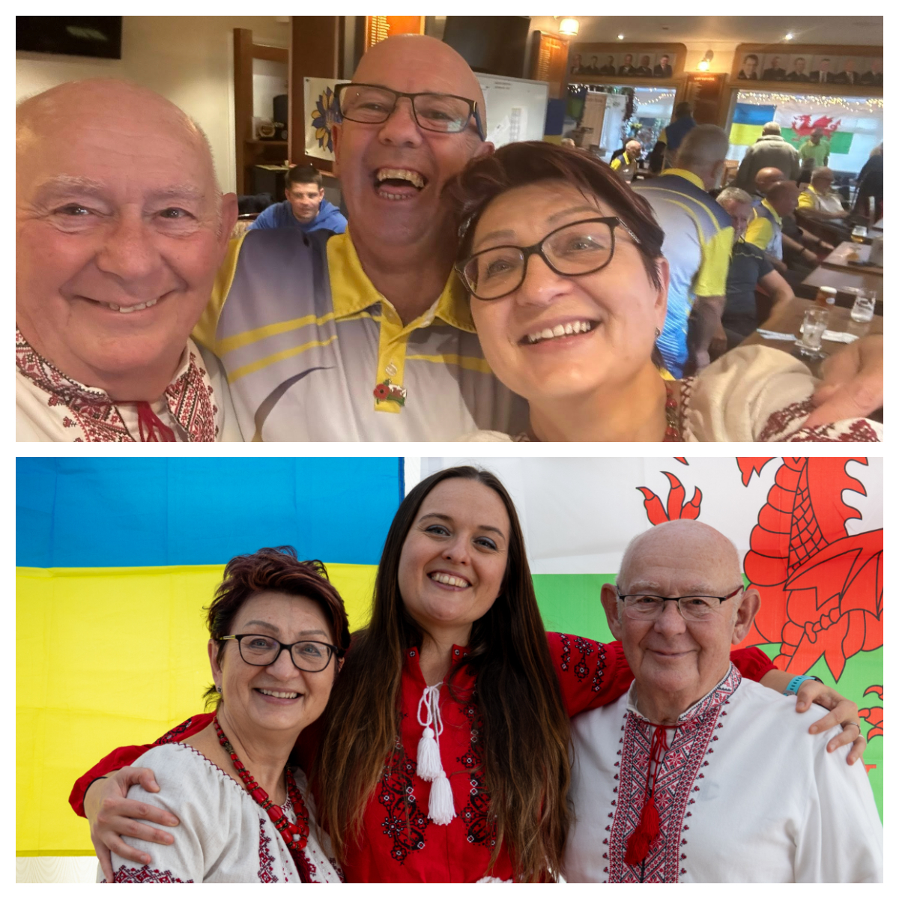

Sunflowers Wales together with <a href="https://www.facebook.com/bridgendgolfing" target="_blank">Coed-Y-Mwstwr Golf Club Bridgend</a> held a golf fundraiser for Ukraine with a Halloween twist. 

<!--more-->

People turned up in Ukrainian 🇺🇦 flag colour outfits or dressed up for Halloween. Brian won a prize for the best Ukrainian themed outfit, Sam was the best in her Halloween costume and received a little prize for making the effort. 

Special taste of Ukrainian cuisine was offered on the day by amazing club’s chef Carla. She was presented with beautiful knitted daffodil made by Ukrainian refugee <a href="https://www.facebook.com/galina.cuhno" target="_blank">Halyna Chuhno</a>. I also would like to mention the bar staff of the club who were very welcoming and helpful. 

The weather was not so kind to us on the day so a shot of Ukrainian vodka kept the players going. 
Despite the weather players enjoyed a day of friendly competition on the course, with prizes awarded for various categories. 

The event was organised to raise funds for humanitarian aid and relief efforts in Ukraine, and saw an impressive turnout with participants from across the community. 

In addition to the golf tournament, a raffle was held! Well done <a href="https://www.facebook.com/sofiya.abramchukhussey" target="_blank">Sofiya</a> for selling the tickets!! A huge range of donated items helped increase the fundraising total. 

We raised amazing **£1529**!

Thanks to the generosity of participants, sponsors, and donors to support vital services for those affected by the war in Ukraine. The funds will be directed to providing medical supplies and other very much needed items for families and individuals suffering from that brutal war. 

Overall it was an amazing day of camaraderie, fun and support. Thank you to everyone who organised, participated and contributed to the event. 

Special thanks to <a href="https://www.facebook.com/mike.paddick" target="_blank">Mike</a> and <a href="https://www.facebook.com/mich.paddick" target="_blank">Michelle Paddick</a> for their hard work organising the event and also to the club manager Gareth Summerton for accommodating the event. 

