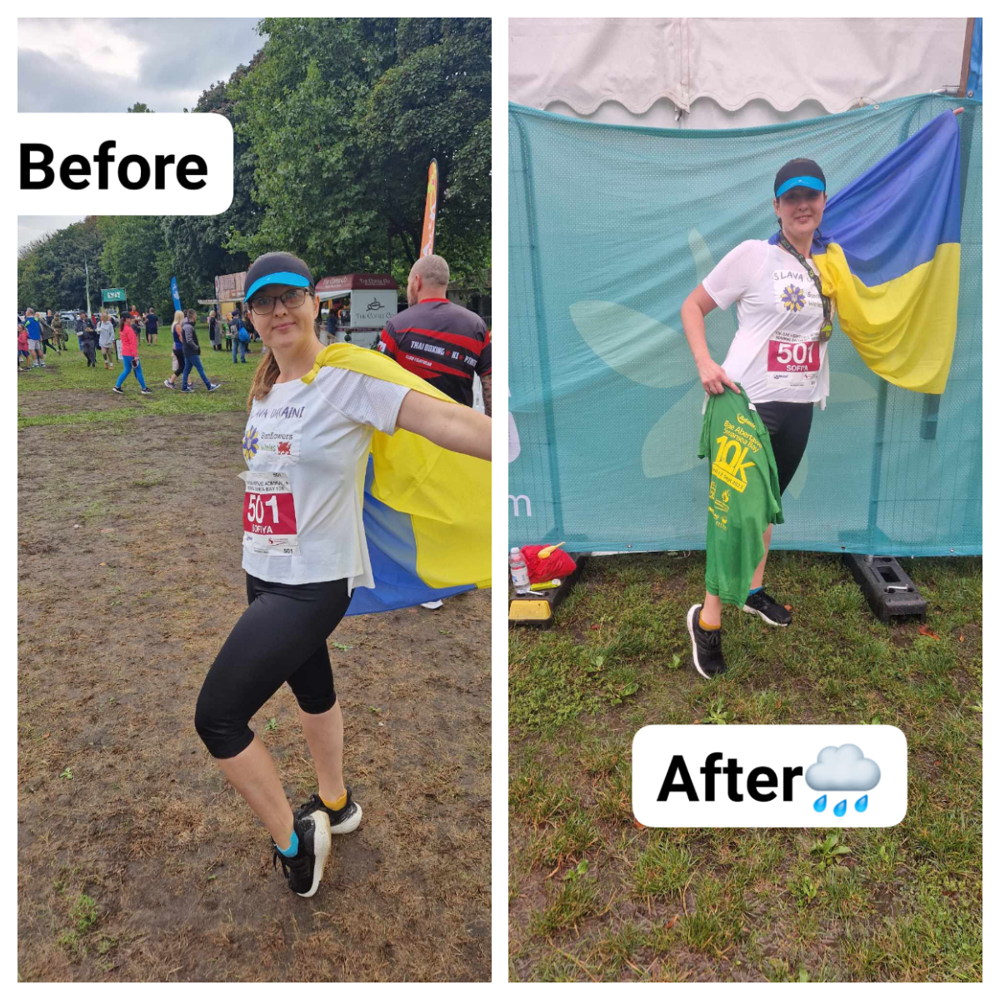
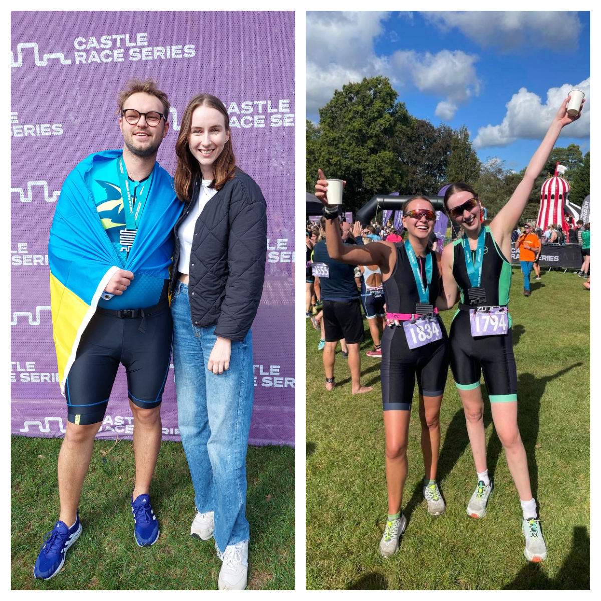
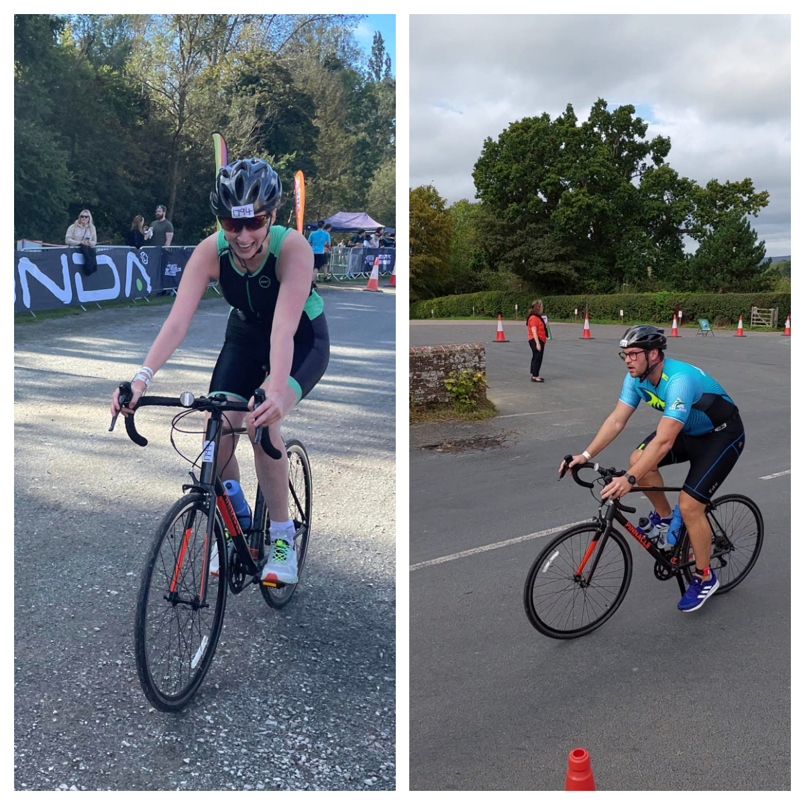
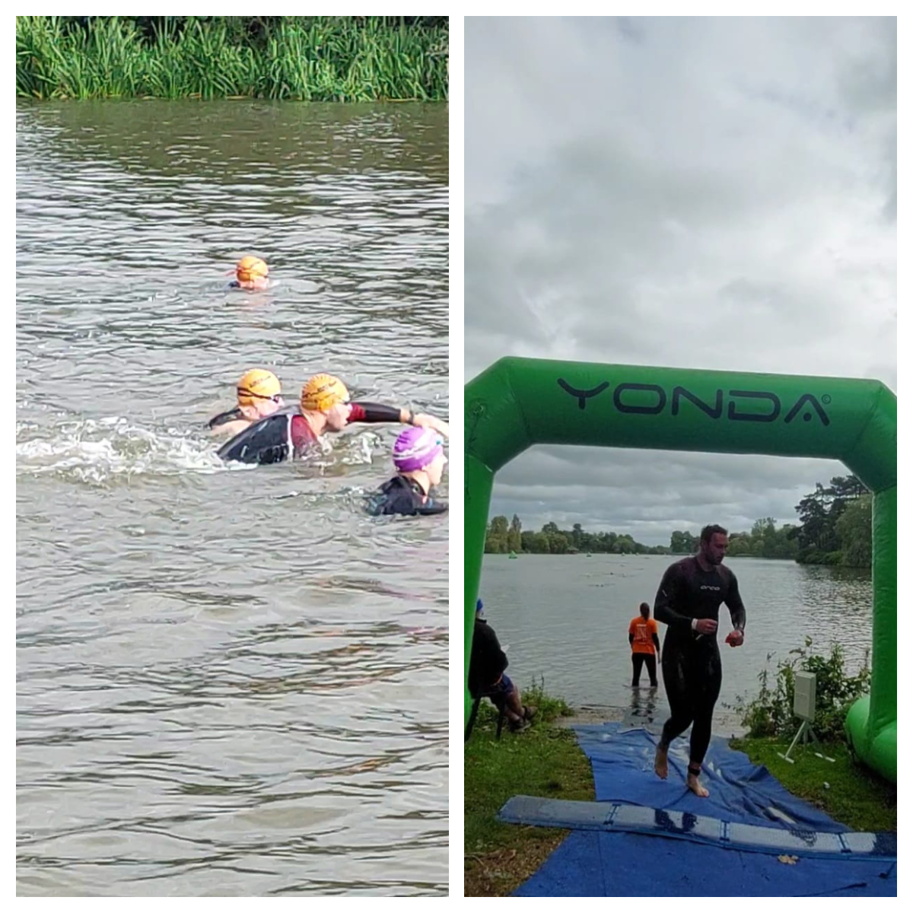

Our members and friends were fundraising money in two great sport events

<!--more-->

<a href="https://www.facebook.com/anna.farrell.50" target="_blank">Anna Farrell</a> and <a href="https://www.facebook.com/profile.php?id=100011238180945" target="_blank">Serg Nilov</a> took part in famous triathlon: Hever Castle Race Series – 1.5&nbsp;km of swimming, 5&nbsp;km of running, 40&nbsp;km of cycling! They've done it amazingly!!! They are happy with their results and with the support they received in the fundraising at <a href="https://www.justgiving.com/crowdfunding/Triathlon-for-SunflowersWales" target="_blank">Justgiving</a> – over £1000!

<a href="https://www.facebook.com/sofiya.abramchukhussey" target="_blank">Sofiya Abramchuk-Hussey</a> run Swansea Bay 10km marathon despite really bad weather. With smile, full of energy, supported by family and friends! Her fundraising at <a href="https://www.crowdfunder.co.uk/p/aid-to-ukraine-by-sunflowers-wales" target="_blank">Crowdfunder</a> achieved £400 so far.

The money will be used to buy tourniquets, haemostatic dressings, and other crucial life-saving medical supplies for Ukrainian paramedics.

A big thank you to everyone who generously contributed to these campaigns!

Sunflowers Wales – Standing Strong Together!

