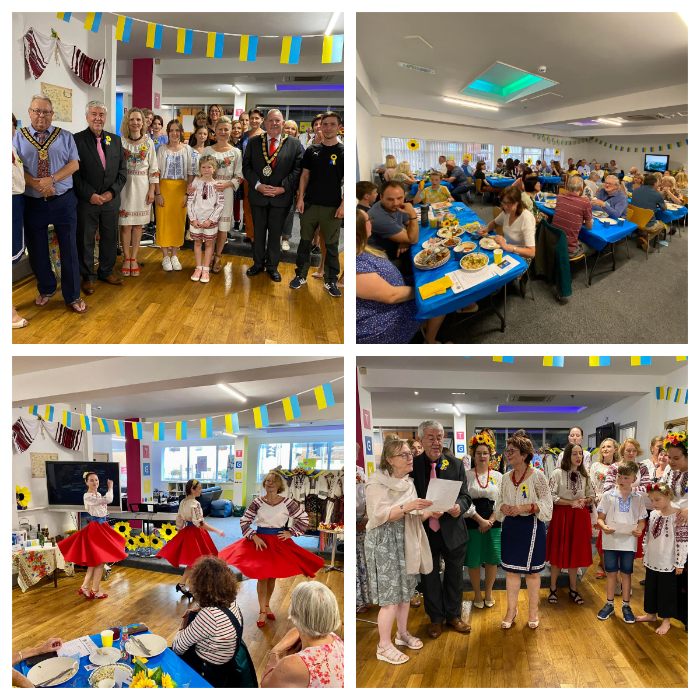
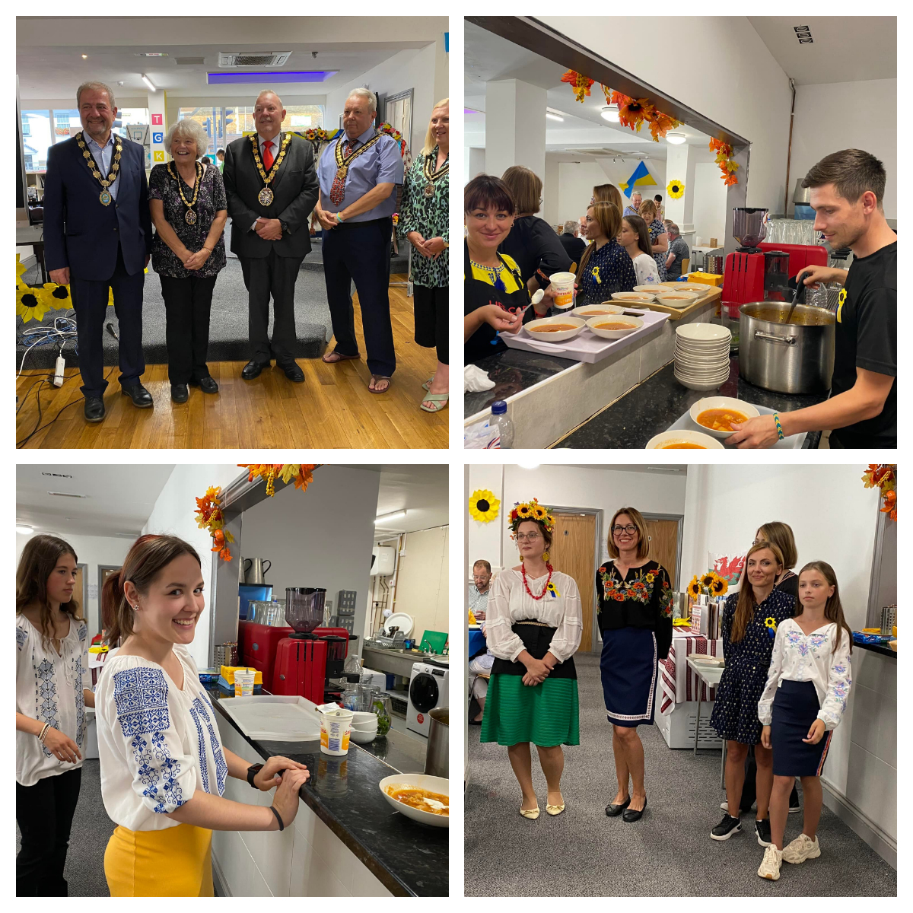
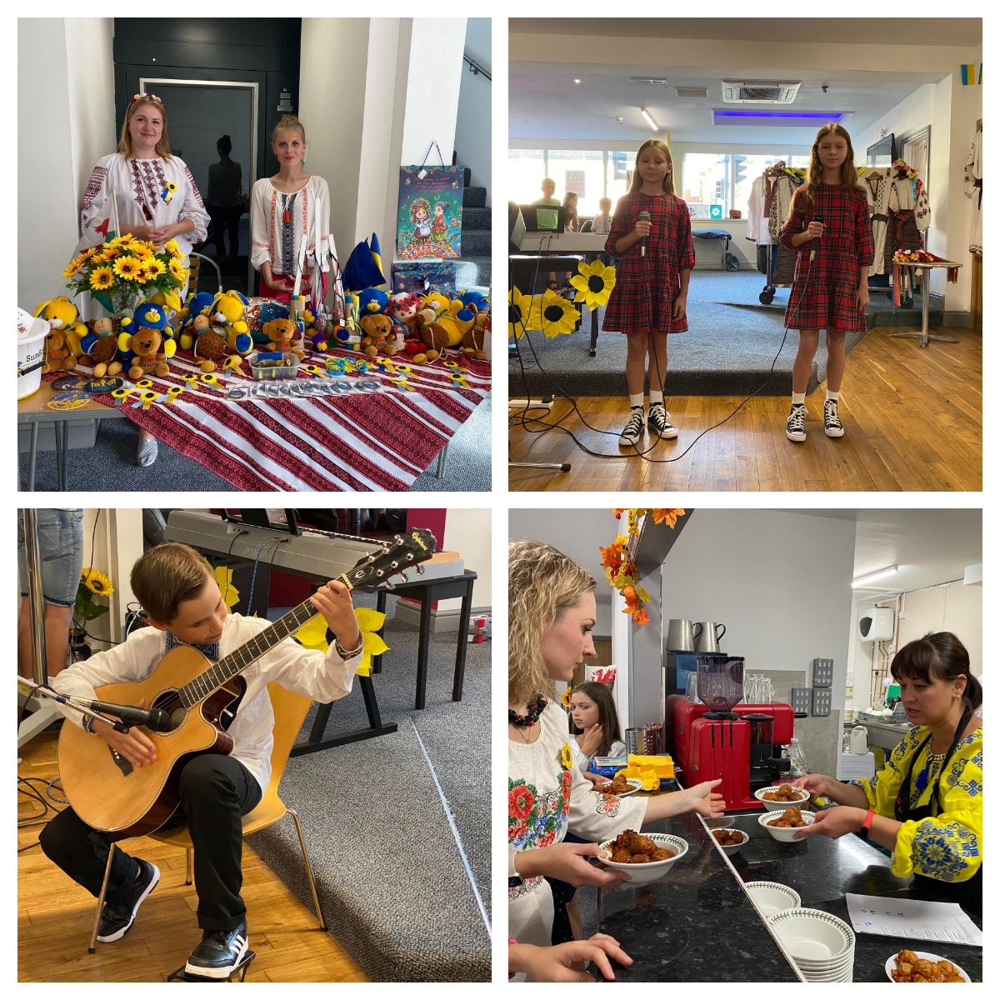
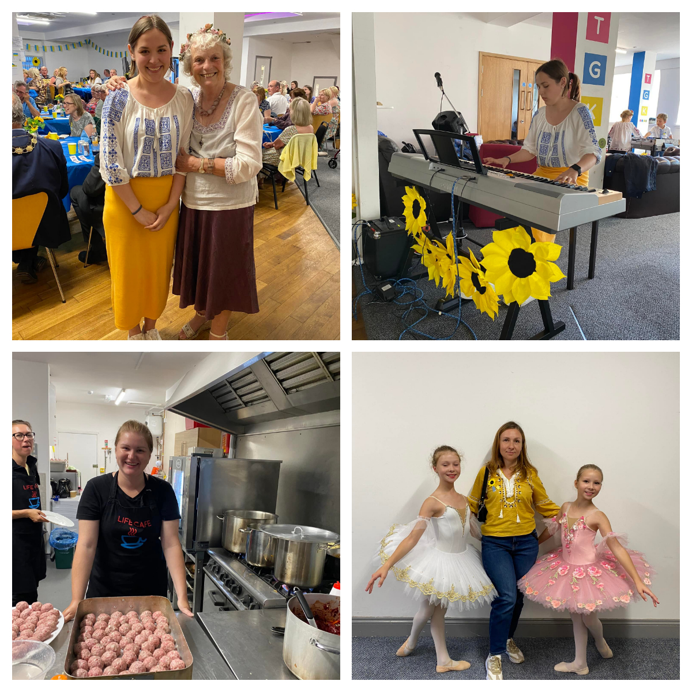

Sunflowers Wales hosted a sold-out Taste of Ukraine evening at Ty Gwyn Community Church. 

<!--more-->

We raised £3076.96, which will be used to buy medical supplies and to send humanitarian aid to Ukraine. 
It was so special to welcome 120 guests and give them a snapshot of Ukrainian cuisine and culture. 

Of course, none of this would be possible without the fantastic help and support we had!

Thank you to Pastor Ben, <a href="https://www.facebook.com/groups/601579067497655/user/517633431/" target="_blank">Sam Hodgetts</a> and <a href="https://www.facebook.com/TyGwynChurch/" target="_blank">Tŷ Gwyn Community Church</a> community for allowing us to use their premises and equipment and being helpful and supportive. 

Thank you to Dashti Rashid <a href="https://www.facebook.com/groups/601579067497655/user/100058909853000/" target="_blank">Zabka mini supermarket</a> in Llanelli, for supplying delicious cold cuts of meat, ham and sausages! 

Thank you to our kind raffle prize donors:
<a href="https://www.facebook.com/parcyscarlets/" target="_blank">Parc y Scarlets</a>, <a href="https://www.facebook.com/diplomathotelwales/" target="_blank">The Diplomat Hotel, Restaurant & Spa, Llanelli</a>, <a href="https://www.facebook.com/groups/601579067497655/user/100060692783920/" target="_blank">Claire's Flowers 4 All Occasions</a>, <a href="https://www.facebook.com/ffoslasracecourse/" target="_blank">Ffos Las Racecourse</a>, <a href="https://www.facebook.com/marzanos/" target="_blank">Marzano's Caffe Bar</a>, <a href="https://www.facebook.com/groups/601579067497655/user/100063705573697/" target="_blank">AVO CAFE</a>, John Fronde (<a href="https://www.facebook.com/groups/601579067497655/user/100000727482581/" target="_blank">Zina Minimurzina</a>),Jane Griffiths 

Also, thank you for the support from <a href="https://www.facebook.com/groups/601579067497655/user/100005157739273/" target="_blank">Llanelli CommunityPartnership</a>, <a href="https://www.facebook.com/groups/601579067497655/user/640042670/" target="_blank">Paolo Piana</a>, <a href="https://www.facebook.com/groups/601579067497655/user/100064946041490/" target="_blank">Cyngor Sir Gâr - Carmarthenshire County Council</a>, Llanelli Town Council, <a href="https://www.facebook.com/groups/601579067497655/user/100067062548972/" target="_blank">Pembrey Burry Port Town Council</a>. 

Our heartfelt thank you goes to our new Ukrainian families! Everyone worked so hard and gave their all! From cooking to serving to decorating, to cleaning and of course singing, dancing and playing musical instruments! Absolutely bursting with pride and admiration for everyone one of them!

<a href="https://www.facebook.com/groups/601579067497655/user/100005563908626/" target="_blank">Igor Khomov</a>, <a href="https://www.facebook.com/groups/601579067497655/user/100010140852854/" target="_blank">Боднарчук Ірина</a>, <a href="https://www.facebook.com/groups/601579067497655/user/100022883122623/" target="_blank">Таня Карнаух</a> and daughter Nika, <a href="https://www.facebook.com/groups/601579067497655/user/100000435325989/" target="_blank">Kateryna Nerush-Laktyonova</a> and son Ilya, <a href="https://www.facebook.com/groups/601579067497655/user/100009919216659/" target="_blank">Полина Трифонова</a>, <a href="https://www.facebook.com/groups/601579067497655/user/100012841634455/" target="_blank">Alena Bykovchenko</a>, <a href="https://www.facebook.com/groups/601579067497655/user/100002425518234/" target="_blank">Галина Чухно</a> and mother Lena, <a href="https://www.facebook.com/groups/601579067497655/user/100009204770664/" target="_blank">Tetiana Mydza-Obukhovska</a> and sons Danik and Arsen, <a href="https://www.facebook.com/groups/601579067497655/user/100000872378105/" target="_blank">Ann Kotovets</a> and daughter Anastasia, <a href="https://www.facebook.com/groups/601579067497655/user/100014563804797/" target="_blank">Аня Литвиненко</a> and daughter Valeria, Halyna Hrabovska, <a href="https://www.facebook.com/groups/601579067497655/user/1833868299/" target="_blank">Marina Avdzhy</a>, <a href="https://www.facebook.com/groups/601579067497655/user/100013523310564/" target="_blank">Mariia Zalutska</a> and daughter Vitalina, <a href="https://www.facebook.com/groups/601579067497655/user/100007102721701/" target="_blank">Залуцька Христина</a>, <a href="https://www.facebook.com/groups/601579067497655/user/100006338559946/" target="_blank">Tatyana Marshtupa</a>, <a href="https://www.facebook.com/groups/601579067497655/user/100002198745639/" target="_blank">Галина Андрушина</a> and daughters Anya and Katya, <a href="https://www.facebook.com/groups/601579067497655/user/100035244510941/" target="_blank">Елена Пролина</a>, Olya, Yulia and Ania.

And also our local sunflowers: <a href="https://www.facebook.com/groups/601579067497655/user/1488936646/" target="_blank">Bohdana Bahlay</a>, <a href="https://www.facebook.com/groups/601579067497655/user/539659438/" target="_blank">Marianna Horokhivska-John</a>, <a href="https://www.facebook.com/groups/601579067497655/user/100002570886095/" target="_blank">Sofiya Abramchuk-Hussey</a>, <a href="https://www.facebook.com/groups/601579067497655/user/100001342691071/" target="_blank">Oksana Harries</a>, <a href="https://www.facebook.com/groups/601579067497655/user/100004189091446/" target="_blank">Ulyana Abramchuk</a>, <a href="https://www.facebook.com/groups/601579067497655/user/100009219208454/" target="_blank">Ana Abramchuk</a>, <a href="https://www.facebook.com/groups/601579067497655/user/100005384823760/" target="_blank">Oksana Shapovalova</a> and children Amelia, Max, Avalyn, Lydia, Vlad.

Together we are strong! We won't be defeated! 

Thank you to everyone who attended, your support is so important to us.

We are already thinking to do another Taste of Ukraine evening and hoping you will be able to join us again soon!

Thank you!

Diolch yn fawr!

Дякую!
    

 

