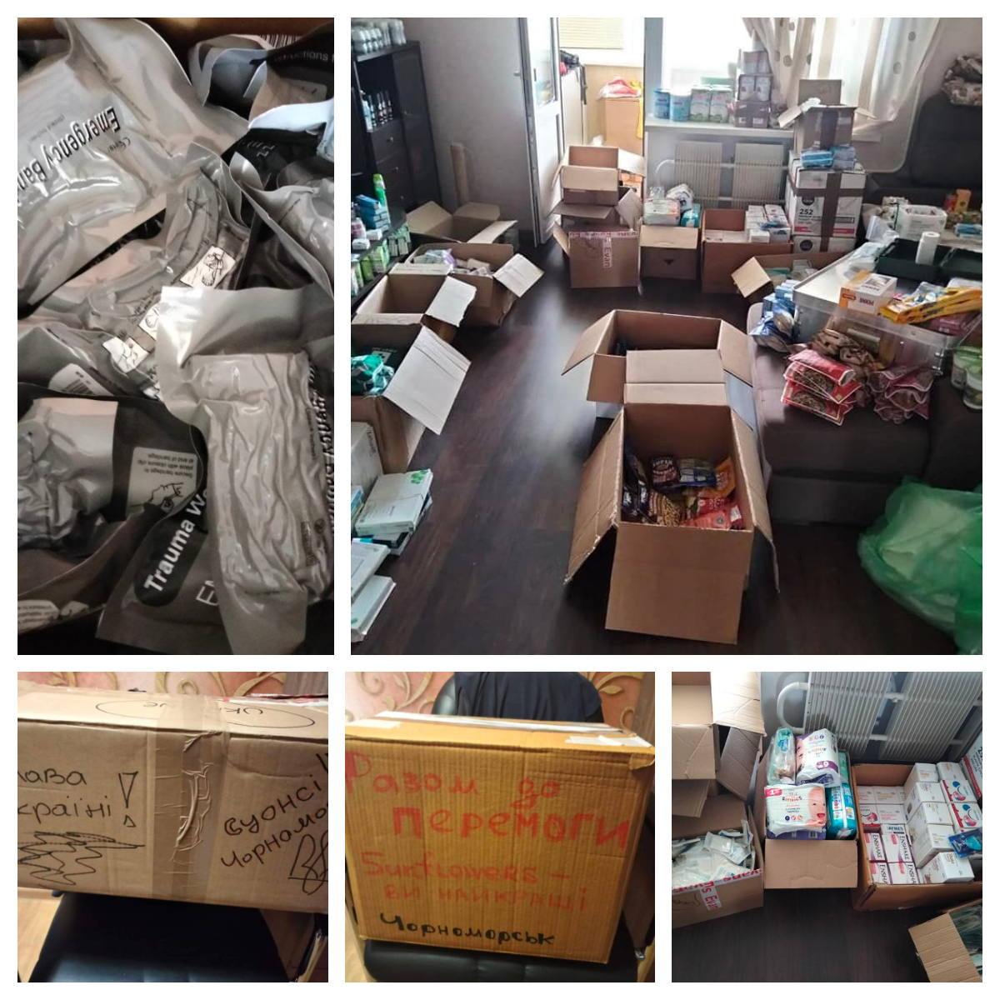
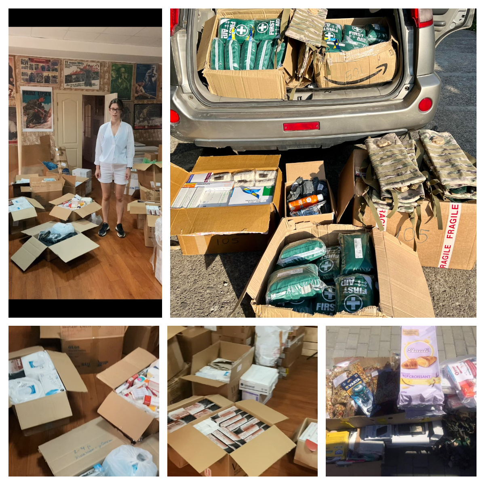

Ca. 3.5 m3 of parcels with humanitarian aid and medical supplies  were sent to volunteers in Ukraine (Chornomorsk, Khmelnytskyi, Lviv, Uzhhorod) who sent them then to hospitals, defence units, displaced people centres etc. 

<!--more-->

Many thanks to everyone who bought items from our Amazon list! It remains <a href="https://www.amazon.co.uk/hz/wishlist/ls/3IKD8RINIZODU">open</a>, it's not the last shipment, unfortunately.

Many thanks to everyone who donated money, so we could pay for the shipment, and we are able to work on further actions!

Many thanks to the members of *Sunflowers Wales*, who made so fantastic job in fundraising, getting medical supplies, sorting clothes *etc.*!

In less than a week, the parcels were received, sorted, and forwarded further by Ukrainian volunteers:

