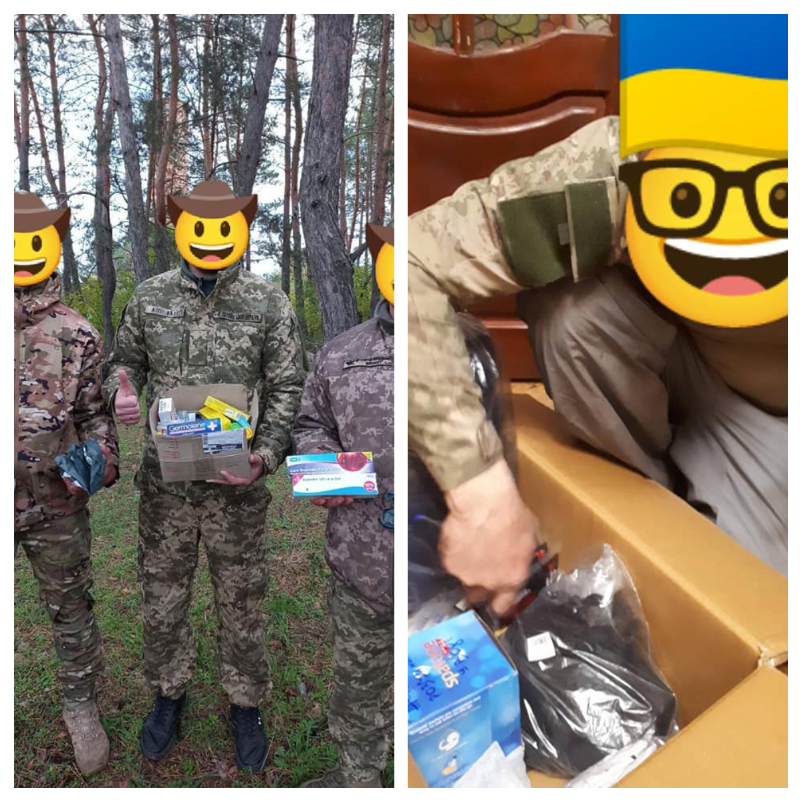
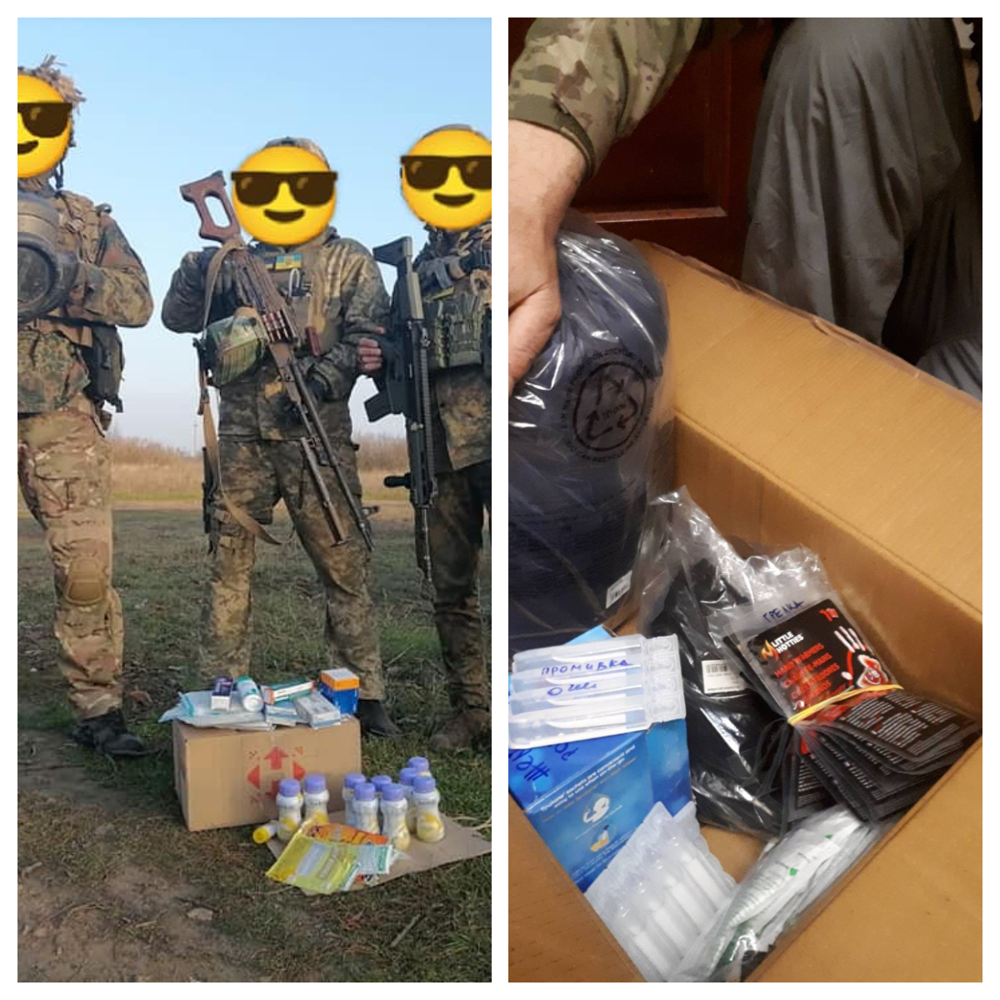
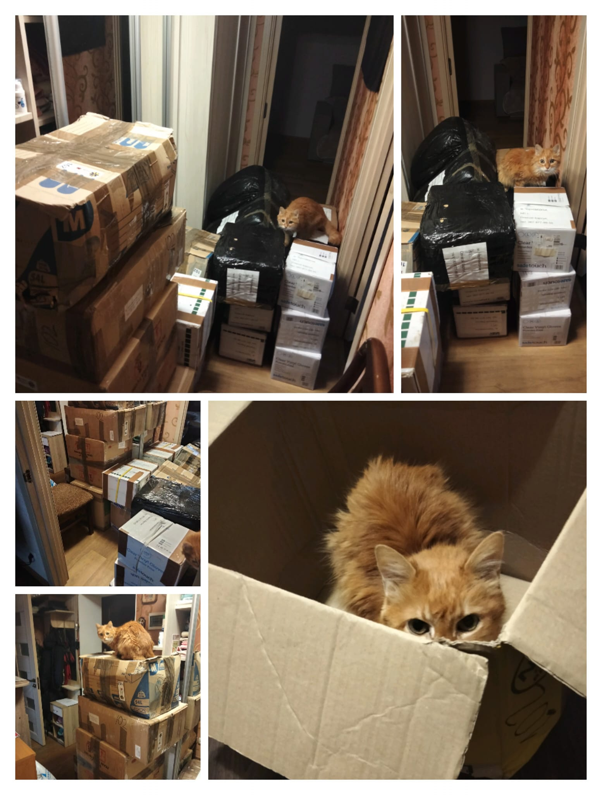
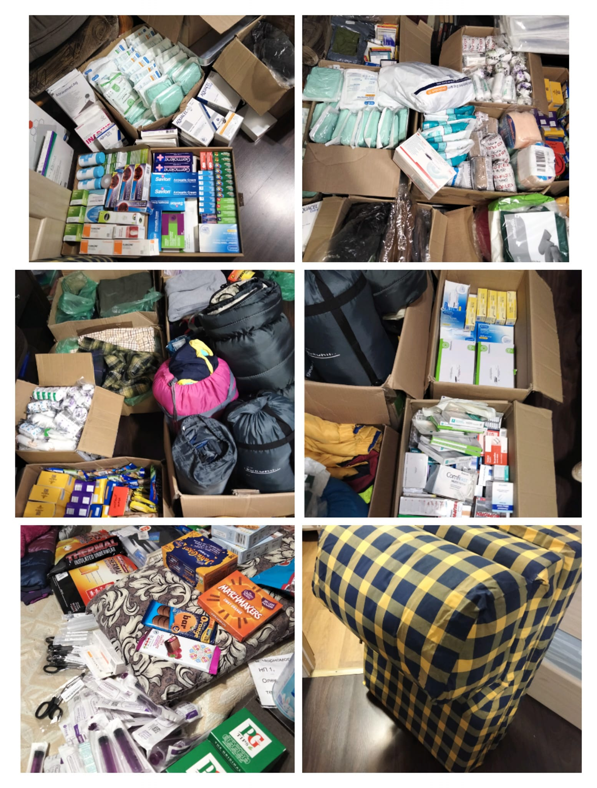
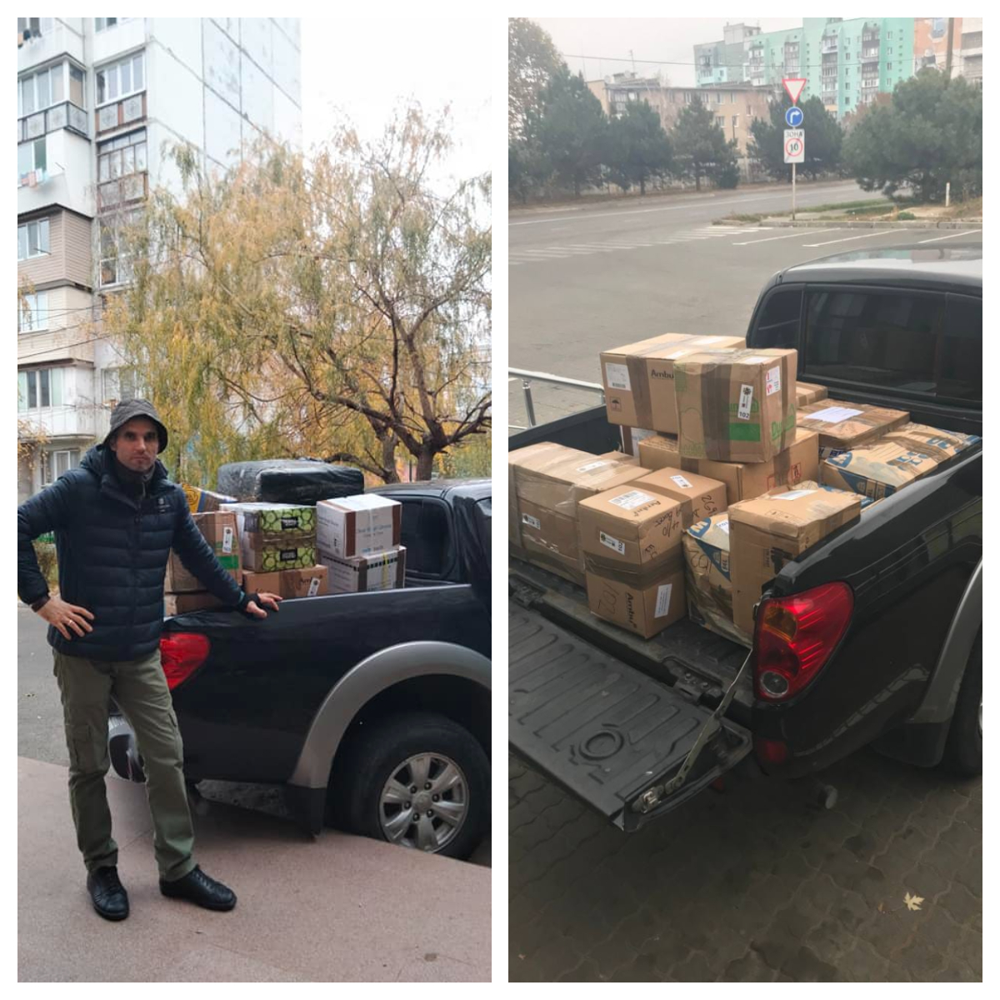

A massive shipment reached volunteers in Ukraine and is forwarding further!

<!--more-->

More than 60 parcels and bags of  medical supplies and humanitarian aid are now in Ukraine!

Many thanks to everyone who donated supplies and money to make this possible!

We send shipments to Ukraine every 2 weeks, and they quickly reach our trusted volunteers who send them to the frontline, shelters, orphan house etc! (See FB-posts: 
<a href="https://www.facebook.com/permalink.php?story_fbid=pfbid0sKFXLYedKqHRVc2EeBBqeLW2kvn6yPPip5F87D7jNgyDuevDFM4Z6pHKjnf4iQhbl&id=100087035491875" target="_blank">Link 1</a>.)

Our effective work is impossible without you, your help, your generosity! 
Together we are strong! Glory to Ukraine! Glory to the heroes!

 

 

