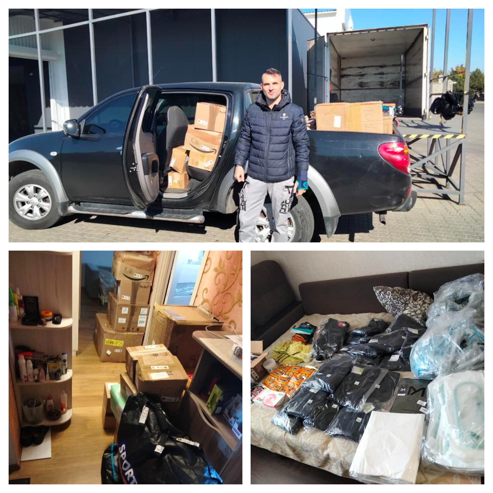
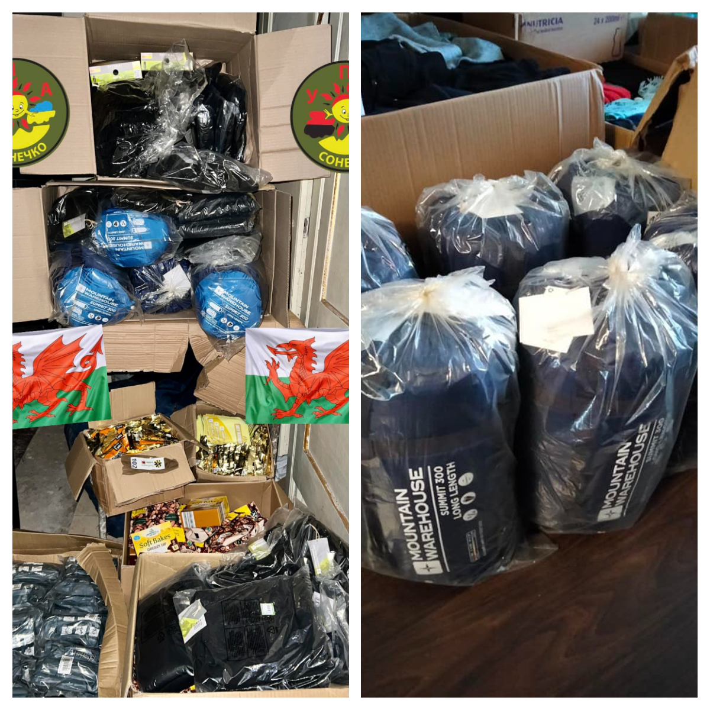
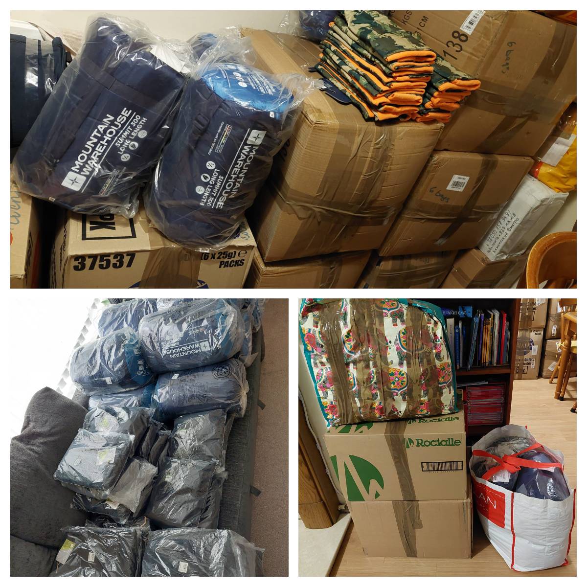

Yet another big shipment to Ukraine!

<!--more-->

More than 3 m3 of humanitarian aid, medical supplies, and a vast number of sleeping bags and winter baselayers!

Many thanks to <a href="https://www.mountainwarehouse.com/" target = "_blank"> Mountain Warehouse</a> for their generous 40% reduction for the goods bought for Ukraine! And of course for the prompt delivery together with <a href="https://www.evri.com/" target = "_blank">EVRi</a>! (The courier does remember our house now:  about 20 large boxes and bags!)

We send shipments to Ukraine every 2 weeks, and they quickly reach our trusted volunteers who send them to the frontline, shelters, orphan house etc! (See FB-posts: 
<a href="https://www.facebook.com/luda.barsyk/posts/pfbid02d5HCMnadvkNqdUUDNv7j3KdEYZTxiuTGQvsykBHP6cUUAAg5jWWtuPeud3HDFwzal" target="_blank">Link 1</a>, 
<a href="https://www.facebook.com/pavlo.fedaka/posts/pfbid0336oQwpzsvVQgjvWkVW5vq768XCZgrTDc99dKcWHu44L1ugzs7wn3MzvbtMmDSJBol" target="_blank">Link 2</a>.)

Our effective work is impossible without you, your help, your generosity! 
Together we are strong! Glory to Ukraine! Glory to the heroes!

 

