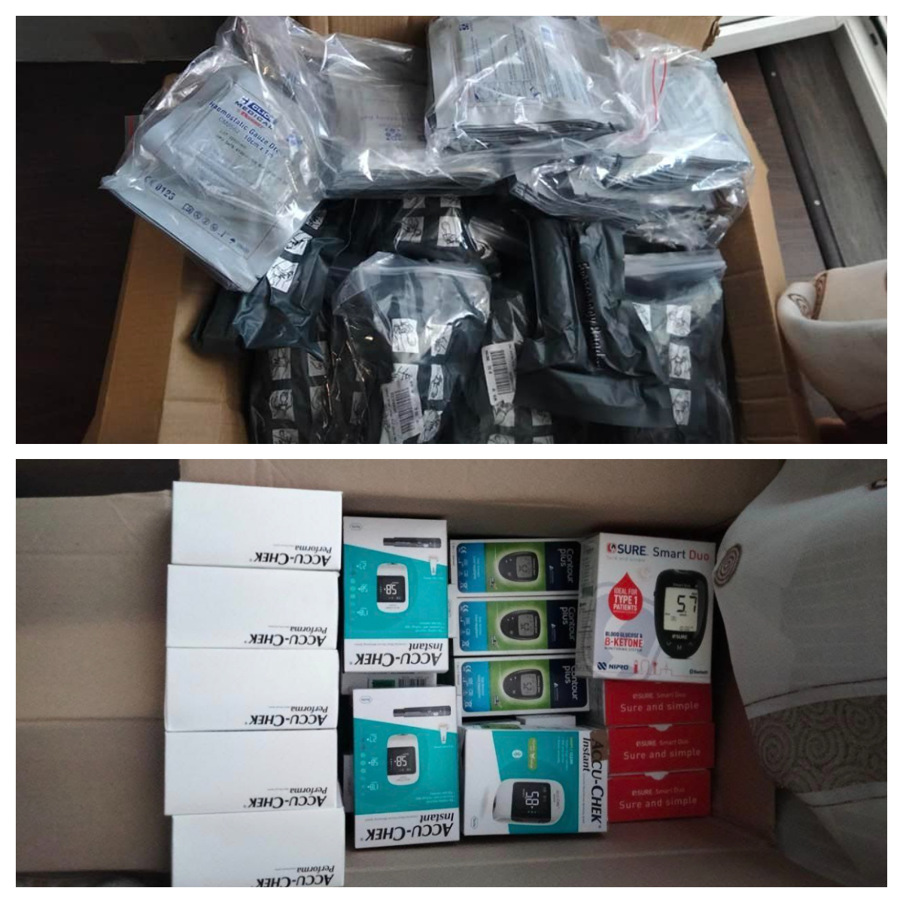
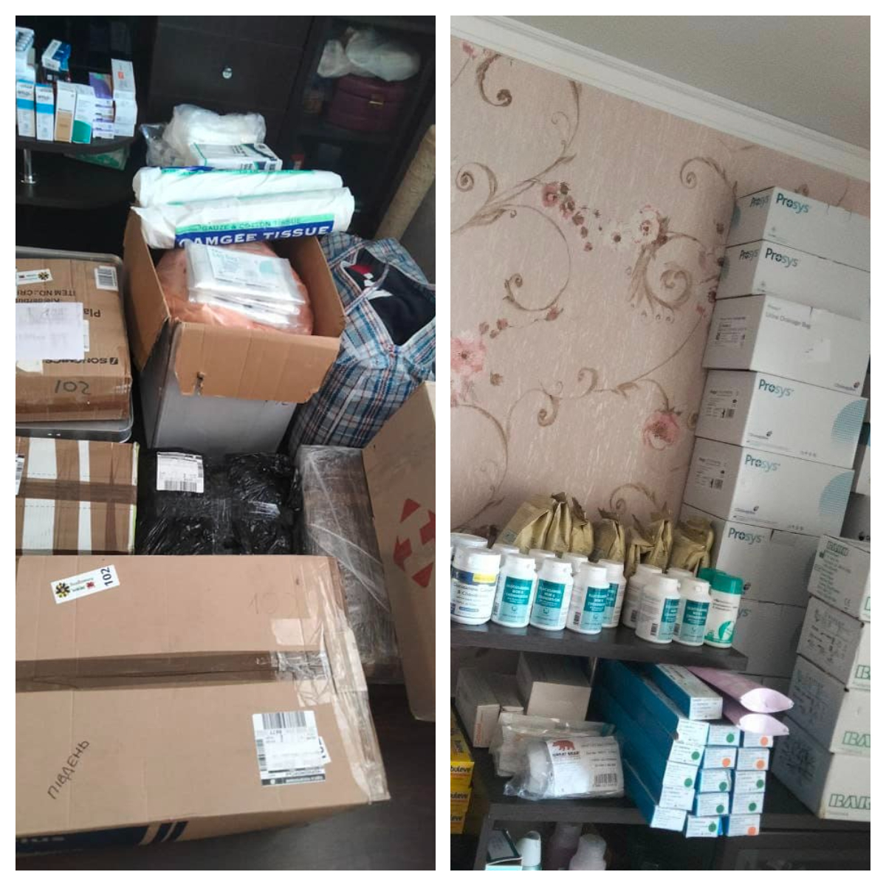

A vast shipment of medical supplies, including 50 pairs of Israeli bandages (£850) and 100 hemostatic dressing folds (£1450), was sent to Ukraine.

<!--more-->

We have also sent ointments, vitamins, other medicine, and glucose meters.

The parcels were sent to Ukrainian volunteers in Chernomorsk  and Uzhhorod.

 