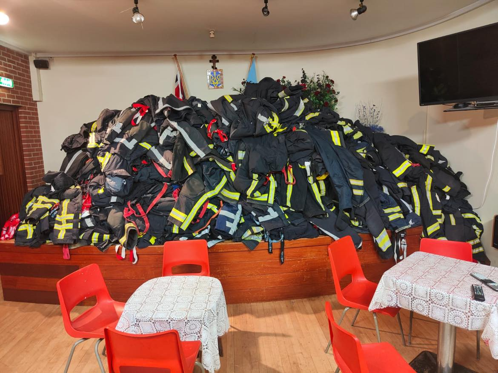
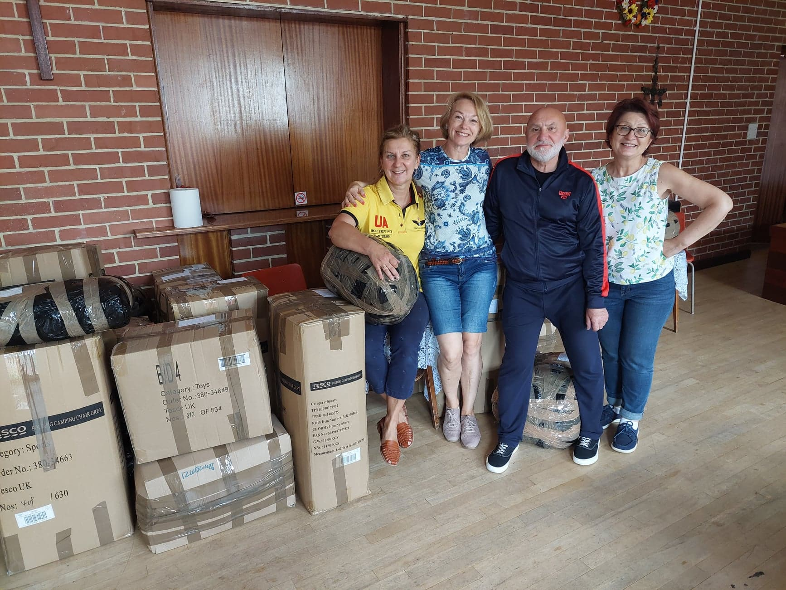
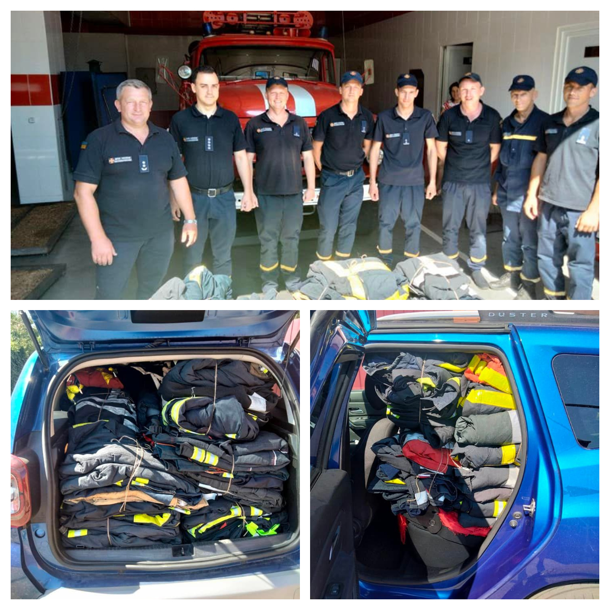

Two shipments at once! A number of emergency bandages and fireproof costumes were sent to Ukraine.

<!--more-->

Ca. 500 emergency (Israeli haemorrhage control) bandages were bought by our group using your generous donations! 

Ca. 100 fireproof costumes for Ukrainian firemen were kindly donated by Gloceste community. 

Many thanks to everyone involved!

Before

After (see FB-posts: 
<a href="https://www.facebook.com/luda.barsyk/posts/pfbid0vrsf9MPcpg2cBEvtr7W4U8sComFCPiBpNtzjePnG2tWxRrwaRUJeQj5sJRyQ852Vl" target="_blank">Link 1</a>, 
<a href="https://www.facebook.com/luda.barsyk/posts/pfbid02h2qMnyMhHX3rx4bkwPNBFjH2qF9vFDbArVfpjRcBdu1qHQRNT8Qxks5iUepvAvVFl" target="_blank">Link 2</a>.)

