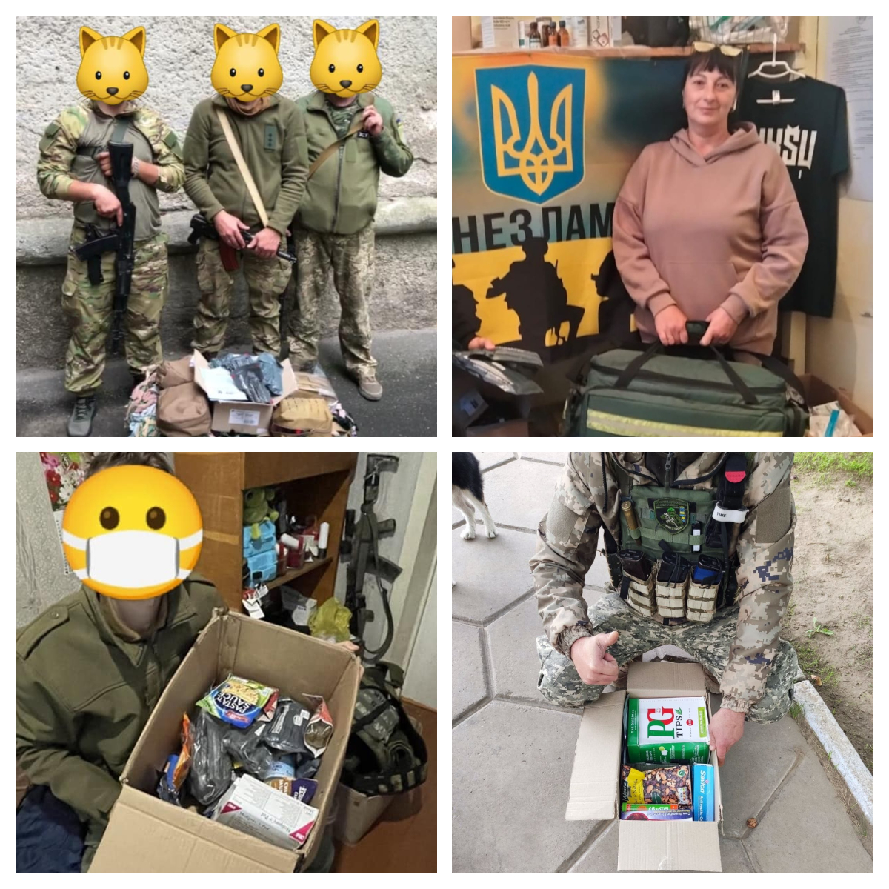
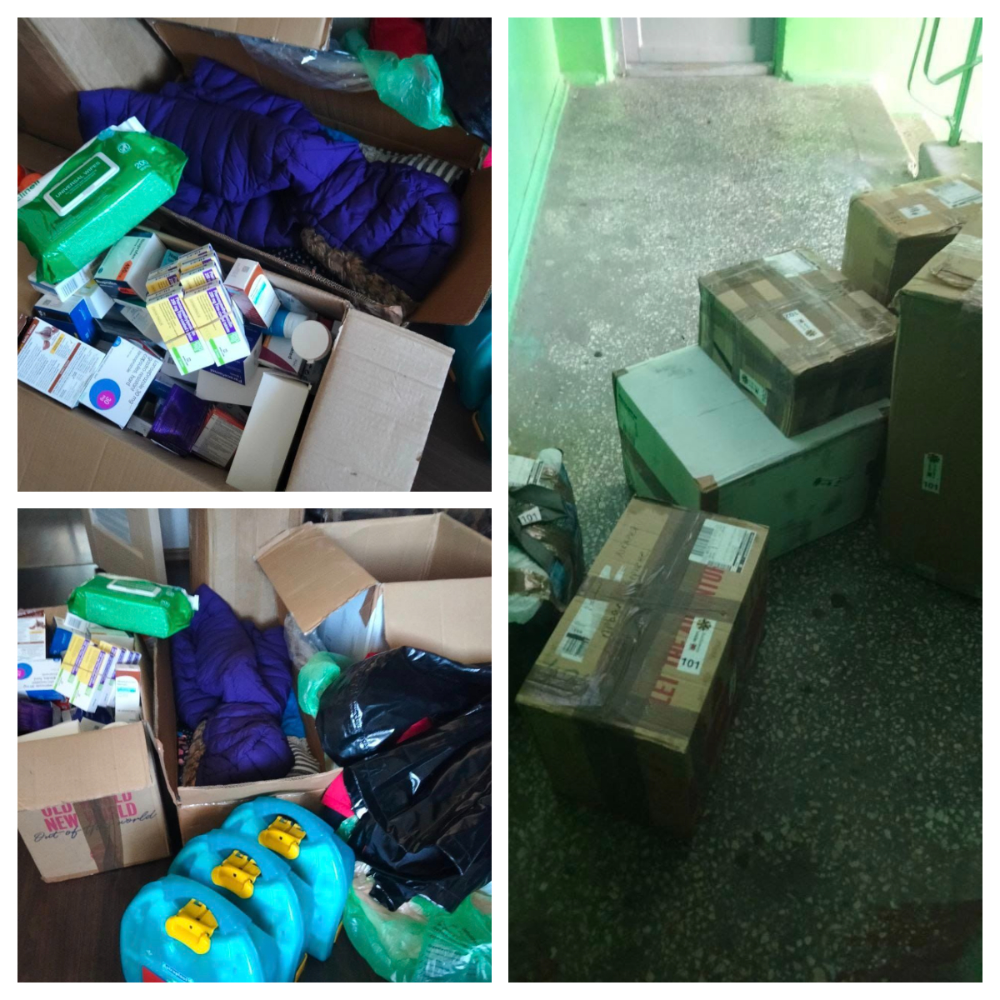
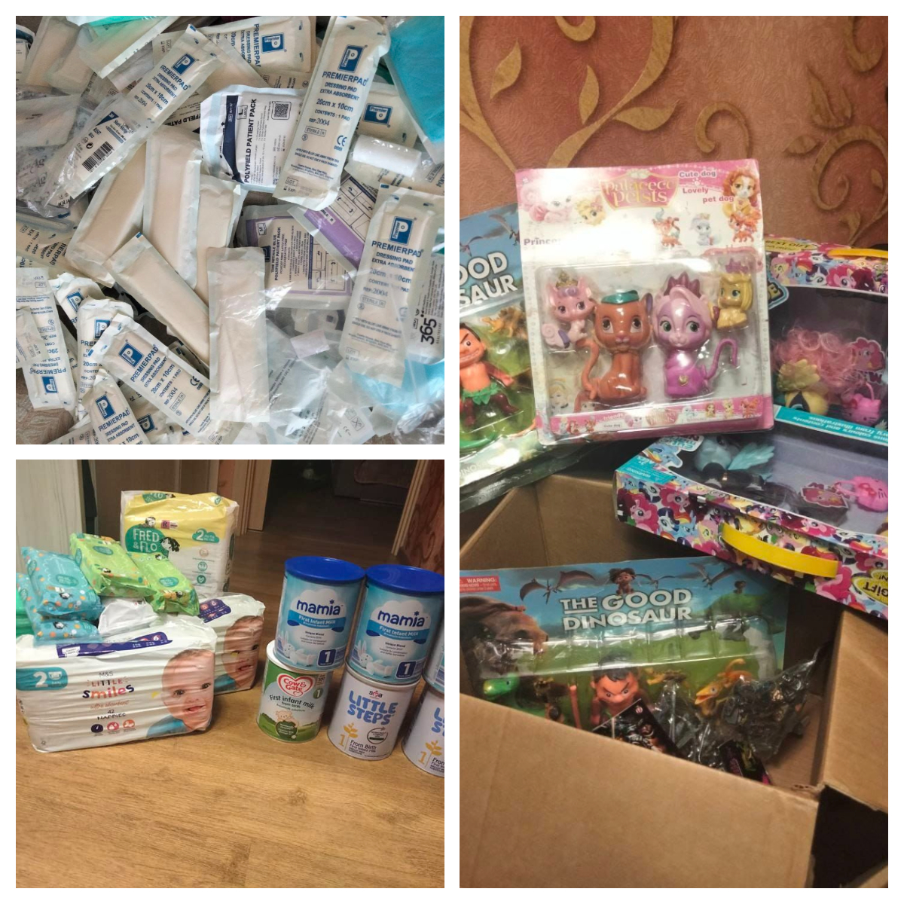

A regular shipment of humanitarian aid and medical supplies to Ukraine at the late September.

<!--more-->

Medicine, professional medical kits, dry food for militaries, baby food, nappies, hygienic pad and kits, vitamins, clothes. The war is far from the end, the people are struggling. We are grateful to everyone who donated! 

The parcels were sent to Chornomorsk where Ukrainian volunteers delivered them to shelters and orphan houses. (See FB-posts: 
<a href="https://www.facebook.com/groups/601579067497655/permalink/685066965815531" target="_blank">Link 1</a>, 
<a href="https://www.facebook.com/luda.barsyk/posts/pfbid025UHti9nzFqcppc8oHtynwCVQ7oQNQsL56M6tnaKT9AfLKjSQu2mMMYcaB4VzdVy3l" target="_blank">Link 2</a>, <a href="https://www.facebook.com/luda.barsyk/posts/pfbid0RbXm2iwTwkS8C9ueJQuBNky1xWpGkLgegVdwE1By5DxvvG65n8Gke7USkzT1gfDGl" target="_blank">Link 3</a>.)

Glory to Ukraine! Glory to the heroes!

 

