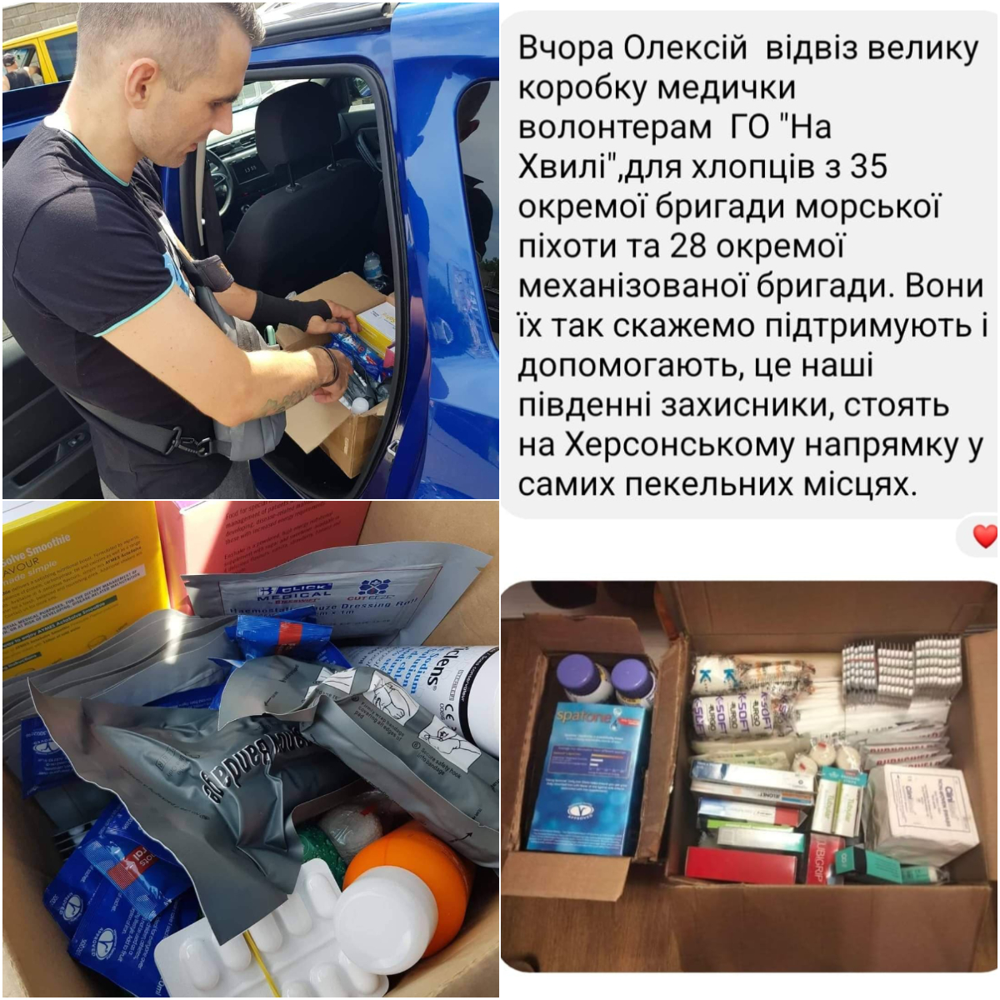
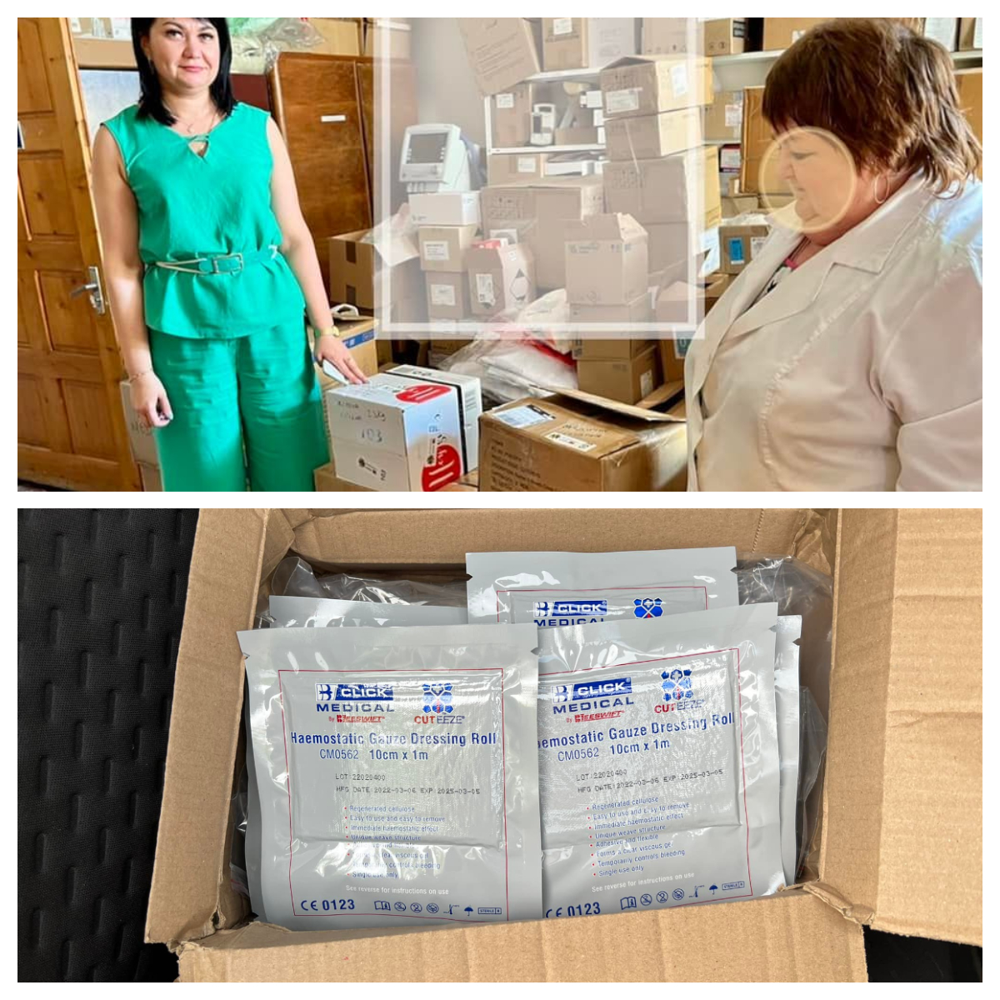

Night shipments become a pattern! Last night we have sent 1.5 m3 of parcels with humanitarian aid and medical supplies to Ukraine!

<!--more-->

They were sent to volunteers in Ukraine (Chornomorsk, Lviv, Uzhhorod) who sent them to hospitals, defence units, displaced people centres etc.

Many thanks to everyone who bought items from our Amazon list! It remains <a href="https://www.amazon.co.uk/hz/wishlist/ls/3IKD8RINIZODU" target="_blank">open</a>;  please, participate!

Many thanks to everyone who donated money, so we could pay for the shipment, and we are able to work on further actions!

Many thanks to <a href="/about/">the members of Sunflowers Wales</a>, who made so fantastic job in fundraising, getting medical supplies, sorting things etc.!

Stay with us! Together we can do more!

Glory to Ukraine!  

In less than a week, the parcels were received, sorted, and forwarded further by Ukrainian volunteers (see also FB-posts: 
<a href="https://www.facebook.com/luda.barsyk/posts/pfbid02XjSp7zip4tT6JtKTks4DyjsFWKL5bZyw91ikZ1fsADRsocandQdQAkwbuKBYiE2ql" target="_blank">Link 1</a>):

 
