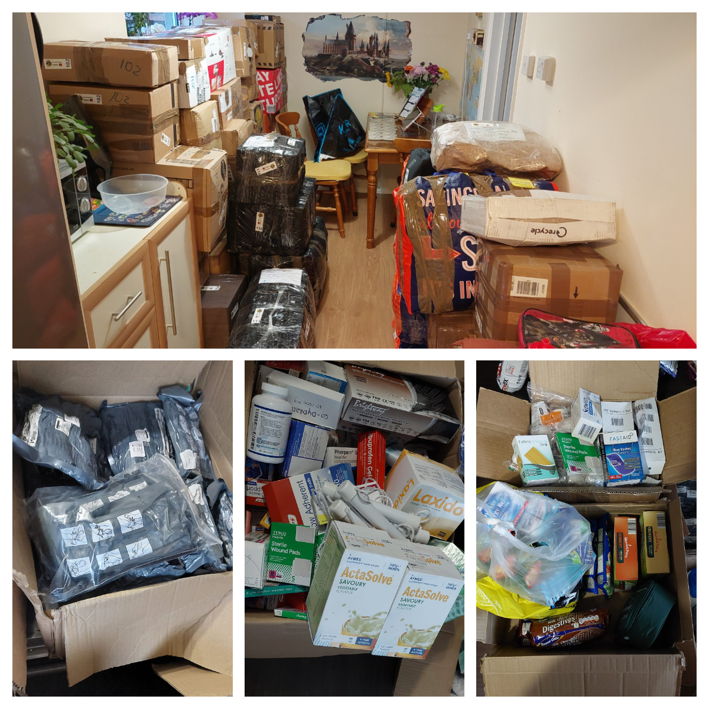

Another ca. 2 m3 of humanitarian aid and medical supplies were sent to Ukraine.

<!--more-->

We have sent a number of Israeli bandages and hemostatic dressings, medicine, hygienic packs, dry baby food.

The parcels were sent to Ukrainian volunteers in Chernomorsk, Lviv, and Uzhhorod.

 