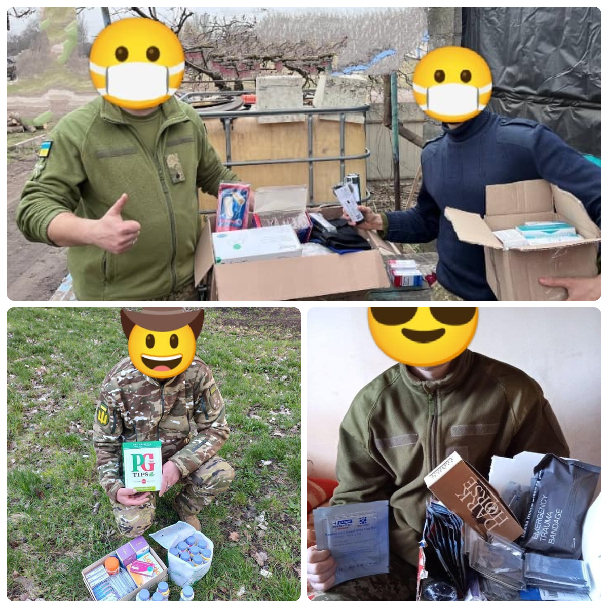
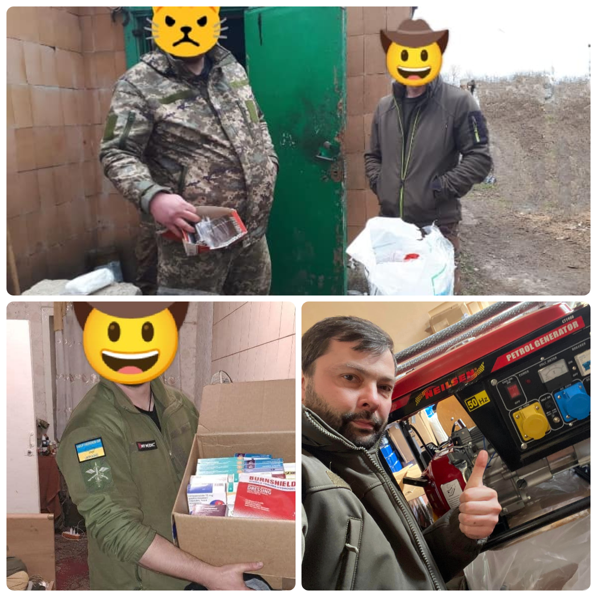
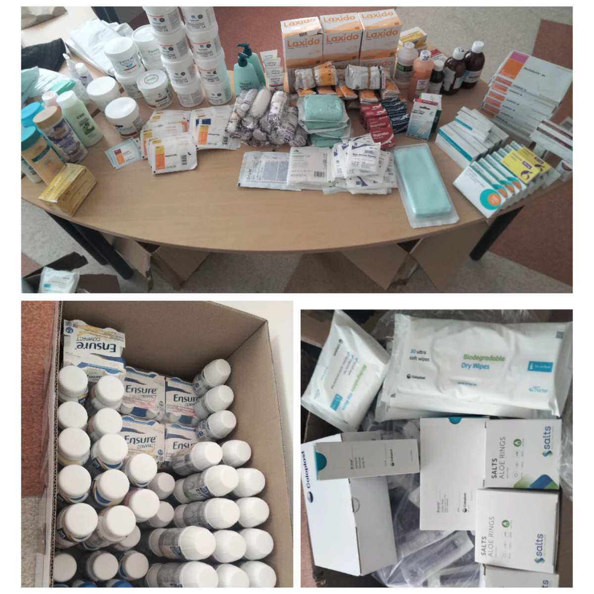
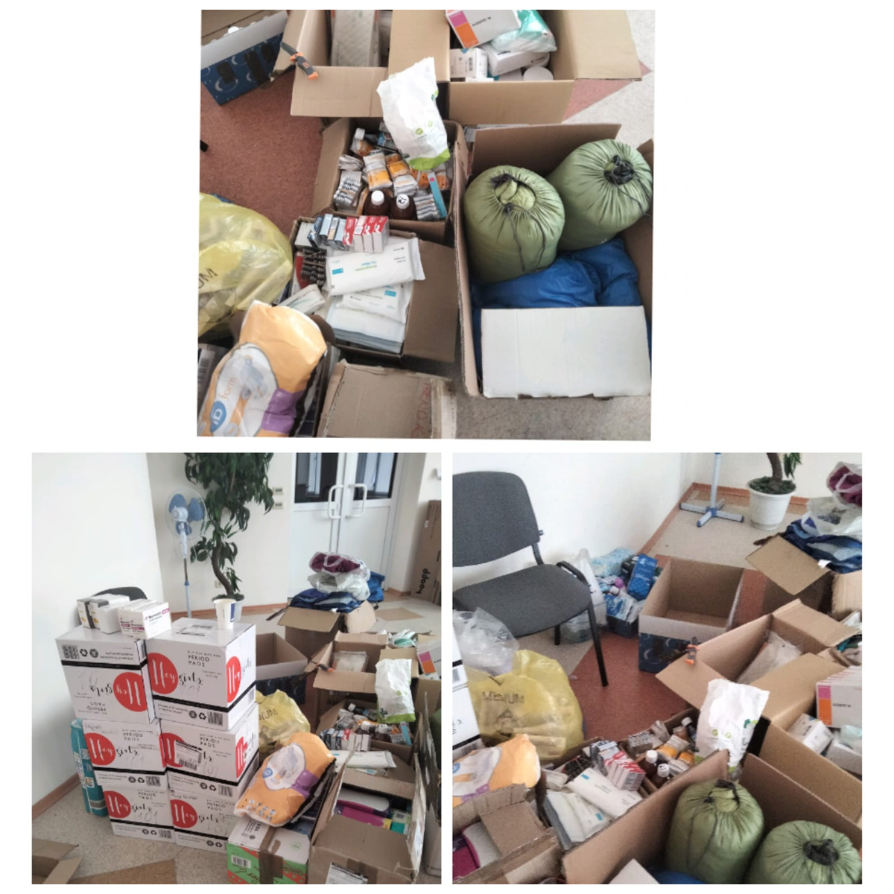
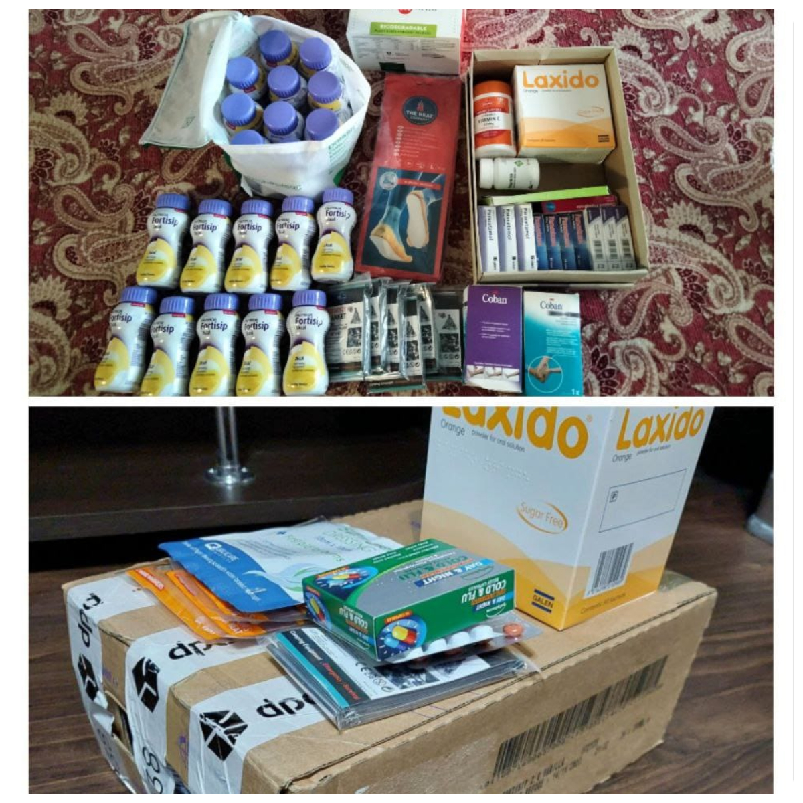
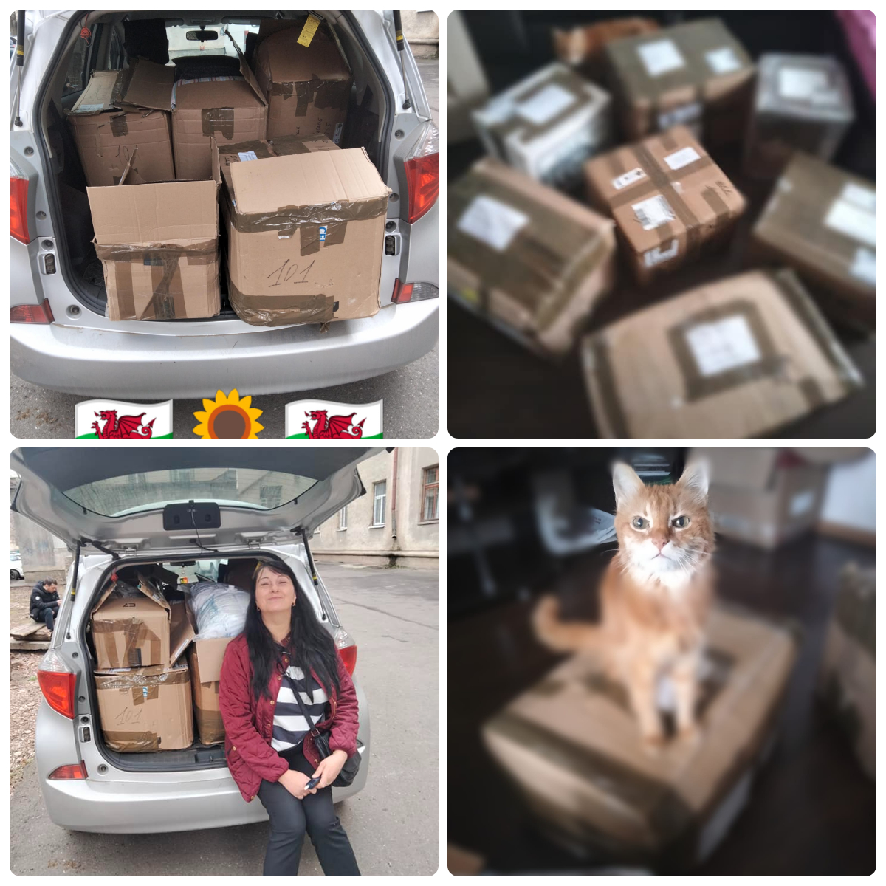

In March, we have sent three valuable shipments to Ukraine.

<!--more-->

The shipments on 3, 17 and 31 March were, as usual, full of medical supplies and selected humanitarian aid.

Overall, it was ca. 3 m3 of parcels, and the medical supplies costed ca. £2500!

Many thanks for all the generous money donations they were vital to send this to Ukraine!

Many thanks to our members for their tireless work! 

Many thanks to the volunteers in UKraine who promptly delivered this to the destination points:

<a href="https://www.facebook.com/luda.barsyk/posts/pfbid0hhGsyDJaq5Sky5puTpMpGPgy457cnzdB6sbRqxBKkXvs3tFomRUhxx8GP7n8pDPwl" target="_blank">Link 1</a>&nbsp;&nbsp;
<a href="https://www.facebook.com/permalink.php?story_fbid=pfbid02o3KYr8TVCaMQ3f8vQHBpYH4h7BnRKg1saTYjykb5icGWRKRFkyDXr5nPi7vKSfcLl&id=100087035491875" target="_blank">Link 2</a>
<a href="https://www.facebook.com/luda.barsyk/posts/pfbid023RU9cZfMMewEeaA7J58RP8L8jZTXeg7kVa3QTaRKVS1dBprkWXhzgsys5qDURvbsl" target="_blank">Link 3</a>&nbsp;&nbsp;
<a href="https://www.facebook.com/permalink.php?story_fbid=pfbid029uNPnupWxzS2yMzKv4rNZb3KmAb1PB4rdxcUvKDngQResRE5Yaso2kjMo9mU14tRl&id=100087035491875" target="_blank">Link 4</a>&nbsp;&nbsp;
<a href="https://www.facebook.com/permalink.php?story_fbid=pfbid045oWSvUQeSvfPgV4SeGY1u9gcNgbun6GaHYpaz48iksBghvVyZY6zi519nnWFozzl&id=100087035491875" target="_blank">Link 5</a>&nbsp;&nbsp;

<a href="https://www.facebook.com/groups/601579067497655/posts/790426558612904/" target="_blank">Link 6</a>&nbsp;&nbsp;
<a href="https://www.facebook.com/permalink.php?story_fbid=pfbid0Fv5WZFb4gQeNkE346BzKMmbLDExQb9L5G3JD9gQLvCirH1kt8ByYSTs5Cb5FEzS3l&id=100087035491875" target="_blank">Link 7</a>&nbsp;&nbsp;
<a href="https://www.facebook.com/oleksandr.korkoil/posts/pfbid02kYj7T2pysn31SWbuE4P4T3T5U8DctJ7wYVv2BVqpXqVKbFehKbNKbv52DdmPwf3Fl" target="_blank">Link 8</a>&nbsp;&nbsp;
<a href="https://www.facebook.com/oleksandr.korkoil/posts/pfbid02SDtozfkJz8TwRFMiiYu2znoMpENgmD2SFu8d87FvNwavvEuF4zRVcrbpYNLm31Gwl" target="_blank">Link 9</a>&nbsp;&nbsp;
<a href="https://www.facebook.com/pavlo.fedaka/posts/pfbid02ZPsj6dXs9GhVz9bGNkb7zE1cyP3VPDb6tbiNGLoUTZgBAmCwkeFjjsVkZmwd269Cl" target="_blank">Link 10</a>&nbsp;&nbsp;

<a href="https://www.facebook.com/pavlo.fedaka/posts/pfbid0MZbjb43Aru9VGamCSA6D5rnjuXbKnZAPqhgjjBNZA47DUzEVoEbznLKDvHo6bte3l" target="_blank">Link 11</a>&nbsp;&nbsp;
<a href="https://www.facebook.com/zknfz/posts/pfbid02dWHFm47smqJfUEUndjT53Knii7EsBJAAnTMQv73Hhmm2s21iwa4a3Fxwiz4QfLyKl" target="_blank">Link 12</a>&nbsp;&nbsp;
<a href="https://www.facebook.com/groups/601579067497655/posts/794520954870131/" target="_blank">Link 13</a>
 
We will not stop, we continue to help Ukrainians! Our effective work is impossible without you, your help, and your generosity! 

Every hemostatic dressing from our <a href="https://amzn.to/3DeSWrn" target="_blank">Amazon list</a> we sent may save a life. 
Every generator we sent will help Ukrainian medics to continue saving lives. 

It's worth all the effort!

Thank you, our dear friends!

Together we are strong!

Glory to Ukraine!

Glory to the heroes!

 

 

 