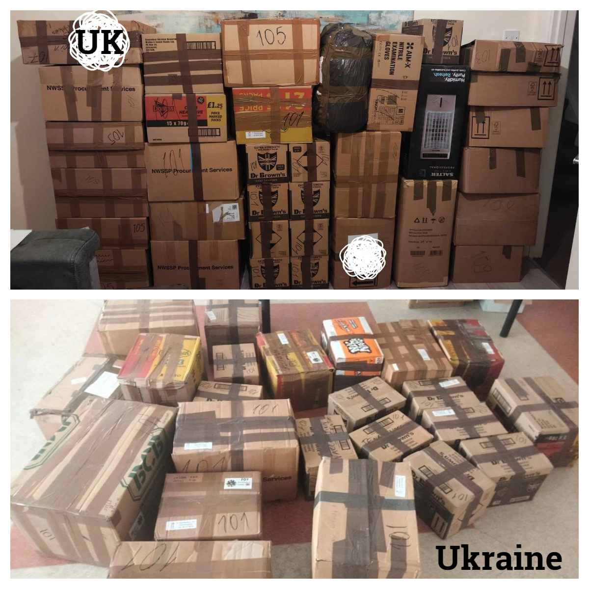
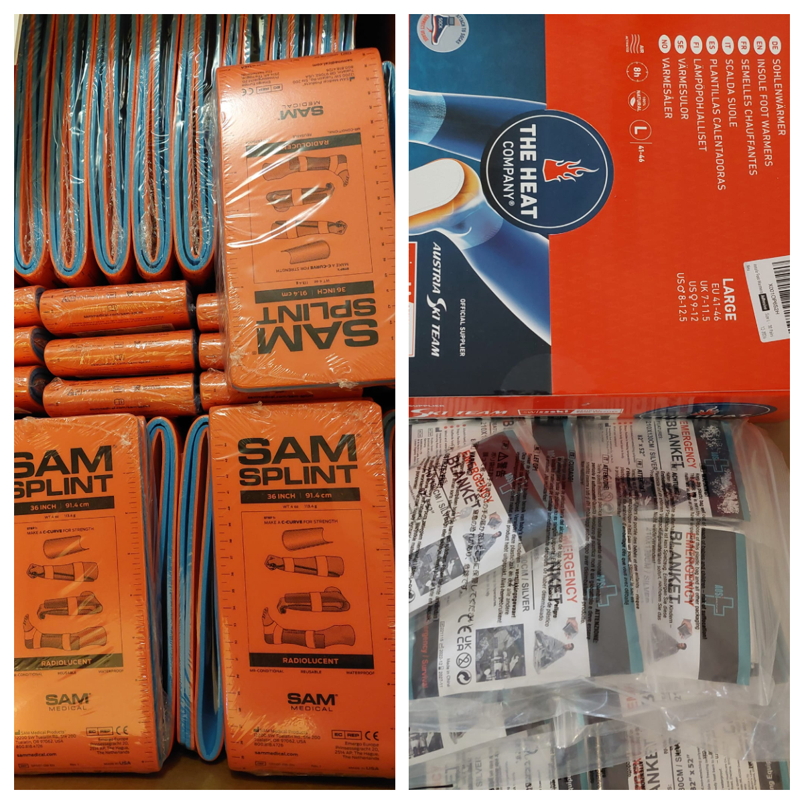
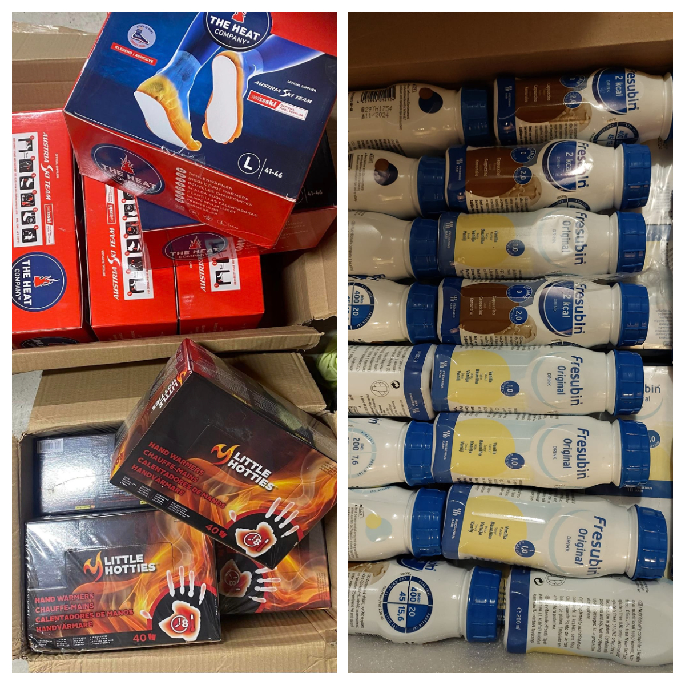
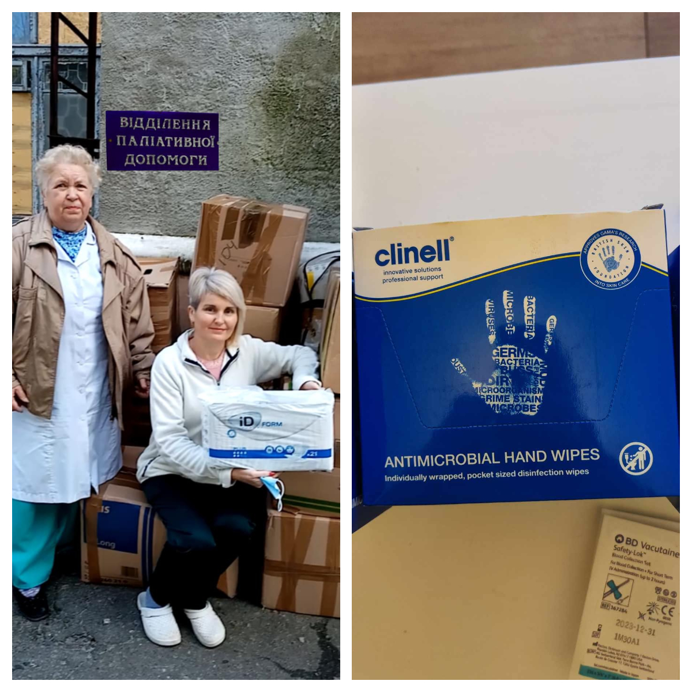
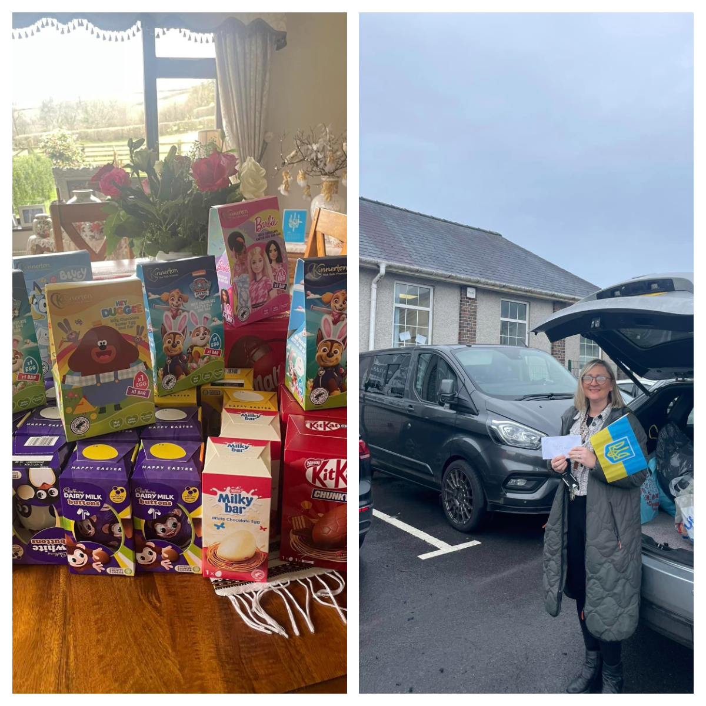
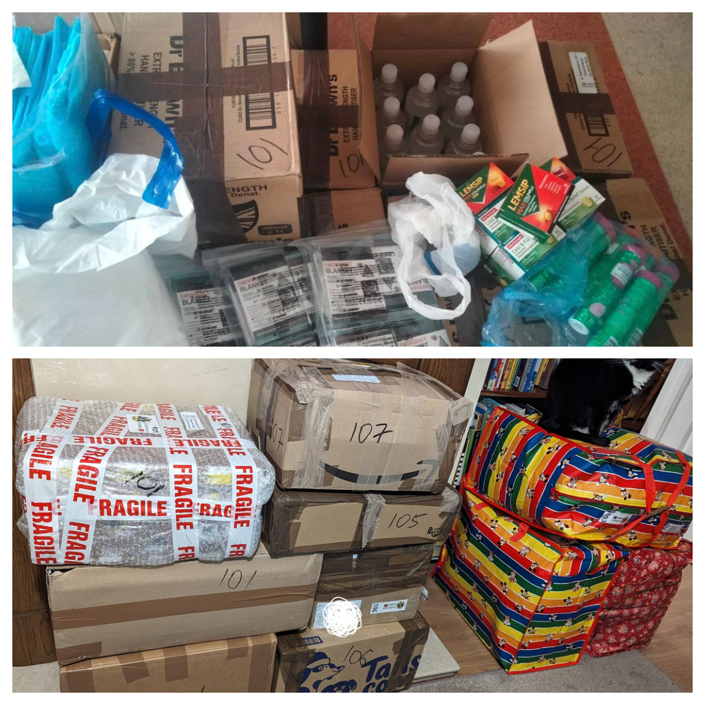

In January-February 2024, we sent three shipments to Ukraine.

<!--more-->

Over 5.5 m3 have been sent so far, and it was really valuable shipments. Haemostatic dressings and warmers (hand, insoles, blankets), burn gel, medical supplies, meal-replacement drinks, end-of life support items, nappies. A lot of items were bought, other were received from you, our dear friends. 

We're very grateful for your generosity and kindness!

Here are some reports from our Ukrainian friends:

<a href="https://www.facebook.com/pavlo.fedaka/posts/pfbid07Jx9jAJ82vYJN1p664utx9T35EE5FqTZyYhejCjA1hkmnwJxKUTKmGWZVCzRiMqwl" target="_blank">Link 1</a>&nbsp;&nbsp;
<a href="https://www.facebook.com/luda.barsyk/posts/pfbid0ZrbXwcBv2QNgGooHdEznFybS27TRMegy5Njb9cN6LqQTq1Aaht9Nt8ALNhVkeNCwl" target="_blank">Link 2</a>&nbsp;&nbsp;
<a href="https://www.facebook.com/zknfz/posts/pfbid029QB3Au9o6LUvRh4WY6kko4rrYaWAKNknxPMdUtCBZALD1yJ1w6AAaFHte2c9snREl" target="_blank">Link 3</a>&nbsp;&nbsp;
<a href="https://www.facebook.com/permalink.php?story_fbid=pfbid0JhLyYhBHtGH8RQhWH1B2gLds5nKHrNjQTArek9KYRiVzbTiKn1u8RzWSnAykAct4l&id=100012514024631" target="_blank">Link 4</a>&nbsp;&nbsp;
<a href="https://www.facebook.com/luda.barsyk/posts/pfbid0CD7hnW7heeFGfxJN3RxrtN3pfB8b2LK9D2RXT8dXTY7inrKbt5ScsMmnZtG28hCCl" target="_blank">Link 5</a>

<a href="https://www.facebook.com/nataliia.maksymovych/posts/pfbid02qTBWor7tSR5aai3DZH4ztRDfmaiVF4nj1B3HDxGmFewNbTNajMtAxvPYaQkuaSQPl" target="_blank">Link 6</a>&nbsp;&nbsp;
<a href="https://www.facebook.com/groups/601579067497655/posts/950806005908291/" target="_blank">Link 7</a>&nbsp;&nbsp;
<a href="https://www.facebook.com/groups/601579067497655/posts/953494958972729/" target="_blank">Link 8</a>&nbsp;&nbsp;
<a href="https://www.facebook.com/pavlo.fedaka/posts/pfbid0CnCxmuoQwv69Q7RJbtXQzxj8muMT7dxq9RYCtvkFbM25ULqVxasxoujDGtfGtKC4l" target="_blank">Link 9</a>&nbsp;&nbsp;
<a href="https://www.facebook.com/luda.barsyk/posts/pfbid022JZWpHCKuZZX8cqhdVkUg9sgiE1BxbLTtcytRzSd5NEBauW7Dxw6Qb4zdEmjNDpul" target="_blank">Link 10</a>

The war is a marathon and your constant support is vital!

We will not stop, we continue to help Ukrainians! Our effective work is impossible without you, your help, and your generosity! 

Every hemostatic dressing from our <a href="https://amzn.to/3DeSWrn" target="_blank">Amazon list</a> we sent may save a life. 

It's worth all the effort!

Thank you, our dear friends!

Glory to Ukraine!

Glory to the heroes!

Sunflowers Wales - Standing Strong Together!

 

 

 
